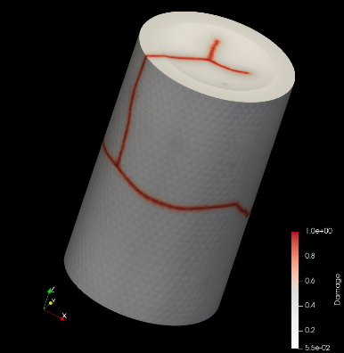
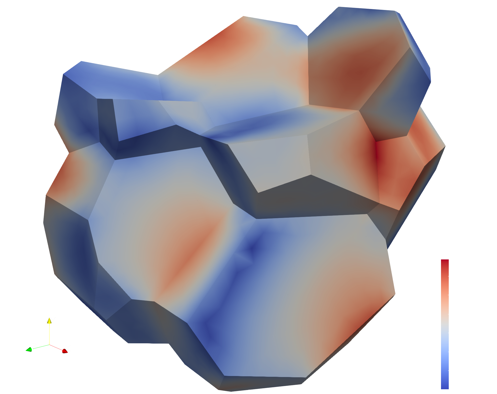

# Summary

The `MFEM-MGIS-MFRONT` (MMM) application, aims at
efficiently use supercomputers in the field of implicit nonlinear
thermo-mechanics. This open-source library is based on several components as
prerequisites. The first component, `MFEM` [@mfem, @mfem-web], is a finite element library
designed for current supercomputers but also for the upcoming exascale
supercomputers. It provides many useful features for carrying out realistic
simulations: support for curvilinear meshes, high order approximation spaces
and different families of finite elements, interfaces to several types of
parallel solvers (including matrix-free ones), preconditioners, and native
support for adaptive non-conforming mesh refinement (AMR).  

# MFEM-based Thermo-Mechanical Solver for Nuclear Fuel Simulations

Originating from the applied mathematics and parallel computing communities, `MFEM` offers both
performance and a large panel of advanced mathematical features. In particular,
one can easily switch from one linear solver to another (direct or iterative),
which is essential for the targeted application: microstructure and mesoscale
modeling for nuclear fuel. However, applications to solid mechanics in `MFEM`
are mostly limited to simple constitutive equations such as elasticity and
hyper-elasticity, which is insufficient to address complex nuclear fuel simulations such as a REV of nuclear fuel or a pellet cracking.

# Statement of needs

The aim of `MMM` project is to combine `MFEM` with the `MFrontGenericInterfaceSupport`
(`MGIS`) project [@Helfer2020], an open-source `C++` library handles all the kinds of
behavior supported by the open-source `MFront` code generator [@helfer2015introducing].
In the field of nonlinear mechanics, this encompasses arbitrary complex behaviors that
can describe damage, plasticity, viscoplasticity, phase change in both small or finite
strain analyses. Generalized behaviors such as strongly coupled thermo-mechanical
behaviors, variational approaches to fracture, cosserat media are supported by `MGIS`
and will be considered in future versions of `MMM`.

Through its integration with `MGIS` and `MFront`, along with dedicated advancements,
`MMM` has incorporated the subsequent mechanical attributes in contrast to the pure
`MFEM` approach while maintaining parallel performance:

- Ability to handle several materials which distinct constitutive equations.  
- Support for internal state variables (defined at quadrature points):
  - Use of `MGIS` data structures
  - Use mechanical behavior laws generated by `MFront` (DSL) 
- Support for complex boundary conditions specific to nonlinear mechanics:
  - Periodic evolution problems
  - Dirichlet boundaries conditions 
- Support for post-processing specific to nonlinear mechanic:
  - computeMeanThermodynamicForcesValues: Compute the macroscopic stress and strain for each materials:
  - ParaviewExportIntegrationPointResultsAtNodes: Paraview post processing files with internal state variables according to `MGIS`
  - ComputeResultantForceOnBoundary: TODO
- Flexible support to easily customize your problem:
  - Number of level of uniform refinement
    - Element family and order
    - Boundary conditions
    - Solver and Preconditioner

These features are described in the tutorial: `https://thelfer.github.io/mfem-mgis/web/tutorial.html`.

The implementation of high order meshes or finite elements is easy.
The library tackles some peculiarities of nonlinear mechanics. In particular,
the support of complex constitutive laws and the management of advanced
boundary conditions.  

The `MMM` library [7] is written in `C++-17` language and
provides a very high level of abstraction based on a very declarative
text-based Application Programming Interface.

# Integrate MMM in an Open Source Ecosystem

The `MMM` library takes full advantage of an open-source software (OSS) stack. It
benefits from the increasing maturity of many communities and tools working
together. Thus, within `MFEM`, one has many available choices to set the linear
solver, such as: `Hypre`[@hypre], `PETSc`[@petsc-web-page], `MUMPS`[@mumps], `SuperLU`, `UMFPACK`[@davis2004algorithm] or other ones. Likewise,
several preconditioners, partitioning libraries, or input mesh formats can be
activated and used. Combinations are highly configurable and almost all
external libraries are switchable. To handle the numerous accessible
combinations, Spack [@gamblin2015spack] is really a cornerstone. This package manager simplifies
building, installing, customizing, and sharing HPC software stacks. It provides
a simple way for installing packages with cumbersome structures and lots of
dependencies. `Spack` is an open-source package manager developed and maintained
by community of HPC developers. Our setup that combines OSS allows for a fast
and cheap access to advanced features embedded in the underlying libraries.

# Software stack

The MMM software stack is presented in Figure YY. Most of low-level external libraries are required by `MFEM` and can be disabled. This is the minimal package requirements to build MMM on a HPC platform:`C++-17`, `MFEM`, `MGIS`, `TFEL`(MFront) and `MPI`. 

As described before, installation process is made easier by using `Spack` and `Cmake`, some installation scrips are available in the MMM GitHub repository. Note that other HPC libraries will be used in future, such as `CUDA`, `RAJA` or `OCCA` for performance portability on GPU. 

To complete the installation, you can enable the following options while compiling `MFEM`. The most interesting are the solver or preconditioner packages such as `Hypre`,`MUMPS`, and `PETSc` (including `SuperLU`, `UMFPACK`), and the load balancing packages `Zoltan` [@devine2000design] and `Metis` [@karypis1997parmetis].

# Numerical Results 
{#sec:numerical_results}

Installation and deployment on desktop or large computers is based on the Spack
package manager. With MMM, we were able to carry out a multi-material
elastic modeling on computing clusters. Scalability performance is good on a
few thousands of CPU cores. Despite the very high level of abstraction and the
genericness of MMM (multi-material and arbitrary behaviors), the overhead
appears reasonably limited, roughly 30% compared to a pure `MFEM` version which
provides very optimized and specialized kernels (this was tested on an elastic
setting with 2 materials). Several examples can be found on the open-source GitHub 
repository: `https://github.com/latug0/mfem-mgis-examples`. Below is a non-exhaustive 
list of examples running on supercomputers.

## Representative Elementary Volume (REV) of Combustible Mixed Oxides for Nuclear Applications:

This simulation consists of a Representative Elementary Volume of MOX (Mixed Oxide) material over time, while applying a deformation gradient. The objective of this work is to replicate and compare the outcomes of these papers and compare them against results obtained using the FFT method [@masson2020modified, @fauque2021homogenization]. The mesh has been generated using `MEROPE` (https://github.com/MarcJos/Merope) in combination with `GMSH`, constructing a periodic mesh with 100 spheres / inclusions, which represents a volume fraction of 17%. Periodic conditions are applied using the `PeriodicNonEvolutionProblem` class, blocking a point, while establishing periodic relationships for nodes within the periodic mesh. The applied stress loading matrix is defined as follows, with a strain rate $\alpha=0.012$:

Bon là je te laisse mettre les bonnes notations ...

$$Symbol strain gradient matrix = \begin{pmatrix} -\alpha/2 & 0 & 0\\
0 & -\alpha/2 & 0\\
0 & 0 & \alpha\\
\end{pmatrix}$$

For modeling the mechanical responses of the matrix and inclusions, an elasto-viscoplastic law is used with the following parameters:

|Mesh set | Young Modulus ($\epsilon$) | Poisson Ratio ($\nu$) | Stress Threshold ($\sigma$) | Norton Exponent ($n$) | Temperature|
|--|--|--|--|--|--|
|Matrix |  8.182e9 | 0.364 | 100.0e6 | 3.333333 | 293.15|
|Inclusions | 16.364e9 | 0.364 | 100.0e12 | 3.333333 | 293.15|

The figure XX illustrates this simulation, involving approximately 10 million Degrees Of Freedom (DOF), conducted over a total simulation time of 5 seconds across 40 time steps ($\Delta_t=0.125s$). A Newton algorithm is applied during each time step, converging within 2 to 4 Newton iterations. The solver used is `HyprePCG` and the preconditioner is `HypreBoomerAMG`.  This simulation was performed using 1,024 `MPI` processes on the CCRT/Topaze HPC platform, resulting in an execution time of 1 hour and 32 minutes. This simulation could not be reach on a single laptop (memory footprint and duration). This example is available here: `https://github.com/latug0/mfem-mgis-examples/tree/master/ex7` with the elasto-viscoplastic behavior law: `matrixlaw.mfront` and a periodic mesh with one inclusion: `inclusions.msh`.

  ![Visualization of a MOX with 17% inclusions, using an elasto-viscoplastic behavior law with color representation based on the magnitude of displacement denoted as u. The figure includes the following: [1] A view of the Representative Elementary Volume (REV) of the MOX material. [2] A close-up view of a slide within the REV. [3] A view of the inclusions isolated from the matrix. [4] The evolution of macroscopic strain along the ZZ direction over time, comparing the results obtained with MMM and the reference data acquired by FFT.](./Mox-picture.png "Visualization of a MOX with 17% inclusions, using an elasto-viscoplastic behavior law with color representation based on the magnitude of displacement denoted as u. The figure includes the following: [1] A view of the Representative Elementary Volume (REV) of the MOX material. [2] A close-up view of a slide within the REV. [3] A view of the inclusions isolated from the matrix. [4] The evolution of macroscopic strain along the ZZ direction over time, comparing the results obtained with MMM and the reference data acquired by FFT.")

## Modelling Fuel Pellet Fragmentation during Reactor start-up

- MicromorphicDamageII mechanical behavior `MFront` law
  

## Viscoplastic behavior of a polycrystalline microstructure for UO2

  A model simulation of UO2 with polycrystalline microstructure has been proposed in ([ex8](https://github.com/latug0/mfem-mgis-examples/tree/master/ex8)) from [MMM-examples](https://github.com/latug0/mfem-mgis-examples). The polycrystalline geometrical model is based on a Voronoi diagram and has been generated using [MEROPE](https://github.com/MarcJos/Merope) library.

  Mechanical behavior is implemented with `MFront` tools. It is provided by a unique single-crystal plasticity model proposed for UO2, which is modified according to the orthotropy directions of the polycrystal.
  
  The mechanical loading conditions corresponds to a uniaxial compression test with periodic conditions of the microstructure :

    - periodic boundaries conditions in all directions,
    - imposed uniform strain in z-axis direction,
    - null macroscopic stresses in x and y directions.

  

- Computation
- Results

# Performance Results MMM on a HPC platform

Computation related to the behavior law at Gauss points is independent for each other, and while some behavior laws might be computationally expensive, the primary focus of parallel computation time is on solving linear systems at each time step. As a result, the parallel performance of our library is strongly influenced by the performance of `MFEM` (Finite Element Library) and, by extension, the selection of suitable solvers and preconditioners.

To highlight MMM performances, we conducted a strong scaling benchmark at CEA/CCRT up to 65,536 cores, using AMD EPIC Milan processor. We simulated a REV 3D (49 inclusions) with an elastic behavior law for both the matrix and inclusions, resulting in convergence within a single time step. The strong scaling was done with the `MPI` version, i.e. one `MPI` process per core (~1.8GB per core). We have tested several pairs of solver/preconditioner and eliminated pairs did not converge within 5,000 Krylov iterations or reach memory limits (in the case of direct solver) over 65,384 cores. 

The simulation involves approximately 80 million of Degrees Of Freedom. The results are presented in Figure [@Runtime] and exhibit a quas-linear speed-upn as expected when combining `MFEM` and `MFront`-`MGIS`. Note that the most scalable "pairs" are not necessarily the fastest, as their runtimes are longer on few cores. In addition, performances decrease between 32,768 to 65,536 is attributed to the low workload per `MPI` process (less than 2,000 DOFs per `MPI` process), while `MPI` communications per process increases.   

# Conclusion

This paper presents the `MMM` HPC application designed to address large scale thermo-mechanical simulation and recent supercomputers. Based on an open-source
software stack, it allows for the fine representation of microstructure in full
3D in the field of fuel modeling. On the one hand, `MGIS` and `MFRONT` bring
nonlinear mechanics features such as damage, plasticity, viscoplasticity
capabilities. On the other hand, `MFEM` provides advanced finite elements schemes
and parallel performance (tested on several thousands of cores until now).
Open-source approach was chosen mainly to: promote collaboration, improve
reproducibility, and reduce costs for development and maintenance.

Regarding performance portability on GPUs, MFEM already offers numerous algorithms such as partial assembly on GPUs, but MMM does not exploit these features yet. Work is underway to port behavior laws to the GPU (MFront) and associated data structures (MGIS). 

