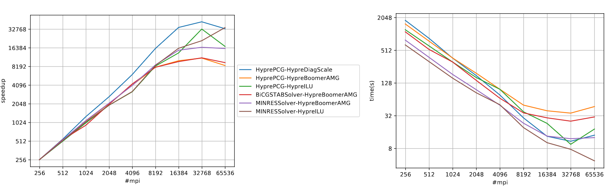

# Summary

The `MFEM-MGIS-MFRONT` (MMM) application, aims at
efficiently use supercomputers in the field of implicit nonlinear
thermo-mechanics. This open-source library is based on several components as
prerequisites. The first component, `MFEM` [@mfem; @mfem-web], is a finite element library
designed for current supercomputers but also for the upcoming exascale
supercomputers. It provides many useful features for carrying out realistic
simulations: support for curvilinear meshes, high order approximation spaces
and different families of finite elements, interfaces to several types of
parallel solvers (including matrix-free ones), preconditioners, and native
support for adaptive non-conforming mesh refinement (AMR).  

# MFEM-based Thermo-Mechanical Solver for Nuclear Fuel Simulations

Originating from the applied mathematics and parallel computing communities, `MFEM` offers both
performance and a large panel of advanced mathematical features. In particular,
one can easily switch from one linear solver to another (direct or iterative),
which is essential for the targeted application: microstructure and mesoscale
modeling for nuclear fuel. However, applications to solid mechanics in `MFEM`
are mostly limited to simple constitutive equations such as elasticity and
hyper-elasticity, which is insufficient to address complex nuclear fuel simulations
such as a Representative Volume Element (RVE) of nuclear fuel or a pellet cracking.

# Statement of needs

The aim of `MMM` project is to combine `MFEM` with the `MFrontGenericInterfaceSupport`
(`MGIS`) project [@Helfer2020], an open-source `C++` library handles all the kinds of
behavior supported by the open-source `MFront` code generator [@helfer2015introducing].
In the field of nonlinear mechanics, this encompasses arbitrary complex behaviors that
can describe damage, plasticity, viscoplasticity, phase change in both small or finite
strain analyses. Generalized behaviors such as strongly coupled thermo-mechanical
behaviors, variational approaches to fracture, cosserat media are supported by `MGIS`
and will be considered in future versions of `MMM`.

Through its integration with `MGIS` and `MFront`, along with dedicated advancements,
`MMM` has incorporated the subsequent mechanical attributes in contrast to the pure
`MFEM` approach while maintaining parallel performance:

- Ability to handle several materials which distinct constitutive equations.  
- Support for internal state variables (defined at integration points):
  - Use of `MGIS` data structures
  - Use of mechanical behavior laws generated by `MFront`
- Support for complex boundary conditions specific to nonlinear mechanics:
  - Periodic evolution problems
  - Dirichlet boundaries conditions
- Support for post-processing specific to nonlinear mechanic:
  - ComputeResultantForceOnBoundary: Compute the resultant of the inner forces on a boundary
  - ComputeMeanThermodynamicForcesValues: Compute the macroscopic stress and strain for each materials
  - ParaviewExportIntegrationPointResultsAtNodes: Paraview post processing files with internal state variables according to `MGIS`
- Flexible support for easy simulation customization:
  - Number of uniform refinement level
  - Element family and order
  - Boundary conditions
  - Solver and Preconditioner

These features are described in the following tutorial: `https://thelfer.github.io/mfem-mgis/web/tutorial.html`.

The implementation of high order meshes or finite elements is easy.
The library tackles some peculiarities of nonlinear mechanics. In particular,
the support of complex constitutive laws and the management of advanced
boundary conditions.  

The `MMM` library is written in `C++17` language and
provides a very high level of abstraction based on a very declarative
text-based Application Programming Interface.

# Integrate MMM in an Open Source Ecosystem

The `MMM` library takes full advantage of an open-source software (OSS) stack. It
benefits from the increasing maturity of many communities and tools working
together. Thus, within `MFEM`, one has many available choices to set the linear
solver, such as: `Hypre`[@hypre], `PETSc`[@petsc-web-page], `MUMPS`[@mumps], `SuperLU`, `UMFPACK`[@davis2004algorithm] or other ones. Likewise,
several preconditioners, partitioning libraries, or input mesh formats can be
activated and used. Combinations are highly configurable and almost all
external libraries are switchable. To handle the numerous accessible
combinations, Spack [@gamblin2015spack] is really a cornerstone. This package manager simplifies
building, installing, customizing, and sharing HPC software stacks. It provides
a simple way for installing packages with cumbersome structures and lots of
dependencies. `Spack` is an open-source package manager developed and maintained
by community of HPC developers. Our setup that combines OSS allows for a fast
and cheap access to advanced features embedded in the underlying libraries.

# Software stack

{width=75%}

The MMM software stack is presented on Figure \autoref{fig:SoftStack}. Most of low-level external libraries are required by `MFEM` and can be disabled. This is the minimal package requirements to build MMM on a HPC platform:`C++17`, `MFEM`, `MGIS`, `TFEL`(MFront) and `MPI`. 

As described before, installation process is made easier by using `Spack` and `Cmake`, some installation scrips are available in the MMM GitHub repository. Note that other HPC libraries will be used in future, such as `CUDA`, `RAJA` or `OCCA` for performance portability on GPU. 

To complete the installation, you can enable the following options while compiling `MFEM`. The most interesting are the solver or preconditioner packages such as `Hypre`,`MUMPS`, and `PETSc` (including `SuperLU`, `UMFPACK`), and the load balancing packages `Zoltan` [@devine2000design] and `Metis` [@karypis1997parmetis].

# Numerical Results {#sec:numerical_results}

Installation and deployment on desktop or large computers is based on the Spack
package manager. Multi-material elastic modelling on computational clusters has
been carried out with MMM. Scalability performance is good on a
few thousands of CPU cores. Despite the very high level of abstraction and the
genericness of MMM (multi-material and arbitrary behaviors), the overhead
appears reasonably limited, roughly 30% compared to a pure `MFEM` version which
provides very optimized and specialized kernels (This was tested on a simulation
with 2 elastic materials). Several examples can be found on the open-source GitHub
repository: `https://github.com/latug0/mfem-mgis-examples`. Below is an example
running on supercomputers.

## Representative Volume Element of Combustible Mixed Oxides for Nuclear Applications

This simulation represents an RVE of MOx (Mixed Oxide) material under uniform macroscopic deformation. The aim of this simulation is to reproduce and compare the results obtained by [@masson2020modified; @fauque2021homogenization] who used an FFT method. The mesh used is a periodic mesh containing 100 spheres/inclusions, representing a volume fraction of 17%. It was generated using `MEROPE` (https://github.com/MarcJos/Merope) in combination with `GMSH` (https://gmsh.info/). Periodic conditions are applied using the `PeriodicNonEvolutionProblem` class, which defines periodicity relations for the boundary nodes of the periodic mesh, while blocking one mesh point to eliminate rigid body motion. The applied strain is defined as follows, with a strain rate $\alpha=0.012$:

$$\varepsilon = \begin{pmatrix} -\alpha/2 & 0 & 0\\
0 & -\alpha/2 & 0\\
0 & 0 & \alpha\\
\end{pmatrix}$$

For modeling the mechanical responses of the matrix and inclusions, an elasto-viscoplastic law is used with the following parameters:

|Mesh set | Young Modulus (E) | Poisson Ratio ($\nu$) | Stress Threshold ($\sigma$) | Norton Exponent ($n$) | Temperature|
|--|--|--|--|--|--|
|Matrix |  8.182e9 | 0.364 | 100.0e6 | 3.333333 | 293.15|
|Inclusions | 16.364e9 | 0.364 | 100.0e12 | 3.333333 | 293.15|

The figure \autoref{fig:MOX} illustrates this simulation, involving approximately 10 million Degrees Of Freedom (DOF), conducted over a total simulation time of 5 seconds across 40 time steps ($\Delta_t=0.125s$). A Newton algorithm is applied during each time step, converging within 2 to 4 Newton iterations. The solver used is `HyprePCG` and the preconditioner is `HypreBoomerAMG`.  This simulation was performed using 1,024 `MPI` processes on the CCRT/Topaze HPC platform (https://www.top500.org/system/180014), resulting in an execution time of 1 hour and 32 minutes. This simulation could not be reach on a single laptop (memory requirements and duration). This example is available here: `https://github.com/latug0/mfem-mgis-examples/tree/master/ex7` with the elasto-viscoplastic behavior law: `matrixlaw.mfront` and a periodic mesh with one inclusion: `inclusions.msh`.

![Visualization of a MOX with 17% inclusions, using an elasto-viscoplastic behavior law with color representation based on the magnitude of displacement denoted as u. The figure includes the following: [1] A view of the Representative Volume Element (RVE) of the MOX material. [2] A close-up view of a slide within the RVE. [3] A view of the inclusions isolated from the matrix. [4] The evolution of macroscopic stress along the ZZ direction over time, comparing the results obtained with MMM and the reference data acquired by FFT [@masson2020modified; @fauque2021homogenization].\label{fig:MOX}](./Mox-picture.png "Visualization of a MOX with 17% inclusions, using an elasto-viscoplastic behavior law with color representation based on the magnitude of displacement denoted as u. The figure includes the following: [1] A view of the Representative Volume Element (RVE) of the MOX material. [2] A close-up view of a slide within the RVE. [3] A view of the inclusions isolated from the matrix. [4] The evolution of macroscopic strain along the ZZ direction over time, comparing the results obtained with MMM and the reference data acquired by FFT [@masson2020modified; @fauque2021homogenization].")

# Performance Results MMM on a HPC platform

Computation related to the behavior law at Gauss points is independent for each other, and while some behavior laws might be computationally expensive, the primary focus of parallel computation time is on solving linear systems at each time step. As a result, the parallel performance of our library is strongly influenced by the performance of `MFEM` (Finite Element Library) and, by extension, the selection of suitable solvers and preconditioners.

To highlight MMM performances, a strong scaling benchmark was conducted at CEA/CCRT up to 65,536 cores, using AMD EPIC Milan processor. A 3D RVE with 49 inclusions was simulated with a heterogeneity ratio of 2 between inclusions and matrix. Elastic behavior laws were used for both material types, giving convergence in a single iteration. The strong scaling was done with the `MPI` version, i.e. one `MPI` process per core (~1.8GB per core). Several solver/preconditioner pairs were tested without fine tuning of the solver parameters. 

{width=75%}

The simulation involves approximately 80 million of Degrees Of Freedom. The results are presented in Figure \autoref{fig:ScalBench} and exhibit a quasi-linear speed-up as expected when combining `MFEM` and `MFront`-`MGIS`. Solver/preconditioner pairs that failed to converge in less than 5,000 Krylov iterations or reach memory limits (in the case of direct solvers) on 65,384 cores are not shown in Figure \autoref{fig:ScalBench}. Note that the most scalable "pairs" are not necessarily the fastest, as their runtimes are longer on few cores. In addition, performances decrease between 32,768 to 65,536 is attributed to the low workload per `MPI` process (less than 2,000 DOFs per `MPI` process), while `MPI` communications per process increases.

# Conclusion

This paper presents the `MMM` HPC application designed to address large scale thermo-mechanical simulation and recent supercomputers. Based on an open-source
software stack, it allows for the fine representation of microstructure in full
3D in the field of fuel modeling. On the one hand, `MGIS` and `MFRONT` bring
nonlinear mechanics features such as damage, plasticity, viscoplasticity
capabilities. On the other hand, `MFEM` provides advanced finite elements schemes
and parallel performance (tested on several thousands of cores until now).
Open-source approach was chosen mainly to: promote collaboration, improve
reproducibility, and reduce costs for development and maintenance.

Regarding performance portability on GPUs, MFEM already offers numerous algorithms such as partial assembly on GPUs, but MMM does not exploit these features yet. Work is underway to port behavior laws to the GPU (MFront) and associated data structures (MGIS).
