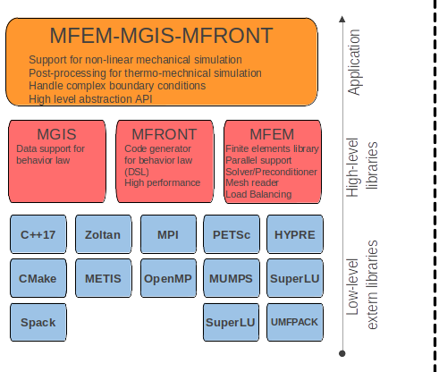

# Summary

The `MFEM-MGIS-MFRONT` (MMM) application, aims at efficiently use
supercomputers in order to describe coupled multiphysics phenomena
with a particular focus on thermo-mechanics. This open-source library
is based on several components as prerequisites: the `MFEM` (Modular
Finite Element Methods) [@mfem; @mfem-web] library, the `MGIS` (MFront
Generic Interface Support) [@Helfer2020] library and the `MFront`
[@helfer2015introducing] DSL code generator.  Thanks to the features
embedded within MGIS and MFront and thanks to specific developments,
MMM adds several mechanical features compared to a pure MFEM approach.
The library tackles some peculiarities of nonlinear
mechanics. In particular, the support of complex constitutive laws and
the management of advanced boundary conditions. It provides a 
high level of abstraction based on a declarative text-based
Application Programming Interface.

# MFEM-based Thermo-Mechanical Solver for Nuclear Fuel Simulations

`MFEM`, is a finite element library
designed for current supercomputers but also for the upcoming exascale
supercomputers. It provides many useful features for carrying out realistic
simulations: support for curvilinear meshes, high order approximation spaces
and different families of finite elements, interfaces to several types of
parallel solvers (including matrix-free ones), preconditioners, and native
support for adaptive non-conforming mesh refinement (AMR).  

Originating from the applied mathematics and parallel computing communities, `MFEM` offers both
performance and a large panel of advanced mathematical features. In particular,
one can easily switch from one linear solver to another (direct or iterative),
which is essential for the targeted application [@bernaud2024pleiades]: microstructure and mesoscale
modeling for nuclear fuel. 

# Statement of need

The solid mechanic applications in `MFEM`
are mostly limited to simple constitutive equations such as elasticity and
hyper-elasticity, which is insufficient to address complex nuclear fuel simulations
such as a Representative Volume Element (RVE) of nuclear fuel or a pellet cracking.

The aim of `MMM` project is to combine `MFEM` with the `MFrontGenericInterfaceSupport`
(`MGIS`) project, an open-source `C++` library handles all the kinds of
behavior supported by the open-source `MFront` code generator.
In the field of nonlinear mechanics, this encompasses arbitrary complex behaviors that
can describe damage, plasticity, viscoplasticity, phase change in both small or finite
strain analyses. Generalized behaviors such as strongly coupled thermo-mechanical
behaviors, variational approaches to fracture, cosserat media are supported by `MGIS`
and will be considered in future versions of `MMM`.

Through its integration with `MGIS` and `MFront`, along with dedicated advancements,
`MMM` has incorporated the subsequent mechanical attributes in contrast to the pure
`MFEM` approach while maintaining parallel performance:

- Ability to handle several materials which distinct constitutive equations:
  - Micromorphique laws
  - Orthotropic laws 
- Support for internal state variables (defined at integration points):
  - Use of `MGIS` data structures
  - Use of mechanical behavior laws generated by `MFront`
- Support for post-processing specific to nonlinear mechanic:
  - ComputeResultantForceOnBoundary: Compute the resultant of the inner forces on a boundary
  - ComputeMeanThermodynamicForcesValues: Compute the macroscopic stress and strain for each materials
  - ParaviewExportIntegrationPointResultsAtNodes: Paraview post processing files with internal state variables according to `MGIS`
- Flexible C++ API to easily define MFEM simulation features

These features are described in the following tutorial: `https://thelfer.github.io/mfem-mgis/web/tutorial.html`.

The implementation of high order meshes or finite elements is easy.
The library tackles some peculiarities of nonlinear mechanics. In particular,
the support of complex constitutive laws and the management of advanced
boundary conditions.  

The `MMM` library is written in `C++17` language and
provides a high level of abstraction based on a declarative
text-based Application Programming Interface.

# Integrate MMM in an Open Source Ecosystem

The `MMM` library takes full advantage of an open-source software (OSS) stack. It
benefits from the increasing maturity of several scientific tools that are combined.
Thus, within `MFEM`, one has many available choices to set the linear
solver, such as: `Hypre`[@hypre2002], `PETSc`[@petsc-web-page], `MUMPS`[@mumps], `SuperLU`, `UMFPACK`[@davis2004algorithm] or other ones. Likewise,
several preconditioners, partitioning libraries, or input mesh formats can be
activated and used. Combinations are highly configurable and almost all
external libraries that relates to linear solvers are switchable. 

# Software stack

{width=75%}

The MMM software stack is presented on \autoref{fig:SoftStack}. Most of low-level external libraries are required by `MFEM` and can be disabled. Hence, the minimal package requirements to build MMM on a HPC platform is typically:`C++17`, `MFEM`, `MGIS`, `TFEL`(MFront), CMake and `MPI`.

To handle the numerous accessible
combinations, Spack [@gamblin2015spack] is really a cornerstone. This package manager simplifies
building, installing, customizing, and sharing HPC software stacks. It provides
a simple way for installing packages with cumbersome structures and lots of
dependencies. `Spack` is an open-source package manager developed and maintained
by community of HPC developers. Our setup that combines OSS allows for a fast
and cheap access to advanced features embedded in the underlying libraries.

To complete the installation, you can enable the following options while compiling `MFEM`. The most interesting are the solver or preconditioner packages such as `Hypre`, `MUMPS`, and `PETSc` (including `SuperLU`, `UMFPACK`), and the load balancing packages `Zoltan` [@devine2000design] and `Metis` [@karypis1997parmetis].

# Numerical Results {#sec:numerical_results}

Installation and deployment on desktop or large computers is shortened using the Spack
package manager. Multi-material elastic modelling on computational clusters has
been carried out with `MMM`. The observed scalability performance is good on a
few thousands of CPU cores. Despite the very high level of abstraction and the
genericness of `MMM` (multi-material and arbitrary behaviors), the overhead
appears reasonably limited. In the worst-case for `MMM`, an overhead of up to 30% has been observed  compared to a pure `MFEM` version which
provides very optimized and specialized kernels (the test was performed on a simulation
with only two elastic materials). Several examples can be found on the open-source GitHub
repository: `https://github.com/latug0/mfem-mgis-examples`.

# Conclusion

This paper presents the `MMM` HPC application designed to address large scale
thermo-mechanical simulation and recent supercomputers. Based on an open source
software stack, it allows for the fine representation of microstructure in full
3D in the field of fuel modeling. On the one hand, `MGIS` and `MFRONT` bring
nonlinear mechanics features such as damage, plasticity, viscoplasticity
capabilities. On the other hand, `MFEM` provides advanced finite elements schemes
and parallel performance (tested on several thousands of cores until now).
Open source approach was chosen mainly to: promote collaboration, improve
reproducibility, and reduce costs for development and maintenance.

Regarding performance portability on GPUs, MFEM already offers numerous algorithms such as partial assembly on GPUs, but MMM does not exploit these features yet. Work is underway to port behavior laws to the GPU (`MFront`) and associated data structures (`MGIS`).
Note that other HPC libraries is considered for the future, such as `CUDA`, `RAJA` or `OCCA` for performance portability of MMM on GPU.

# Acknowledgement

This work was performed using HPC resources from CCRT funded by the CEA/DEs simulation programme.
