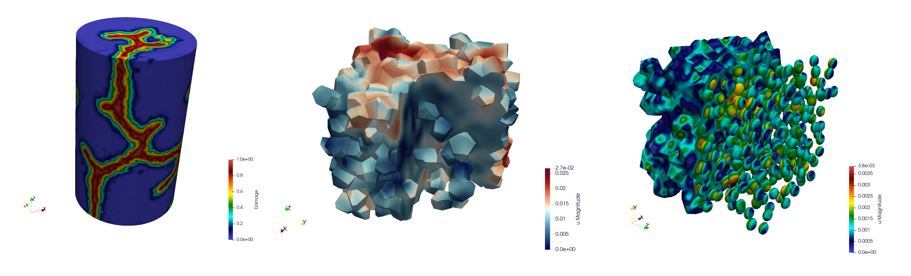

===============================
About the ``MFEM/MGIS`` project
===============================

The MFEM-MGIS project in a nutshell
===================================

The ``MFEM-MGIS`` project, aims at efficiently use supercomputers in order to describe coupled multiphysics phenomena with a particular focus on thermo-mechanics. This open-source library is based on several components as prerequisites: the ``mfem`` (Modular Finite Element Methods) library, the ``mgis`` (MFront Generic Interface Support) library and the ``MFront`` DSL code generator. Thanks to the features embedded within ``mgis`` and ``MFront`` and thanks to specific developments, ``MFEM-MGIS`` adds several mechanical features compared to a pure ``mfem`` approach. The library tackles some peculiarities of nonlinear mechanics. In particular, the support of complex constitutive laws and the management of advanced boundary conditions. It provides a high level of abstraction based on a declarative text-based Application Programming Interface.

Contributors
============

- Thomas Helfer (Mechanics, `thelfer <https://github.com/thelfer>`__)
- Guillaume Latu (Computer science, HPC)
- Raphaël Prat (Computer science, HPC)
- Maxence Wangermez (Mechanics)

Tools
=====

The ``TFEL/MFront`` web site was build using the following tools:

-  ``pandoc`` (http://johnmacfarlane.net/pandoc/index.html)
-  ``HTML5`` Boilerplate (http://html5boilerplate.com)
-  tutorials from ``AlsaCreations`` (http://www.alsacreations.com) and
   ``Tutorialzine`` (http://tutorialzine.com)

The documentation of the code is generated using the ``doxygen``
tool (http://www.doxygen.org/). The output has been customized based
on the following project: https://github.com/Velron/doxygen-bootstrapped

