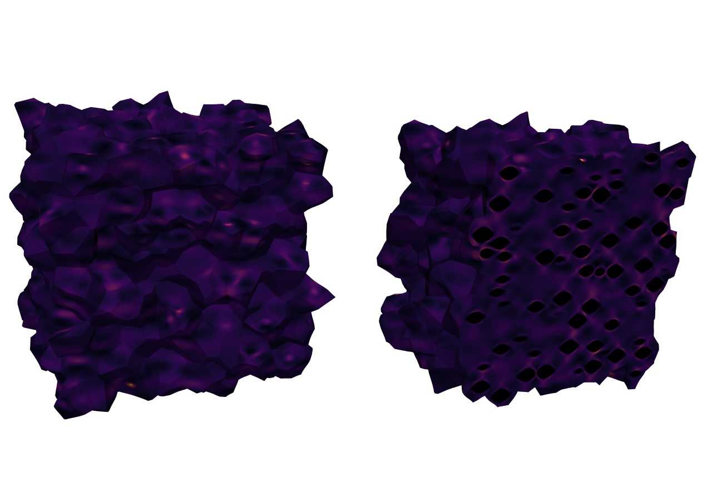
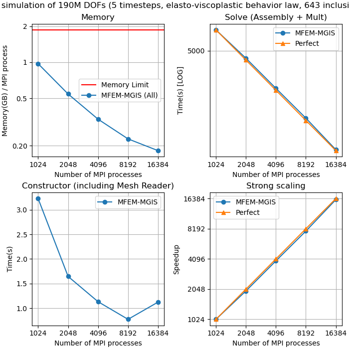
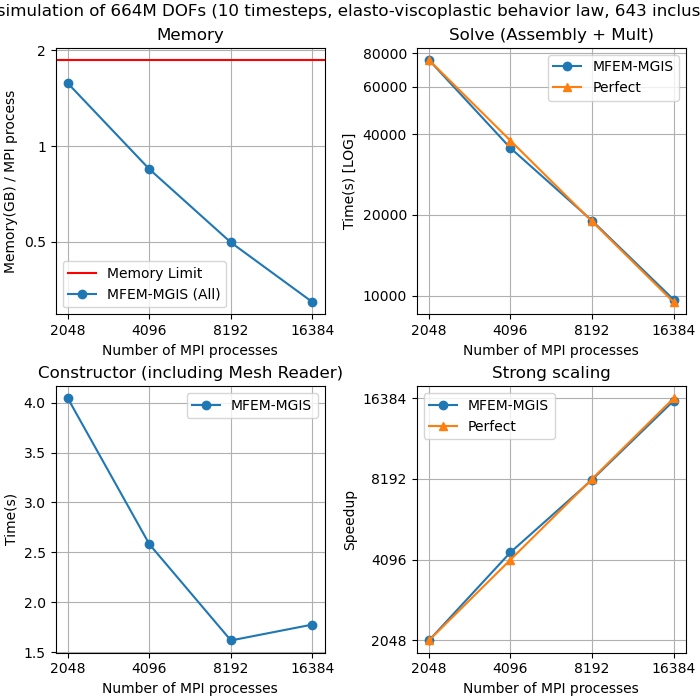

Benchmarks
==========

Benchmarks REV MOX
^^^^^^^^^^^^^^^^^^

In this section, we propose some scaling curves for different test cases. For the first benchmark, we use the MOX REV example with 643 inclusions and a viscoplastic behavior law for the matrix, and an elastic behavior law for the inclusions. Calculations are performed on the TOPAZE supercalculator at CCRT. Each node in the cluster is built on 64-core AMD EPYC Milan 7763 dual-socket processors running at 2.45 GHz and equipped with 256 GB RAM. Benchmarks are in pure MPI. 

Regarding the specificities of the simulations, we use the HyprePCG solver with a HypreBoomerAMG preconditioner. Mesh reading is performed using a mesh pre-cut into small msh files to limit the impact on the memory footprint.

We performed tests on 3 problem sizes: 80M ddl, 190M ddl and 664M ddl.

.. note::

  Un test de faisabilité de cette simulation a aussi était réalisé sûr plus de 5.3 milliards de ddl.

80M ddl
-------

.. figure:: _static/80MDofMFEMMGIS.png
   :alt: Time, Memory footprint and speedup of a MOX RVE with 80M ddl.

190M ddl
--------

664M ddl
---------

