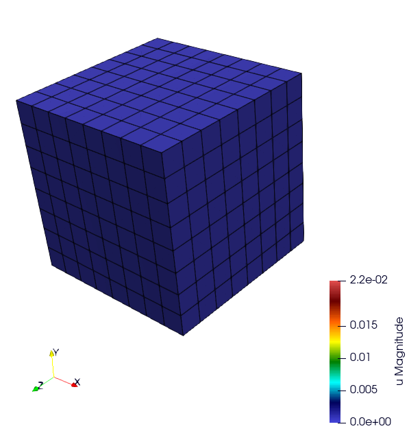
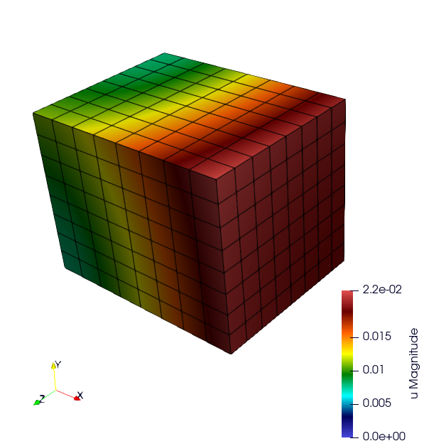
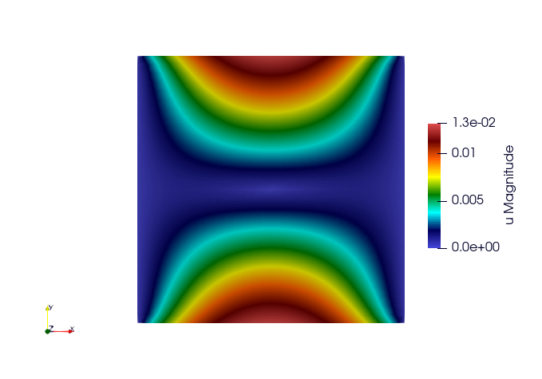
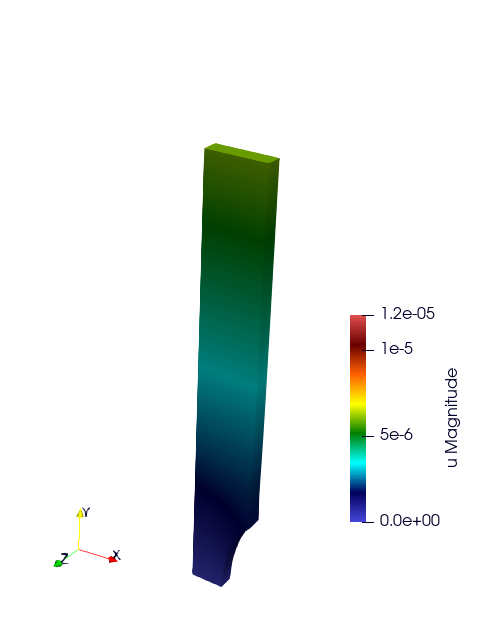
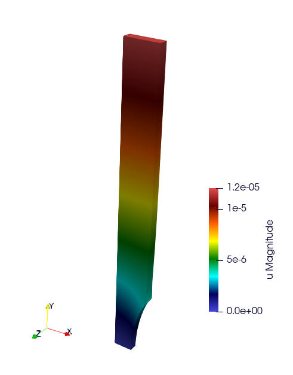

Basic Tests
===========

.. contents::

TensileTest
-----------

website : https://github.com/latug0/mfem-mgis-examples/tree/master/ex1

Description:

.. warning::

   Complete the description

Problem Solved
~~~~~~~~~~~~~~

.. code:: text

   Export the internal value named plasticity strain

   Solver : Conjugate Gradient (default)
   Preconditioner : Depends on the solver

   The default is plasticity; behaviour law parameters are defined in the loaded library.

   Element: 
   - Family H1
   - Order 1

Run This Simulation
~~~~~~~~~~~~~~~~~~~

.. code-block:: bash

   mpirun -n 10 ./UniaxialTensileTestEx -m cube.mesh -l  src/libBehaviour.so -b Plasticity -r Plasticity.ref -ls 1 -p 1 -v EquivalentPlasticStrain

Available options
~~~~~~~~~~~~~~~~~

To customize the simulation, several options are available, as detailed
below.

+---------------------------------+--------------------------------------------+
| Command line                    | Description                                |
+=================================+============================================+
| --mesh or -m                    | Specify the mesh ".msh" used (default =    |
|                                 | inclusion.msh)                             |
+---------------------------------+--------------------------------------------+
| --refinement or -r              | The reference file                         |
|                                 | (default = Plasticity.ref)                 |
+---------------------------------+--------------------------------------------+
| --behaviour or -b               | Name of the behaviour law                  |
|                                 | (default = Plasticity)                     |
+---------------------------------+--------------------------------------------+
| --internal-state-variable or -v | Internal variable name to be post-processed|
|                                 | (default = EquivalentPlasticStrain)        |
+---------------------------------+--------------------------------------------+
| --library or -l                 | Material library                           |
|                                 | (default = src/libBehaviour.so)            |
+---------------------------------+--------------------------------------------+
| --linearsolver or -ls           | Identifier of the linear solver: 0 -> CG,  |
|                                 | 1 -> GMRES, 2 -> UMFPack (serial),         |
|                                 | 3-> MUMPS(serial), 2 -> HypreFGMRES (//),  |
|                                 | 3 -> HyprePCG (//), 4 -> HypreGMRES (//).  |
+---------------------------------+--------------------------------------------+
| --order or -o                   | Finite element order (polynomial degree)   |
|                                 | (default = 2)                              |
+---------------------------------+--------------------------------------------+
| --parallel or -p                | Run parallel execution                     |
|                                 | (default = 0, serial)                      |
+---------------------------------+--------------------------------------------+

Satoh
-----

website: https://github.com/latug0/mfem-mgis-examples/tree/master/ex5

Description:

Modelling of a plate of length 1, in plane strain, clamped on the left and right boundaries and subjected to a parabolic thermal gradient along the x-axis. (source code 5)

Problem solved
~~~~~~~~~~~~~~

.. code:: text

   This test models a 2D plate of length 1 in plane strain clamped on the left
   and right boundaries and subjected to a parabolic thermal gradient along the
   x-axis:
    
   - the temperature profile is minimal on the left and right boundaries
   - the temperature profile is maximal for x = 0.5

   This example shows how to define an external state variable using an
   analytical profile.

   Solver : UMFPackSolver
   Preconditioner : None

   Elastic behavior law parameters :
   [ parameters       , material ]
   [ Young Modulus    , 150e9    ];
   [ Poisson Ratio    , 0.3      ];
   [ Temperature      , 293.15   ];

   Element: 
   - Family H1
   - Order 2

Run the simulation
~~~~~~~~~~~~~~~~~~

Parameters are hardcoded in this example.

.. code-block:: bash

   ./SatohTest

.. note::

   If you want to run this example in parallel, you'll have to change the solver too.

Ssna303 Example (2D and 3D)
---------------------------

This tutorial deals with a 2D (plane strain) tensile test (ex2) and 3D (ex4) on a notched beam modeled by finite-strain plastic behavior. See the tutorial section. 

- website 2D example: https://github.com/latug0/mfem-mgis-examples/tree/master/ex2
- website 3D example : https://github.com/latug0/mfem-mgis-examples/tree/master/ex4

