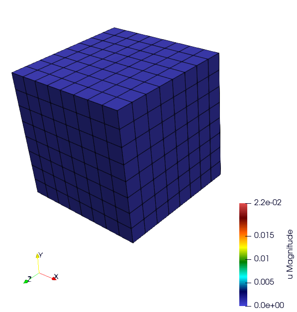
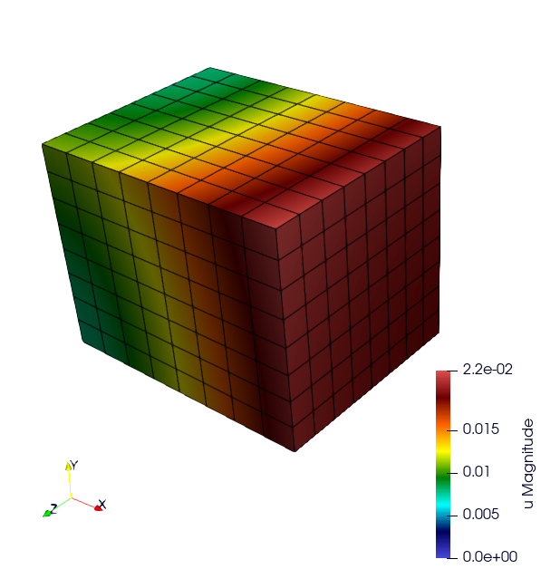
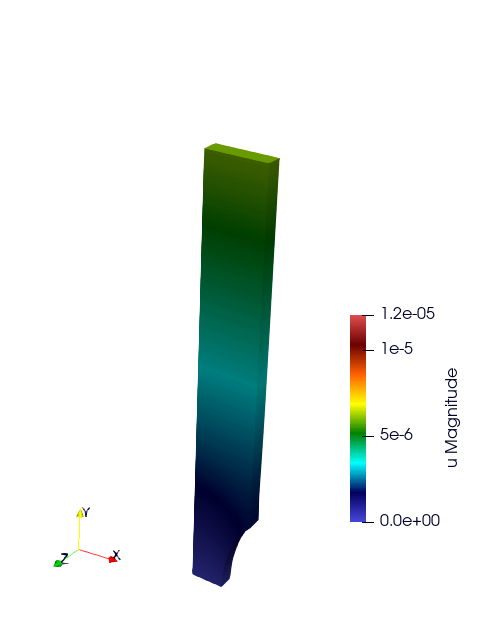
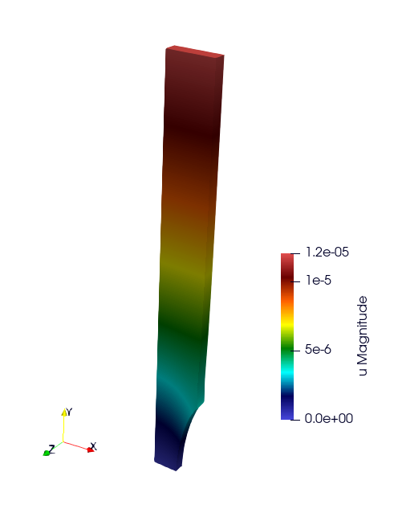

Basic Tests
===========

.. contents::

TensileTest
-----------

website : https://github.com/latug0/mfem-mgis-examples/tree/master/ex1

Description:

This example is a cyclic tension-compression test on a unit cube. The
imposed axial strain goes up to 0.9 %, down to -2.1 % and back up to
1.9 %, in 100 time steps. Its test compares the results to the reference
file ``Plasticity.ref``.

Problem Solved
~~~~~~~~~~~~~~

.. code:: text

   Plastic behaviour with linear isotropic hardening (Plasticity.mfront):
   [ parameters      , material ]
   [ Young Modulus   , 70e9     ];
   [ Poisson Ratio   , 0.34     ];
   [ Yield Stress    , 300e6    ];
   [ Hardening Slope , 10e9     ];

   Boundary conditions:
   - symmetry on the faces x = 0, y = 0 and z = 0
   - imposed displacement along x on the face x = 1

   Solver : Conjugate Gradient (default)

   Element:
   - Family H1
   - Order 1

Run This Simulation
~~~~~~~~~~~~~~~~~~~

Without any option, the example runs as described above, in serial or
in parallel. The ``-r`` option compares the results to the reference file:

.. code-block:: bash

   ./UniaxialTensileTestEx
   mpirun -n 2 ./UniaxialTensileTestEx -p 1
   ./UniaxialTensileTestEx -r Plasticity.ref

Available options
~~~~~~~~~~~~~~~~~

To customize the simulation, several options are available, as detailed
below.

+---------------------------------+--------------------------------------------+
| Command line                    | Description                                |
+=================================+============================================+
| --mesh or -m                    | Mesh file (default = cube.mesh)            |
+---------------------------------+--------------------------------------------+
| --reference-file or -r          | Reference file, compared to the results    |
|                                 | when given (default = none)                |
+---------------------------------+--------------------------------------------+
| --behaviour or -b               | Name of the behaviour                      |
|                                 | (default = Plasticity)                     |
+---------------------------------+--------------------------------------------+
| --internal-state-variable or -v | Internal state variable compared to the    |
|                                 | reference                                  |
|                                 | (default = EquivalentPlasticStrain)        |
+---------------------------------+--------------------------------------------+
| --library or -l                 | Material library                           |
|                                 | (default = src/libBehaviour.so)            |
+---------------------------------+--------------------------------------------+
| --linearsolver or -ls           | Linear solver. Serial: 0 -> CG,            |
|                                 | 1 -> GMRES, 2 -> UMFPack. Parallel:        |
|                                 | 0 -> CG, 1 -> GMRES, 2 -> HypreFGMRES,     |
|                                 | 3 -> MUMPS (HyprePCG without MUMPS),       |
|                                 | 4 -> HypreGMRES (default = 0)              |
+---------------------------------+--------------------------------------------+
| --order or -o                   | Finite element order (polynomial degree)   |
|                                 | (default = 1)                              |
+---------------------------------+--------------------------------------------+
| --parallel or -p                | 0 for a serial run, 1 for a parallel run   |
|                                 | (default = 0)                              |
+---------------------------------+--------------------------------------------+

Satoh
-----

website: https://github.com/latug0/mfem-mgis-examples/tree/master/ex5

Description:

Plate of length 1 in plane strain, clamped on its left and right boundaries.
A parabolic temperature profile is imposed along the x-axis.

.. figure:: img/SatohTest.png
    :alt: Illustration of the displacement of the plate.

Problem solved
~~~~~~~~~~~~~~

.. code:: text

   This test models a 2D plate of length 1 in plane strain clamped on the left
   and right boundaries and subjected to a parabolic temperature profile along
   the x-axis:

   - the temperature is 293.15 K on the left and right boundaries
   - the temperature is 2000 K for x = 0.5

   This example shows how to define an external state variable using an
   analytical profile.

   Solver : UMFPackSolver
   Preconditioner : None

   Thermoelastic behavior law parameters :
   [ parameters            , material ]
   [ Young Modulus         , 150e9    ];
   [ Poisson Ratio         , 0.3      ];
   [ Thermal Expansion     , 1e-5     ];
   [ Reference Temperature , 293.15   ];

   Element: 
   - Family H1
   - Order 2

Run the simulation
~~~~~~~~~~~~~~~~~~

Parameters are hardcoded in this example.

.. code-block:: bash

   ./SatohTest

.. note::

   The example runs sequentially. A parallel run needs ``parallel`` set to
   ``true`` in the source code and a parallel linear solver.

Ssna303 Example (2D and 3D)
---------------------------

This tutorial deals with a 2D (plane strain) tensile test (ex2) and 3D (ex4) on a notched beam modeled by finite-strain plastic behavior. See the tutorial section. 

- website 2D example: https://github.com/latug0/mfem-mgis-examples/tree/master/ex2
- website 3D example : https://github.com/latug0/mfem-mgis-examples/tree/master/ex4

