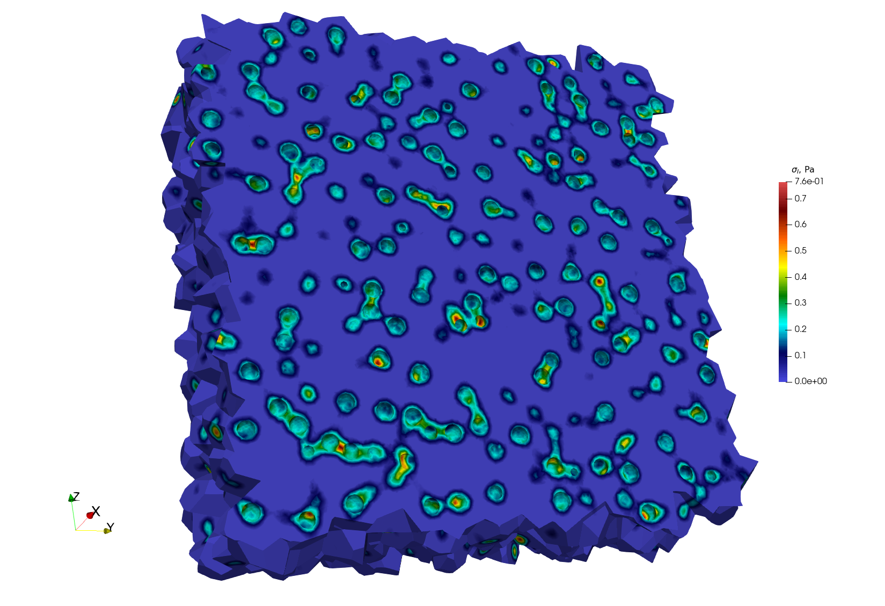
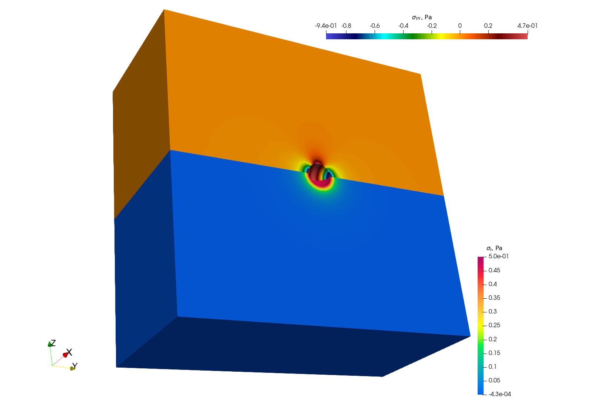
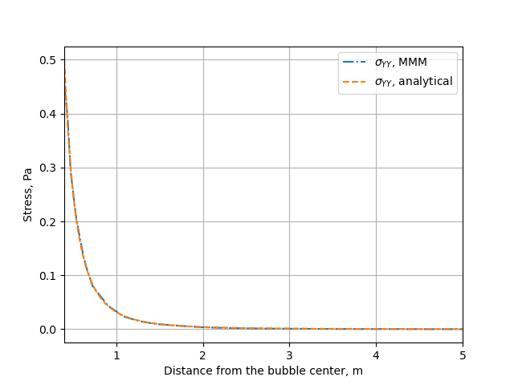

Simulation of pressurized bubbles
=================================

.. contents::

Repository: ``https://github.com/rprat-pro/mm-opera-hpc/tree/main/bubble``

Problem description
-------------------

The default example consists of a single spherical porosity in a quasi-infinite medium. The finite element solution can be compared with an analytical solution giving the elastic stress field as a function of the internal pressure, the bubble radius, and the distance from the bubble. As mentioned above, the boundary conditions for the problem are periodic, and we consider a null macroscopic displacement gradient, which in turn generates a uniform compressive hydrostatic pressure on the RVE. In this case with one porosity in a quasi-infinite medium, the compressive hydrostatic pressure is negligible, in agreement with the analytical solution mentioned above.

Modify the geometry for the single bubble case and mesh it
~~~~~~~~~~~~~~~~~~~~~~~~~~~~~~~~~~~~~~~~~~~~~~~~~~~~~~~~~~

The geometry for the test case is contained in the file ``.geo`` stored in the ``mesh``
folder, and considers a sphere of radius equal to 400 nm at the centre of a (periodic)
cube of 10 µm of size. For a more handy management of the geometry and of the mesh, the
units in the geometry file are expressed in :math:`\mathrm{\mu m}`. One can modify it and
use it as an input for ``gmsh`` to generate the computational mesh for the case by:

.. code-block:: bash

   gmsh -3 single_sphere.geo

A file ``.msh`` is already provided in the folder ``mesh``, generated based on the
aforementioned geometry file. We have seen some slight differences in the final mesh based
on the version of ``gmsh`` employed.

.. note::
    If the bubble center, radius, or the surface label are modified, the corresponding data
    stored in ``single_bubble.txt`` must also be changed.

.. note::
    ``single_bubble_ci.txt`` is used for GitHub continuous integration.

Set-up the physical problem
---------------------------

The simulation considers an empty (i.e., not meshed) cavity, on whose surface we impose an
arbitrary uniform pressure (unitary by default). The medium is described by a purely
elastic constitutive relationship, characterized by two elastic constants:

- :math:`E = 150\ \mathrm{N}\ \mu\mathrm{m}^{-3}`
- :math:`\nu = 0.3`

The elastic modulus is rescaled to coherently describe the geometry in micrometers, rather
than in S.I. units. This choice is done to facilitate the creation of more complex
geometries when using ``Mérope``, given the characteristic length scale of the considered
inclusions.

The geometry is meshed using quadratic elements, to better describe the spherical
inclusions contained in the representative volume element (RVE). Despite ``MFEM``
allowing sub-, super-, and isoparametric analyses, we recommend sticking at least to the
isoparametric choice (i.e., not subparametric) for the polynomial shape functions.

The boundary conditions for the problem are periodic, and we consider a null macroscopic
displacement gradient, which in turn generates a uniform compressive hydrostatic pressure
on the RVE.

Parameters
~~~~~~~~~~

Command-line Usage:

.. code-block:: bash

    Usage: ./test-bubble [options] ...

.. list-table::
    :header-rows: 1
    :widths: 20 10 20 50

    * - Option
      - Type
      - Default
      - Description
    * - ``-h, --help``
      - —
      - —
      - Print the help message and exit.
    * - ``-m <string>, --mesh <string>``
      - string
      - ``mesh/single_sphere.msh``
      - Mesh file to use.
    * - ``-l <string>, --library <string>``
      - string
      - ``src/libBehaviour.so``
      - Material behaviour library.
    * - ``-f <string>, --bubble-file <string>``
      - string
      - ``mesh/single_bubble.txt``
      - File containing the bubble definitions.
    * - ``-o <int>, --order <int>``
      - int
      - ``2``
      - Finite element order (polynomial degree).
    * - ``-r <int>, --refinement <int>``
      - int
      - ``0``
      - Refinement level of the mesh (default = 0).
    * - ``-p <int>, --post-processing <int>``
      - int
      - ``1``
      - Run the post-processing step.
    * - ``-v <int>, --verbosity-level <int>``
      - int
      - ``0``
      - Verbosity level of the output.

The command to execute the test-case is:

.. code-block:: bash

    mpirun -n 6 ./test-bubble

Below we show a contour plot of the :math:`YY` component of the stress tensor (upper
half of the cube) and of the first principal stress (bottom half of the cube).

Verification against the analytical solution
--------------------------------------------

The problem of a pressurized spherical inclusion in an infinite elastic medium has a
closed-form solution for the expressions of the hoop stress as a function of the distance
from the sphere center:

.. math::

    \sigma_{\theta\theta}(r) \;=\; \dfrac{p_{in}\,R_b^3}{2\,r^3}

where :math:`p_{in}` is the internal pressure, :math:`R_b` the bubble radius, and the
expression holds for :math:`r > R_b`.

The script available in ``verification/bubble`` can be used to compare the analytical
solution to the MMM one:

.. code-block:: bash

    python3 mmm_vs_analytical.py

The comparison between the computational results and the analytical solution is shown below.

