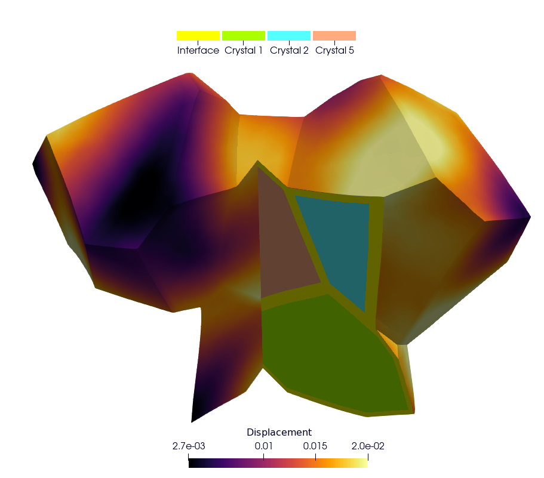
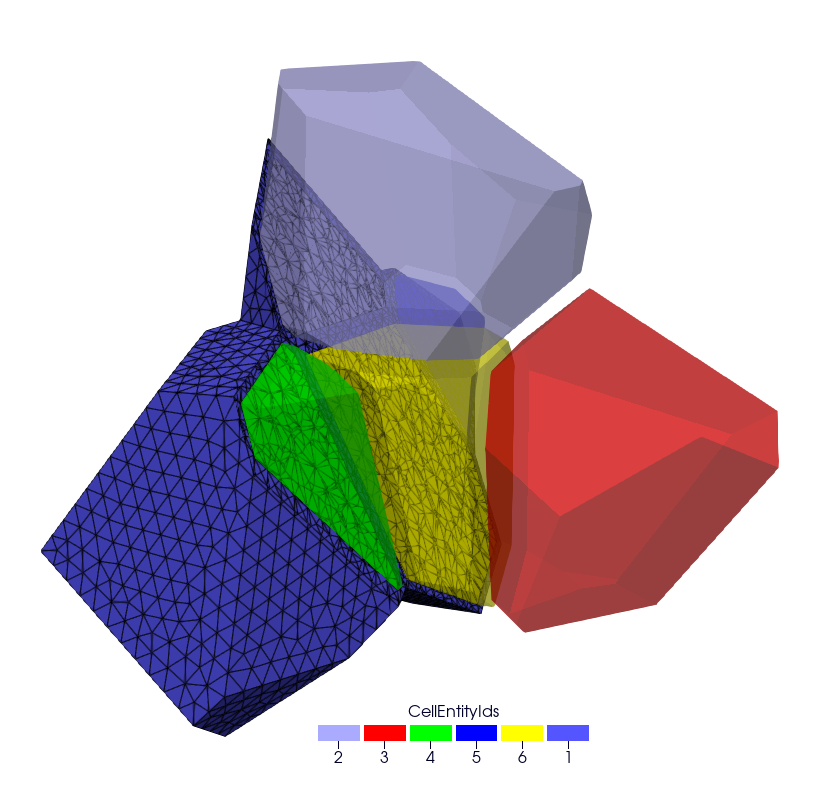
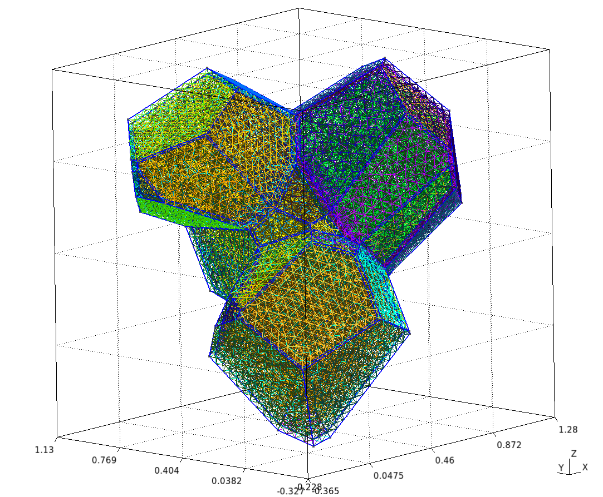
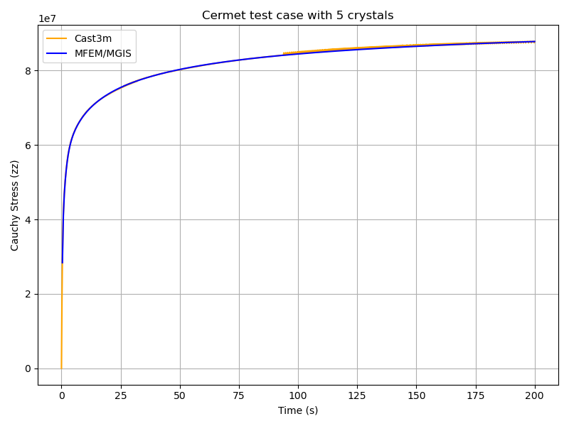

Cermet simulation
=================

.. contents::

Repository: ``https://github.com/rprat-pro/mm-opera-hpc/tree/main/cermet``

Description
-----------

This case is similar to the ``UO2`` polycrystal with the addition of a metallic interface
at the grain boundary. In the Gmsh mesh each grain has a material ID (from 2 to
:math:`N_{\text{grain}} + 1`), as well as its orientation needed for the orthotropic
basis. The metallic interface has the material ID equal to 1, and is considered to be made
of an isotropic elasto-viscoplastic material. In addition to the mechanical analysis, this
example implements a fixed-point algorithm enabling the simulation of a uniaxial
compression/tensile test with periodic boundary conditions.

**Parameters**

- **Boundary conditions:** periodic boundary conditions are applied on the RVE faces.  
  The loading is imposed in one direction, ensuring compatibility and equilibrium across
  periodic faces. More precisely, the axial component :math:`F_{zz}` of the macroscopic
  deformation gradient is imposed. The off-diagonal components of the macroscopic
  deformation gradient are set to zero.  
  The components :math:`F_{xx}` and :math:`F_{yy}` are the unknowns, determined via the
  fixed-point algorithm imposing null values for the components :math:`S_{xx}` and
  :math:`S_{yy}` of the macroscopic Cauchy stress tensor.  
  The main result used for verification is a stress-strain curve with the evolution of the
  axial component :math:`S_{zz}` of the Cauchy stress as a function of :math:`F_{xx}`.

- **[Crystal] Constitutive law:**  
  The UO₂ crystal plasticity law used in the example is detailed in the reference [#portelette2018]_.  
  The corresponding MFront file is available on the MMM GitHub repository.  
  For uranium dioxide, the crystal symmetry is cubic, with the following orthotropic
  elastic properties:

  - Young's modulus = :math:`222\times10^9\ \text{Pa}`
  - Poisson ratio = 0.27
  - Shear modulus = :math:`54\times10^9\ \text{Pa}`

- **[Metallic Interface] Constitutive law:**  
  The Norton creep law used for the interface is derived from the elasto-viscoplastic
  properties of chromium coatings used in eATF claddings, as proposed in the literature.  
  The corresponding MFront file is available on the MMM GitHub repository.

- **Elastic properties:**
  - Young's modulus = :math:`276\times10^9\ \text{Pa}`
  - Shear modulus = :math:`54\times10^9\ \text{Pa}`

- **Norton creep law:**

  .. math::

      \dot{\varepsilon}_{eq} =
      \frac{A D_0 \exp\!\left(-\frac{Q}{R T}\right)}{b^2}
      \left( \frac{\sigma_{eq}}{C} \right)^n

  with the parameters:

  - :math:`A = 2.5\times10^{11}` [a.u.]
  - :math:`n = 4.75`
  - :math:`Q = 3.0627\times10^{5}` [a.u.]
  - :math:`D_0 = 1.55\times10^{-5}` [a.u.]
  - :math:`b = 2.5\times10^{-10}` [a.u.]

- **Finite element order:** 1 (linear interpolation)
- **Finite element space:** H1
- **Simulation duration:** 200 s
- **Number of time steps:** 500
- **Linear solver:** HyprePCG (solver / preconditioner)

Mesh generation
---------------

This section explains how to generate a sample mesh with ``Merope``.

Before running the script, make sure that the environment variable
``MEROPE_DIR`` is properly loaded.

Then, you can generate the mesh in two steps:

.. code-block:: bash

    source ${MEROPE_DIR}/Env_Merope.sh
    python3 mesh/5grains.py    # generate 5grains.geo
    gmsh -3 5grains.geo        # generate 5grains.msh

You will obtain a 3D mesh (``5grains.msh``) of a polycrystalline sample with 5 grains.

Options
-------

**Mesh Generation Examples**

The mesh can be customized by adjusting the input parameters in the Python script.

Below are two examples:

Small Example
~~~~~~~~~~~~~

This setup generates a small polycrystalline mesh (Gmsh version ``11.1``):

- 5 grains
- 12,992 nodes
- 88,687 elements

.. code-block:: python

    L = [1, 1, 1]
    nbSpheres = 20 
    distMin = 0.3
    randomSeed = 0
    layer = 0.02
    MeshOrder = 1
    MeshSize = 0.05

Large Example
~~~~~~~~~~~~~

This setup generates a realistic polycrystalline mesh with:

- 250 grains
- 12,913,361 nodes
- 86,213,779 elements

.. code-block:: python

    L = [5, 5, 5]
    nbSpheres = 250
    distMin = 0.1
    randomSeed = 0
    layer = 0.04
    MeshOrder = 1
    MeshSize = 0.02

Run your simulation
-------------------

Command-line Usage
~~~~~~~~~~~~~~~~~~

.. code-block:: bash

    Usage: ./cermet [options] ...

.. list-table::
    :header-rows: 1
    :widths: 25 10 25 60

    * - Option
      - Type
      - Default
      - Description
    * - ``-h, --help``
      - —
      - —
      - Print the help message and exit.
    * - ``-m <string>, --mesh <string>``
      - string
      - ``mesh/5grains.msh``
      - Mesh file to use.
    * - ``-o <int>, --order <int>``
      - int
      - ``1``
      - Finite element order (polynomial degree).
    * - ``-r <int>, --refinement <int>``
      - int
      - ``0``
      - Refinement level of the mesh (default = 1).
    * - ``-p <int>, --post-processing <int>``
      - int
      - ``1``
      - Run the post-processing step.
    * - ``-v <int>, --verbosity-level <int>``
      - int
      - ``0``
      - Verbosity level of the output.
    * - ``-d <double>, --duration <double>``
      - double
      - ``200``
      - Duration of the simulation (default = 5).
    * - ``-n <int>, --nstep <int>``
      - int
      - ``400``
      - Number of simulation steps (default = 40).
    * - ``-f <string>, --file <string>``
      - string
      - ``vectors_5grains.txt``
      - Vector file to use.
    * - ``--macroscopic-stress-output-file <string>``
      - string
      - ``cermet.res``
      - Main output file containing:
        - Evolution of the diagonal components of the deformation gradient.
        - Evolution of the diagonal components of the Cauchy stress.

How to Run it
~~~~~~~~~~~~~

You can run the simulation in parallel using MPI.  
Below are two examples.

**Basic Test**

Runs a short simulation with:

- Duration = 0.5 s
- 1 timestep
- Mesh = 5grains.msh
- Refinement level = 0

.. code-block:: bash

    mpirun -n 12 ./cermet --duration 0.5 --nstep 1

**Full Test**

Runs a longer simulation with:

- Duration = 200 s
- 400 timesteps
- Custom mesh (``yourmesh.msh``)
- Refinement level = 1

.. code-block:: bash

    mpirun -n 12 ./cermet --duration 200 --nstep 400 -r 1 --mesh yourmesh.msh

Results
-------

By default, the simulation generates the file ``cermet.res`` when running:

.. code-block:: bash

    mpirun -n 12 ./cermet

To validate the results, the Cauchy stress component in the z-direction
(:math:`\overline{\sigma}_{zz}`) can be compared with reference values obtained from
Cast3M.

Plot and Compare
~~~~~~~~~~~~~~~~

To visualize and compare the results, run the following Python script:

.. code-block:: bash

    python3 plot_cermet_results.py

This script generates a figure named ``plot_cermet.png`` as shown below.  
In this figure, we observe good agreement between Cast3M and MFEM-MGIS results.
As observed for the polycrystal test case, there are some oscillations in the Cast3M
solution, which is of poorer quality compared to the MFEM-MGIS results.  
The main conclusion is that the implicit formulation of MFEM-MGIS (full Newton algorithm
using the tangent stiffness) is highly performant—thanks to quadratic convergence and
parallelization—and provides a high-quality solution.  
For verification, the number of time steps has been significantly increased to minimize
the oscillations observed in Cast3M.

Check the values
~~~~~~~~~~~~~~~~

To verify the simulation results, run::

    python3 check_cermet_restults.py

The expected output is: ``Check PASS``.

Example of the detailed output:

.. code-block:: text

               Time     MFEM/MGIS      CAST3M  RelDiff_% Status
	0      0.4  2.837174e+07  29462000.0   3.842755     OK
	1      0.8  4.101172e+07  41798000.0   1.917200     OK
	2      1.2  4.674008e+07  47113000.0   0.797856     OK
	3      1.6  5.042402e+07  50687000.0   0.521535     OK
	4      2.0  5.321536e+07  53452000.0   0.444677     OK
	..     ...           ...         ...        ...    ...
	495  198.4  8.775101e+07  87802000.0   0.058103     OK
	496  198.8  8.775917e+07  87724000.0  -0.040076     OK
	497  199.2  8.776730e+07  87804000.0   0.041820     OK
	498  199.6  8.777539e+07  87814000.0   0.043988     OK
	499  200.0  8.778345e+07  87737000.0  -0.052917     OK

				[500 rows x 5 columns]
				Check PASS.

This table shows the comparison between the simulated Cauchy stress values and the
reference Cast3M results, along with the relative difference and a status check.

References
----------

.. [#portelette2018] Portelette, L., Amodeo, J., Madec, R., *et al.*  
   *Crystal viscoplastic modeling of UO₂ single crystal.*  
   *Journal of Nuclear Materials*, **510**, 635–643 (2018).