==================
Commented Examples
==================

All the examples presented in this section can be found in the git repositories: https://github.com/latug0/mfem-mgis-examples and https://github.com/rprat-pro/mm-opera-hpc (developed as part of operaHPC project).

.. contents::
    :depth: 1
    :local:

Polycrystal
===========

Repository: ``https://github.com/rprat-pro/mm-opera-hpc/tree/main/polycrystal``

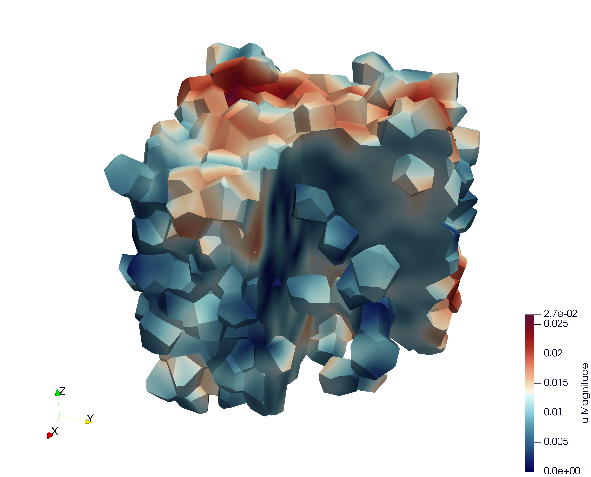

Problem definition
------------------

This test case illustrates the simulation of a **Representative Volume Element (RVE)** of a polycrystal made of uranium dioxide (UO₂). The objective is to study the mechanical response of the material under uniaxial loading. This example also implements a fixed-point algorithm that enables the simulation of a uniaxial compression/tensile test with periodic boundary conditions.

**Boundary conditions**

* Periodic boundary conditions are applied on the RVE faces.
* The loading is imposed in one direction (axial component :math:`F_{zz}` of the macroscopic deformation gradient). The off-diagonal components of the macroscopic deformation gradient are set to zero.
* The macroscopic unknowns :math:`F_{xx}` and :math:`F_{zz}` are determined via a fixed-point algorithm imposing :math:`S_{xx}=S_{yy}=0` (macroscopic components of the Cauchy stress tensor).
* The main verification result is the stress-strain curve: :math:`S_{zz}` (Cauchy) versus :math:`F_{xx}`.

Numerical and physical parameters

* **Finite element order:** 1 (linear interpolation)
* **Finite element space:** :math:`H^1`
* **Simulation duration:** 200 s
* **Number of time steps:** 600

**Constitutive law (crystal)**

The ``UO₂`` crystal plasticity law used in this example is described in reference [#portelette2018]_, and the corresponding MFront file is available on the MMM GitHub repository. In the case of uranium dioxide, the crystal symmetry is cubic, and the corresponding orthotropic elastic properties used in the crystal plasticity law are:

* Young’s modulus = 222.e9 Pa
* Poisson’s ratio = 0.27
* Shear modulus = 54.e9 Pa

The orthotropic basis of each grain is provided as input material data, precomputed from the grain Euler angles. The fixed-point algorithm uses the homogenized elastic properties of the polycrystal to predict the displacement gradient required to converge toward a uniaxial tensile test. These macroscopic properties are derived from the single-crystal elastic constants given above, taking the mean values of the Voigt and Reuss bounds for an isotropic polycrystal (see `MacroscropicElasticMaterialProperties.cxx` in the repository).

Mesh generation
---------------

This section explains how to generate a sample mesh using the **Merope** toolkit [#josien2024]_.

Before running the script, ensure that the environment variable `MEROPE_DIR` is properly loaded:

.. code-block:: bash

  source ${MEROPE_DIR}/Env_Merope.sh

Then, generate the mesh in two steps:

.. code-block:: bash

  source ${MEROPE_DIR}/Env_Merope.sh
  python3 mesh/5crystals.py # generates 5crystals.geo
  gmsh -3 5crystals.geo     # generates 5crystals.msh

You will obtain a 3D mesh (`5crystals.msh`) of a polycrystalline sample composed of 5 grains.

Mesh generation options
~~~~~~~~~~~~~~~~~~~~~~~

The following parameters are set in the ``mesh/5crystals.py`` script:

.. code-block:: python

   L = [1, 1, 1]        # Dimensions of the RVE box
   nbSpheres = 5        # Number of grains (polycrystal composed of 5 crystals)
   distMin = 0.4        # Minimum distance between sphere centers
   randomSeed = 0       # Random seed for reproducibility
   MeshOrder = 1        # Polynomial order of elements
   MeshSize = 0.05      # Target mesh size

The resulting polycrystal is composed of 5 grains.

Mesh Polycrystal composed of 5 crystals
~~~~~~~~~~~~~~~~~~~~~~~~~~~~~~~~~~~~~~~

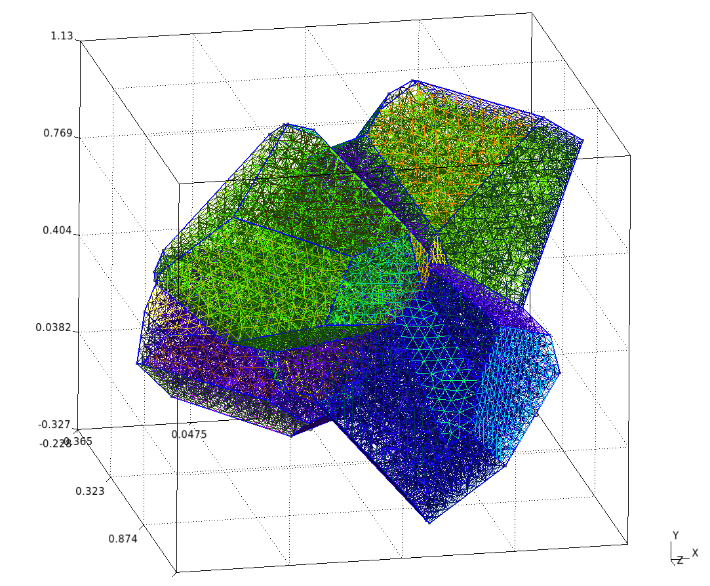

Simulation options
------------------

The main executable for this test case is **uniaxial-polycrystal**. Its command-line options are:

.. code-block:: bash

  ./uniaxial-polycrystal --help

Main options
~~~~~~~~~~~~

.. list-table:: Executable options
   :header-rows: 1

   * - Option
     - Type
     - Default
     - Description
   * - ``-h, --help``
     - —
     - —
     - Print the help message and exit.
   * - ``-m <string>, --mesh <string>``
     - string
     - ``mesh/5crystals.msh``
     - Mesh file to use.
   * - ``-f <string>, --vect <string>``
     - string
     - ``mesh/vectors_5crystals.txt``
     - Vector file to use.
   * - ``-l <string>, --library <string>``
     - string
     - ``src/libBehaviour.so``
     - Material library.
   * - ``-b <string>, --behaviour <string>``
     - string
     - ``Mono_UO2_Cosh_Jaco3``
     - Mechanical behaviour.
   * - ``-o <int>, --order <int>``
     - int
     - ``1``
     - Finite element order (polynomial degree).
   * - ``-r <int>, --refinement <int>``
     - int
     - ``0``
     - Mesh refinement level.
   * - ``-v <int>, --verbosity-level <int>``
     - int
     - ``0``
     - Output verbosity level.
   * - ``-d <double>, --duration <double>``
     - double
     - ``200``
     - Simulation duration.
   * - ``-n <int>, --nstep <int>``
     - int
     - ``600``
     - Number of time steps.
   * - ``--linear-solver <string>``
     - string
     - ``HyprePCG``
     - Linear solver to use.
   * - ``--linear-solver-preconditioner <string>``
     - string
     - ``HypreBoomerAMG``
     - Preconditioner for the linear solver. Use ``none`` to disable.
   * - ``--macroscopic-stress-output-file <string>``
     - string
     - ``uniaxial-polycrystal.res``
     - Output file containing the evolution of the deformation gradient and the Cauchy stress.
   * - ``--enable-post-processings``
     - bool
     - ``false``
     - Execute post-processing steps.
   * - ``--enable-export-von-Mises-stress``
     - bool
     - ``false``
     - Export von Mises stress.
   * - ``--enable-export-first_eigen_stress``
     - bool
     - ``false``
     - Export the first eigen stress.

.. note::

  To generate the grain orientation vectors, use the ``randomVectorGeneration`` tool provided in the distribution. This ensures a consistent and physically realistic initialization of crystallographic orientations.

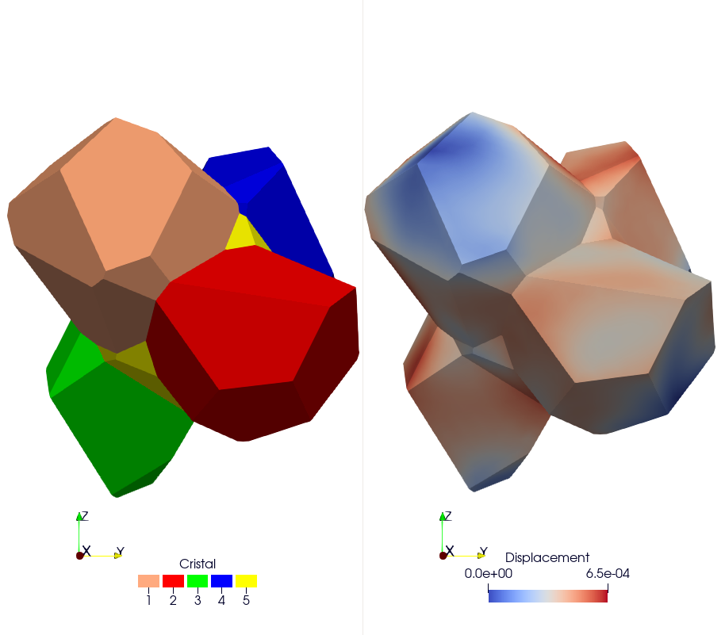

Results & Post-processing
--------------------------

You can run the simulation in parallel using MPI:

.. code-block:: bash

   mpirun -n 16 ./uniaxial-polycrystal

Check Results
-------------

By default, the simulation generates the file ``uniaxial-polycrystal.res``.

Plot and Compare:
~~~~~~~~~~~~~~~~~

To visualize and compare the results:

.. code-block:: bash

  python3 plot_polycrystal_results.py

This script generates the figure `plot_polycrystal.png` (Figure 6), showing a comparison between Cast3M and MFEM-MGIS results. The Cast3M curve shows minor oscillations due to time-step discretization. The MFEM-MGIS implicit formulation (full Newton algorithm using tangent stiffness) exhibits robust quadratic convergence and excellent parallel performance.

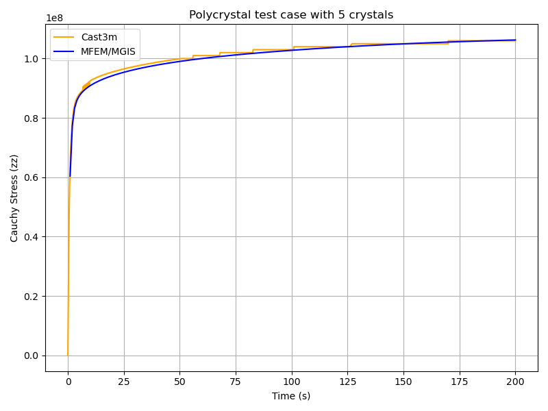

Check the Values
~~~~~~~~~~~~~~~~

To verify simulation results:

.. code-block:: bash

   python3 check_polycrystal_restults.py

Expected output: ``Check PASS``.

Example detailed output:

.. code-block:: text

      Time     MFEM/MGIS       CAST3M  RelDiff_% Status
   0      1.0  6.041066e+07   63100000.0   4.451762     OK
   1      2.0  7.737121e+07   79000000.0   2.105167     OK
   2      3.0  8.327457e+07   84300000.0   1.231384     OK
   3      4.0  8.583679e+07   86600000.0   0.889139     OK
   4      5.0  8.730071e+07   87900000.0   0.686468     OK
   ..     ...           ...          ...        ...    ...
  595  199.0  1.062465e+08  106000000.0  -0.231979     OK
  596  199.0  1.062465e+08  106000000.0  -0.231979     OK
  597  200.0  1.062661e+08  106000000.0  -0.250424     OK
  598  200.0  1.062661e+08  106000000.0  -0.250424     OK
  599  200.0  1.062661e+08  106000000.0  -0.250424     OK

This table shows the comparison between simulated Cauchy stress values and the reference Cast3M results, with relative differences and status indicators.

Simulation of pressurized bubbles
=================================

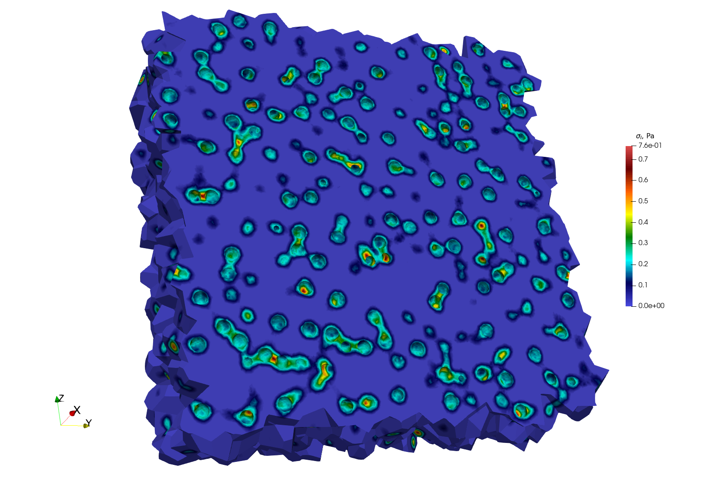

Repository: ``https://github.com/rprat-pro/mm-opera-hpc/tree/main/bubble``

Problem description
-------------------

The default example is constituted by a single spherical porosity in a quasi-infinite medium. The finite element solution can be compared with an analytical solution giving the elastic stress field as a function of the internal pressure, the bubble radius, and the distance from the bubble. As mentioned above, the boundary conditions for the problem are periodical, and we consider a null macroscopic displacement gradient, which in turns generate a uniform compressive hydrostatic pressure on the REV. In this case with one porosity in a quasi-infinite medium, the compressive hydrostatic pressure is negligeable, in agreement with the analytical solution mentioned above.

Modify the geometry for the single bubble case and mesh it
~~~~~~~~~~~~~~~~~~~~~~~~~~~~~~~~~~~~~~~~~~~~~~~~~~~~~~~~~~

The geometry for the test case is contained in the file ``.geo`` stored in the ``mesh``
folder, and considers a sphere of radius equal to 400 nm at the centre of a (periodic)
cube of 10 µm of size. For a more handy management of the geometry and of the mesh, the
units in the geometry file are expressed in :math:`\mathrm{\mu m}`. One can modify it and
use it as an input for ``gmsh`` to generate the computational mesh for the case by:

.. code-block:: bash

  gmsh -3 single_sphere.geo

A file ``.msh`` is already provided in the folder ``mesh``, generated based on the
aforementioned geometry file. We have seen some slight differences in the final mesh based
on the version of ``gmsh`` employed.

.. note::
   If the bubble center, radius, or the surface label are modified, the corresponding data
   stored in ``single_bubble.txt`` must also be changed.

.. note::
   ``single_bubble_ci.txt`` is used for GitHub continuous integration.

Set-up the physical problem
---------------------------

The simulation considers an empty (i.e., not meshed) cavity, on whose surface we impose an
arbitrary uniform pressure (unitary by default). The medium is described by a purely
elastic constitutive relationship, characterized by two elastic constants:

- :math:`E = 150\ \mathrm{N}\ \mu\mathrm{m}^{-3}`
- :math:`\nu = 0.3`

The elastic modulus is rescaled to coherently describe the geometry in micrometers, rather
than in S.I. units. This choice is done to facilitate the creation of more complex
geometries when using ``Mérope``, given the characteristic length scale of the considered
inclusions.

The geometry is meshed using quadratic elements, to better describe the spherical
inclusions contained in the representative elementary volume (REV). Despite ``MFEM``
allowing sub-, super-, and isoparametric analyses, we recommend to stick at least to the
isoparametric choice (i.e., not subparametric) for the polynomial shape functions.

The boundary conditions for the problem are periodical, and we consider a null macroscopic
displacement gradient, which in turn generates a uniform compressive hydrostatic pressure
on the REV.

Parameters
~~~~~~~~~~

Command-line Usage:

.. code-block:: bash

   Usage: ./test-bubble [options] ...

.. list-table::
   :header-rows: 1
   :widths: 20 10 20 50

   * - Option
     - Type
     - Default
     - Description
   * - ``-h, --help``
     - —
     - —
     - Print the help message and exit.
   * - ``-m <string>, --mesh <string>``
     - string
     - ``mesh/single_sphere.msh``
     - Mesh file to use.
   * - ``-l <string>, --library <string>``
     - string
     - ``src/libBehaviour.so``
     - Material behaviour library.
   * - ``-f <string>, --bubble-file <string>``
     - string
     - ``mesh/single_bubble.txt``
     - File containing the bubble definitions.
   * - ``-o <int>, --order <int>``
     - int
     - ``2``
     - Finite element order (polynomial degree).
   * - ``-r <int>, --refinement <int>``
     - int
     - ``0``
     - Refinement level of the mesh (default = 0).
   * - ``-p <int>, --post-processing <int>``
     - int
     - ``1``
     - Run the post-processing step.
   * - ``-v <int>, --verbosity-level <int>``
     - int
     - ``0``
     - Verbosity level of the output.

The command to execute the test-case is:

.. code-block:: bash

   mpirun -n 6 ./test-bubble

Below we show a contour plot of the :math:`YY` component of the stress tensor (upper
half of the cube) and of the first principal stress (bottom half of the cube).

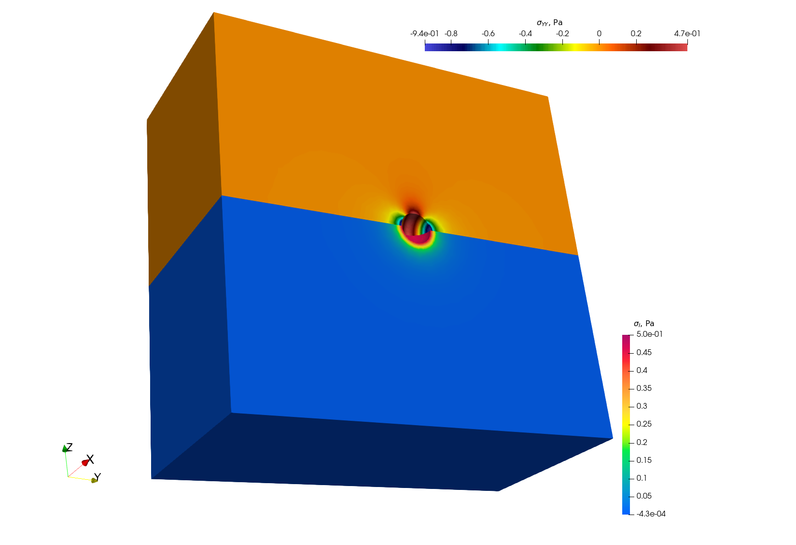

Verification against the analytical solution
--------------------------------------------

The problem of a pressurized spherical inclusion in an infinite elastic medium has a
closed-form solution for the expressions of the hoop stress as a function of the distance
from the sphere center:

.. math::

   \sigma_{\theta\theta}(r) \;=\; \dfrac{p_{in}\,R_b^3}{2\,r^3}

where :math:`p_{in}` is the internal pressure, :math:`R_b` the bubble radius, and the
expression holds for :math:`r > R_b`.

The script available in ``verification/bubble`` can be used to compare the analytical
solution to the MMM one:

.. code-block:: bash

   python3 mmm_vs_analytical.py

The comparison between the computational results and the analytical solution is showed below.

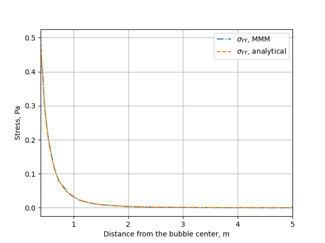

Cermet simulation
=================

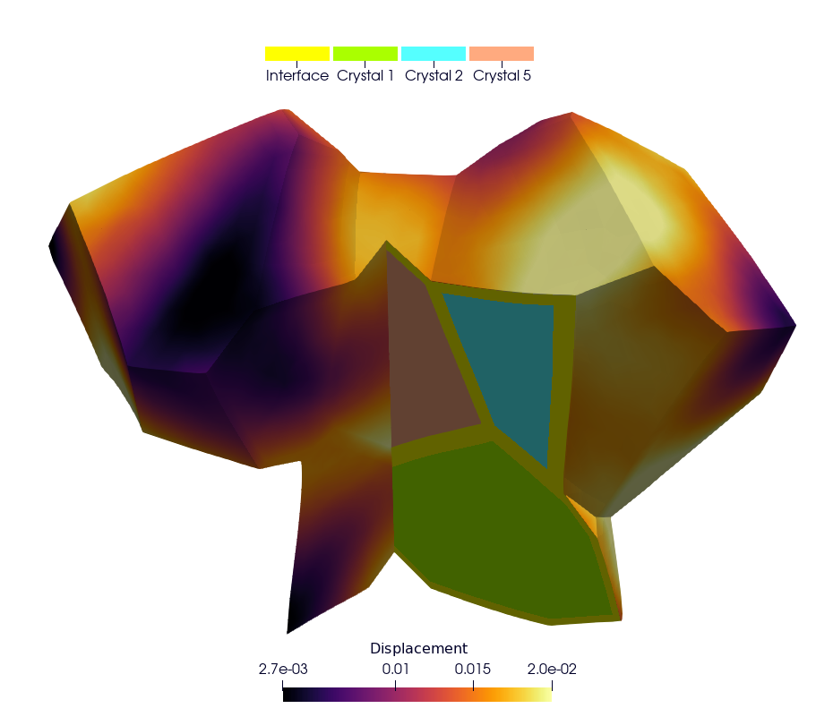

Repository: ``https://github.com/rprat-pro/mm-opera-hpc/tree/main/cermet``

Description
-----------

This case is similar to the ``UO2`` polycrystal with the addition of a metallic interface
at the grain boundary. In the Gmsh mesh each grain has a material ID (from 2 to
:math:`N_{\text{grain}} + 1`), as well as its orientation needed for the orthotropic
basis. The metallic interface has the material ID equal to 1, and is considered to be made
of an isotropic elasto-viscoplastic material. In addition to the mechanical analysis, this
example implements a fixed-point algorithm enabling the simulation of a uniaxial
compression/tensile test with periodic boundary conditions.

**Parameters**

- **Boundary conditions:** periodic boundary conditions are applied on the RVE faces.  
  The loading is imposed in one direction, ensuring compatibility and equilibrium across
  periodic faces. More precisely, the axial component :math:`F_{zz}` of the macroscopic
  deformation gradient is imposed. The off-diagonal components of the macroscopic
  deformation gradient are set to zero.  
  The components :math:`F_{xx}` and :math:`F_{yy}` are the unknowns, determined via the
  fixed-point algorithm imposing null values for the components :math:`S_{xx}` and
  :math:`S_{yy}` of the macroscopic Cauchy stress tensor.  
  The main result used for verification is a stress-strain curve with the evolution of the
  axial component :math:`S_{zz}` of the Cauchy stress as a function of :math:`F_{xx}`.

- **[Crystal] Constitutive law:**  
  The UO₂ crystal plasticity law used in the example is detailed in the reference [#portelette2018]_.  
  The corresponding MFront file is available on the MMM GitHub repository.  
  For uranium dioxide, the crystal symmetry is cubic, with the following orthotropic
  elastic properties:

  - Young's modulus = :math:`222\times10^9\ \text{Pa}`
  - Poisson ratio = 0.27
  - Shear modulus = :math:`54\times10^9\ \text{Pa}`

- **[Metallic Interface] Constitutive law:**  
  The Norton creep law used for the interface is derived from the elasto-viscoplastic
  properties of chromium coatings used in eATF claddings, as proposed in the literature.  
  The corresponding MFront file is available on the MMM GitHub repository.

- **Elastic properties:**
  - Young's modulus = :math:`276\times10^9\ \text{Pa}`
  - Shear modulus = :math:`54\times10^9\ \text{Pa}`

- **Norton creep law:**

  .. math::

     \dot{\varepsilon}_{eq} =
     \frac{A D_0 \exp\!\left(-\frac{Q}{R T}\right)}{b^2}
     \left( \frac{\sigma_{eq}}{C} \right)^n

  with the parameters:

  - :math:`A = 2.5\times10^{11}` [a.u.]
  - :math:`n = 4.75`
  - :math:`Q = 3.0627\times10^{5}` [a.u.]
  - :math:`D_0 = 1.55\times10^{-5}` [a.u.]
  - :math:`b = 2.5\times10^{-10}` [a.u.]

- **Finite element order:** 1 (linear interpolation)
- **Finite element space:** H1
- **Simulation duration:** 200 s
- **Number of time steps:** 500
- **Linear solver:** HyprePCG (solver / preconditioner)

Mesh generation
---------------

This section explains how to generate a sample mesh with ``Merope``.

Before running the script, make sure that the environment variable
``MEROPE_DIR`` is properly loaded.

Then, you can generate the mesh in two steps:

.. code-block:: bash

   source ${MEROPE_DIR}/Env_Merope.sh
   python3 mesh/5grains.py    # generate 5grains.geo
   gmsh -3 5grains.geo        # generate 5grains.msh

You will obtain a 3D mesh (``5grains.msh``) of a polycrystalline sample with 5 grains.

Options
-------

**Mesh Generation Examples**

The mesh can be customized by adjusting the input parameters in the Python script.

Below are two examples:

Small Example
~~~~~~~~~~~~~

This setup generates a small polycrystalline mesh (Gmsh version ``11.1``):

- 5 grains
- 12,992 nodes
- 88,687 elements

.. code-block:: python

   L = [1, 1, 1]
   nbSpheres = 20 
   distMin = 0.3
   randomSeed = 0
   layer = 0.02
   MeshOrder = 1
   MeshSize = 0.05

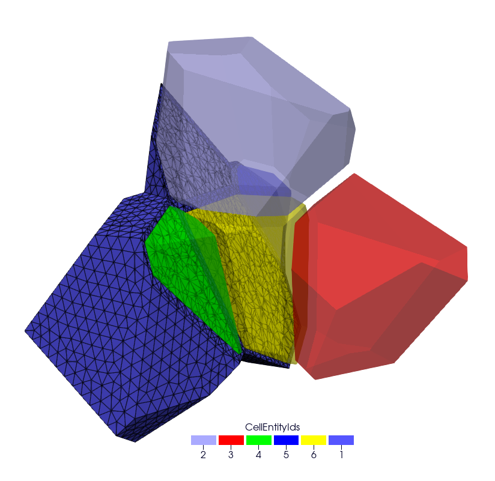

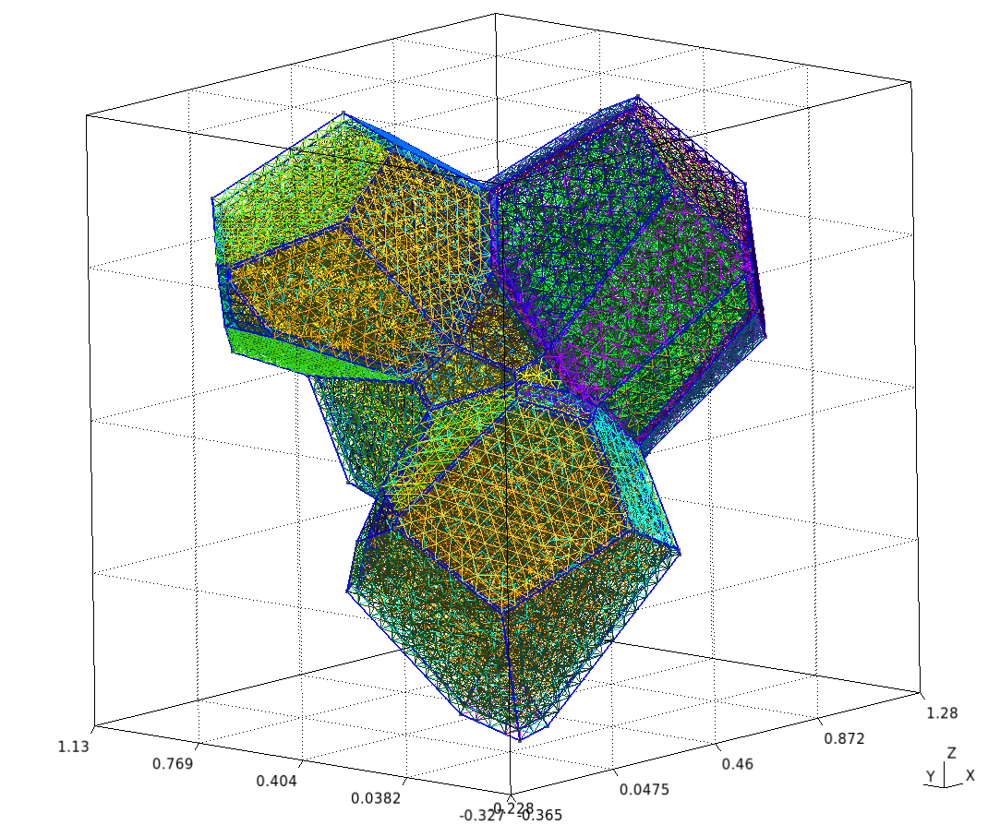

Large Example
~~~~~~~~~~~~~

This setup generates a realistic polycrystalline mesh with:

- 250 grains
- 12,913,361 nodes
- 86,213,779 elements

.. code-block:: python

   L = [5, 5, 5]
   nbSpheres = 250
   distMin = 0.1
   randomSeed = 0
   layer = 0.04
   MeshOrder = 1
   MeshSize = 0.02

Run your simulation
-------------------

Command-line Usage
~~~~~~~~~~~~~~~~~~

.. code-block:: bash

   Usage: ./cermet [options] ...

.. list-table::
   :header-rows: 1
   :widths: 25 10 25 60

   * - Option
     - Type
     - Default
     - Description
   * - ``-h, --help``
     - —
     - —
     - Print the help message and exit.
   * - ``-m <string>, --mesh <string>``
     - string
     - ``mesh/5grains.msh``
     - Mesh file to use.
   * - ``-o <int>, --order <int>``
     - int
     - ``1``
     - Finite element order (polynomial degree).
   * - ``-r <int>, --refinement <int>``
     - int
     - ``0``
     - Refinement level of the mesh (default = 1).
   * - ``-p <int>, --post-processing <int>``
     - int
     - ``1``
     - Run the post-processing step.
   * - ``-v <int>, --verbosity-level <int>``
     - int
     - ``0``
     - Verbosity level of the output.
   * - ``-d <double>, --duration <double>``
     - double
     - ``200``
     - Duration of the simulation (default = 5).
   * - ``-n <int>, --nstep <int>``
     - int
     - ``400``
     - Number of simulation steps (default = 40).
   * - ``-f <string>, --file <string>``
     - string
     - ``vectors_5grains.txt``
     - Vector file to use.
   * - ``--macroscopic-stress-output-file <string>``
     - string
     - ``cermet.res``
     - Main output file containing:
       - Evolution of the diagonal components of the deformation gradient.
       - Evolution of the diagonal components of the Cauchy stress.

How to Run it
~~~~~~~~~~~~~

You can run the simulation in parallel using MPI.  
Below are two examples.

**Basic Test**

Runs a short simulation with:

- Duration = 0.5 s
- 1 timestep
- Mesh = 5grains.msh
- Refinement level = 0

.. code-block:: bash

   mpirun -n 12 ./cermet --duration 0.5 --nstep 1

**Full Test**

Runs a longer simulation with:

- Duration = 200 s
- 400 timesteps
- Custom mesh (``yourmesh.msh``)
- Refinement level = 1

.. code-block:: bash

   mpirun -n 12 ./cermet --duration 200 --nstep 400 -r 1 --mesh yourmesh.msh

Results
-------

By default, the simulation generates the file ``cermet.res`` when running:

.. code-block:: bash

   mpirun -n 12 ./cermet

To validate the results, the Cauchy stress component in the z-direction
(:math:`\overline{\sigma}_{zz}`) can be compared with reference values obtained from
Cast3M.

Plot and Compare
~~~~~~~~~~~~~~~~

To visualize and compare the results, run the following Python script:

.. code-block:: bash

   python3 plot_cermet_results.py

This script generates a figure named ``plot_cermet.png`` as shown below.  
In this figure, we observe good agreement between Cast3M and MFEM-MGIS results.
As observed for the polycrystal test case, there are some oscillations in the Cast3M
solution, which is of poorer quality compared to the MFEM-MGIS results.  
The main conclusion is that the implicit formulation of MFEM-MGIS (full Newton algorithm
using the tangent stiffness) is highly performant—thanks to quadratic convergence and
parallelization—and provides a high-quality solution.  
For verification, the number of time steps has been significantly increased to minimize
the oscillations observed in Cast3M.

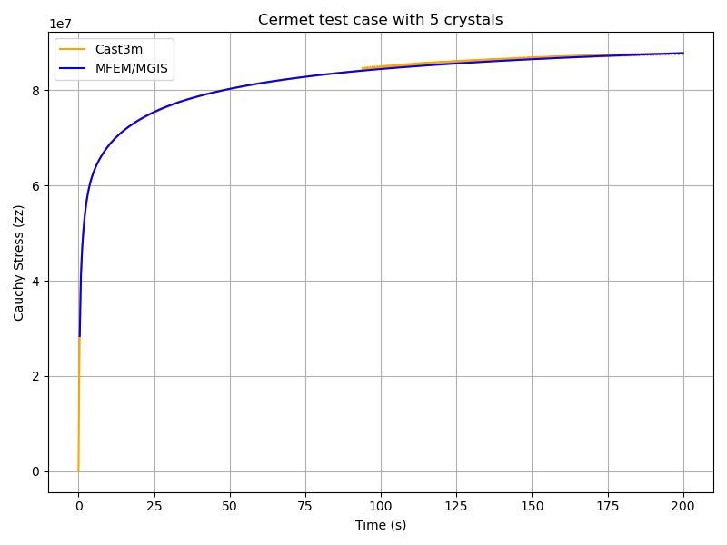

Check the Values
~~~~~~~~~~~~~~~~

To verify the simulation results, run::

   python3 check_cermet_restults.py

The expected output is: ``Check PASS``.

Example of the detailed output:

.. code-block:: text

              Time     MFEM/MGIS      CAST3M  RelDiff_% Status
	0      0.4  2.837174e+07  29462000.0   3.842755     OK
	1      0.8  4.101172e+07  41798000.0   1.917200     OK
	2      1.2  4.674008e+07  47113000.0   0.797856     OK
	3      1.6  5.042402e+07  50687000.0   0.521535     OK
	4      2.0  5.321536e+07  53452000.0   0.444677     OK
	..     ...           ...         ...        ...    ...
	495  198.4  8.775101e+07  87802000.0   0.058103     OK
	496  198.8  8.775917e+07  87724000.0  -0.040076     OK
	497  199.2  8.776730e+07  87804000.0   0.041820     OK
	498  199.6  8.777539e+07  87814000.0   0.043988     OK
	499  200.0  8.778345e+07  87737000.0  -0.052917     OK

				[500 rows x 5 columns]
				Check PASS.

This table shows the comparison between the simulated Cauchy stress values and the
reference Cast3M results, along with the relative difference and a status check.

TensileTest
===========

website : https://github.com/latug0/mfem-mgis-examples/tree/master/ex1

Description:
------------

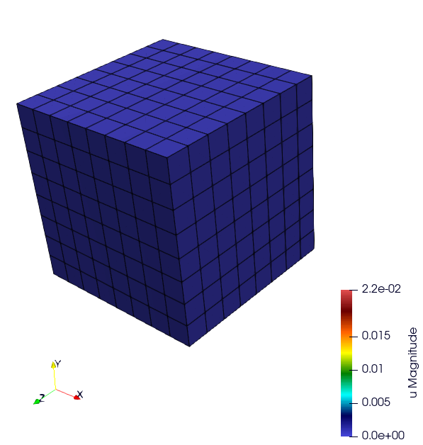

.. figure:: img/ex1End.png
   :alt: Illustration of the start of the TensileTest simulation.

.. warning::

  Complet the description

Problem Solved
--------------

.. code:: text

  Export the internal value name plasticity strain 

  Solver : Conjugate Gradient (default)
  Preconditioner : Depends on the solver

  The default is plasticity, behavior law parameter are defined into the lib loaded.

  Element: 
  - Family H1
  - Order 1

Run This Simulation
-------------------

.. code-block:: bash

  mpirun -n 10 ./UniaxialTensileTestEx -m cube.mesh -l  src/libBehaviour.so -b Plasticity -r Plasticity.ref -ls 1 -p 1 -v EquivalentPlasticStrain

Available options
-----------------

To customize the simulation, several options are available, as detailed
below.

+---------------------------------+--------------------------------------------+
| Command line                    | Descritption                               |
+=================================+============================================+
| --mesh or -m                    | specify the mesh “.msh” used (default =    |
|                                 | inclusion.msh)                             |
+---------------------------------+--------------------------------------------+
| --refinement or -r              | The reference file                         |
|                                 | (default = Plasticity.ref)                 |
+---------------------------------+--------------------------------------------+
| --behaviour or -b               | Name of the behaviour law                  |
|                                 | (default = Plasticity)                     |
+---------------------------------+--------------------------------------------+
| --internal-state-variable or -v | Internal variable name to be post-processed|
|                                 | (default = EquivalentPlasticStrain)        |
+---------------------------------+--------------------------------------------+
| --library or -l                 | Material library                           |
|                                 | (default = src/libBehaviour.so)            |
+---------------------------------+--------------------------------------------+
| --linearsolver or -ls           | identifier of the linear solver: 0 -> CG,  |
|                                 | 1 -> GMRES, 2 -> UMFPack (serial),         |
|                                 | 3-> MUMPS(serial), 2 -> HypreFGMRES (//),  | 
|                                 | 3 -> HyprePCG (//), 4 -> HypreGMRES (//).  |
+---------------------------------+--------------------------------------------+
| --order or -o                   | Finite element order (polynomial degree)   |
|                                 | (default = 2)                              |
+---------------------------------+--------------------------------------------+
| --parallel or -p                | run parallel execution                     |
|                                 | (default = 0, serial)                      |
+---------------------------------+--------------------------------------------+

Ssna303 Example (2D and 3D)
===========================

This tutorial deals with a 2D (plane strain) tensile test (ex2) and 3D (ex4) on a notched beam modeled by finite-strain plastic behavior. See the tutorial section. 

- website 2D example: https://github.com/latug0/mfem-mgis-examples/tree/master/ex2
- website 3D example : https://github.com/latug0/mfem-mgis-examples/tree/master/ex4

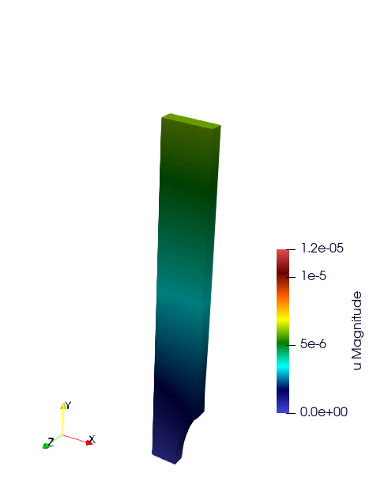

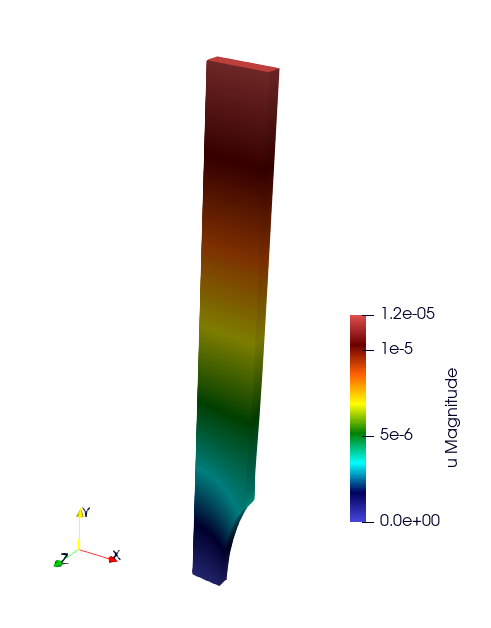

Satoh
=====

website: https://github.com/latug0/mfem-mgis-examples/tree/master/ex5

Description:
------------

Modelling plate of length 1 in plane strain clamped on the left and right boundaries and submitted to a parabolic thermal gradient along the x-axis. (source code 5)

.. figure:: img/SatohTest.png
   :alt: Illustration of the displacement of the plate.

Problem solved
--------------

.. code:: text

  This test models a 2D plate of lenght 1 in plane strain clamped on the left
  and right boundaries and submitted to a parabolic thermal gradient along the
  x-axis:
  
  - the temperature profile is minimal on the left and right boundaries
  - the temperature profile is maximal for x = 0.5
  
  This example shows how to define an external state variable using an
  analytical profile.

  Solver : UMFPackSolver
  Preconditioner : None

  Elastic behavior law parameters :
  [ parameters       , material ]
  [ Young Modulus    , 150e9    ];
  [ Poisson Ratio    , 0.3      ];
  [ Temperature      , 293.15   ];

  Element: 
  - Family H1
  - Order 2

Run the simulation
------------------

Paramerters are hardcode into this example.

.. code-block:: bash

  ./SatohTest

.. note::

  If you want to run this example in parallel, you'll have to change the solver too.

Representative Volume Element with Elastic inclusions
=====================================================

Simulation of a Representative Volume Element (RVE) with a non-linear elastic behavior law. A geometry mesh is provided : "inclusions_49.geo". The mesh can be generated using the following command: gmsh -3 inclusions_49.geo. By modifying the parameters within the .geo file, such as the number of spheres and the size of the element mesh, you can control and customize the simulation accordingly. (code source: ex6)

.. figure:: img/ex6half.png
   :alt: Slice of a RVE with 49 spheres.

.. figure:: img/ex6full.png
   :alt: RVE with 49 spheres.

Build the mesh
--------------

Use GMSH to mesh the geometry. Files ``.geo`` is in the depository ``ex6``. Command line:

.. code:: bash

   # generate the .msh file with GMSH
   gmsh -3 inclusions_49.geo 

Run the Simulation
------------------

.. code:: bash

  mpirun -n 12 ./rve --mesh inclusions_49.msh --verbosity-level 0 

Available options
~~~~~~~~~~~~~~~~~

To customize the simulation, several options are available, as detailed
below.

+-------------------------+--------------------------------------------+
| Command line            | Descritption                               |
+=========================+============================================+
| --mesh or -m            | specify the mesh “.msh” used (default =    |
|                         | inclusion.msh)                             |
+-------------------------+--------------------------------------------+
| --refinement or -r      | refinement level of the mesh (default = 0) |
+-------------------------+--------------------------------------------+
| --order or -o           | Finite element order (polynomial degree)   |
|                         | (default = 2)                              |
+-------------------------+--------------------------------------------+
| --verbosity-level or -v | choose the verbosity level (default = 0)   |
+-------------------------+--------------------------------------------+
| --post-processing or -p | run post processing step (default = 1)     |
+-------------------------+--------------------------------------------+

Representative Volume Element of Combustible Mixed Oxides for Nuclear Applications
==================================================================================

This simulation represents an RVE of MOx (Mixed Oxide) material under
uniform macroscopic deformation. The aim of this simulation is to
reproduce and compare the results obtained by (Fauque et al., 2021;
Masson et al., 2020) who used an FFT method. (source code: ex7)

Problem solved
--------------

.. code:: text

       Problem : RVE MOx 2 phases with elasto-viscoplastic behavior laws

       Parameters : 

       start time = 0
       end time = 5s
       number of time step = 40

       Imposed strain tensor : 
               [ -a/2 ,   0  ,  0 ]
       eps  =  [   0  , -a/2 ,  0 ] 
               [   0  ,   0  ,  a ]
       with a = 0.012

       Solver : HyprePCG
       Preconditioner : HypreBoomerAMG

       Moduli and Norton behavior law parameters :
       [ parameters       , inclusions   , matrix ]
       [ Young Modulus    , 8.182e9  , 2*8.182e9  ];
       [ Poisson Ratio    , 0.364    , 0.364      ];
       [ Stress Threshold , 100.0e6  , 100.0e12   ];
       [ Norton Exponent  , 3.333333 , 3.333333   ];
       [ Temperature      , 293.15   , 293.15     ];

       Element :
       - Familly H1
       - Order 2

.. figure:: img/mox-order2.png
   :alt: Illustration of a RVE with 634 spheres after 5 seconds.

   Illustration of a RVE with 634 spheres after 5 seconds.

How to run the simulation “RVE MOX”
-----------------------------------

Build the mesh
--------------

The mesh is generated with MEROPE and GMSH through the following steps:

-  First step, use MEROPE to generate a ``.geo`` file using the RSA
   algorithm. Scripts are in directory ``script_merope``. Command line:

.. code:: bash

   # generate .geo file with MEROPE
   python3 script_17percent_minimal.py

-  Second step, use GMSH to mesh the geometry. Files ``.geo`` are in the
   directory ``file_geo``. Command line:

.. code:: bash

   # generate the .msh file with GMSH
   gmsh -3 OneSphere.geo 

Run the simulation
------------------

Run a minimal version of the simulation
~~~~~~~~~~~~~~~~~~~~~~~~~~~~~~~~~~~~~~~

In order to run the simulation in sequential computing mode, use the
command line:

.. code:: bash

   # run the simulation by specifying the mesh with --mesh option
   ./mox2 --mesh OneSphere.msh

With ``MPI`` + ``Petsc``:

.. code:: bash
  
  mpirun -n 2 mox2 -m mesh/OneSphere.msh -o 1 --use-petsc true --petsc-configuration-file petscrc 

Available options
~~~~~~~~~~~~~~~~~

To customize the simulation, several options are available, as detailed
below.

+----------------------------+--------------------------------------------+
| Command line               | Descritption                               |
+============================+============================================+
| --mesh or -m               | Specify the mesh “.msh” used (default =    |
|                            | inclusion.msh)                             |
+----------------------------+--------------------------------------------+
| --refinement or -r         | Refinement level of the mesh (default = 0) |
+----------------------------+--------------------------------------------+
| --order or -o              | Finite element order (polynomial degree)   |
|                            | (default = 2)                              |
+----------------------------+--------------------------------------------+
| --verbosity-level or -v    | Choose the verbosity level (default = 0)   |
+----------------------------+--------------------------------------------+
| --post-processing or -p    | Run post processing step (default = 1)     |
+----------------------------+--------------------------------------------+
| --use-petsc                | Activate petsc if petsc is availabled      |
+----------------------------+--------------------------------------------+
| --petsc-configuration-file | Name of the Petsc source file              |
+----------------------------+--------------------------------------------+

Example of customized simulation:

.. code:: bash

   # run the simulation in sequential computing mode with various options
   ./mox2 -r 2 -o 3 --mesh OneSphere.msh

Parallel computing mode
~~~~~~~~~~~~~~~~~~~~~~~

The simulation can be run in parallel computing mode by using the
command:

.. code:: bash

   # run the simulation by specifying the mesh with --mesh option
   mpirun -n 12 ./mox2 --mesh 634Spheres.msh

Simulation can be run on supercomputers. The command depends on the
server manager. For example, on Topaze, a CCRT-hosted supercomputer
co-designed by Atos and CEA, the commands are :

.. code:: bash

   ccc_mprun -n 8 -c 1 -p milan ./mox2 -r 0 -o 3 --mesh OneSphere.msh
   ccc_mprun -n 2048 -c 1 -p milan ./mox2 -r 2 -o 1 --mesh 634Sphere.msh

Post-processing of simulation data
----------------------------------

The aim of this exercise is to reproduce the simulation results of
(Fauque et al., 2021; Masson et al., 2020). To this end, the average
stresses in the z-axis direction (SZZ) will be analyzed. The reference
values, obtained by (Fauque et al., 2021; Masson et al., 2020), can be
found in the directory ``results``, file res-fft.txt (Average stress
versus time).

Extract simulation data from MMM
~~~~~~~~~~~~~~~~~~~~~~~~~~~~~~~~

The avgStress post-processing file generated by MMM contains average
stress values as a function of time, by material phase. MMM simulation
data are available: ``results/res-mfem-mgis-onesphere-o3.txt`` and
``results/res-mfem-mgis-634sphere-o2.txt``.

For example, the average stress SZZ over the RVE (composed of 83% matrix
and 17% inclusion) can be calculated with the awk command under unix:

.. code:: bash

   awk '{if(NR>13) print $1 " " 0.83*$4+0.17*$10}' avgStress > res-mfem-mgis.txt

Display results with gnuplot
~~~~~~~~~~~~~~~~~~~~~~~~~~~~

.. code:: bash

   gnuplot> plot "res-fft.txt" u 1:10 w l title "fft"
   gnuplot> replot "res-mfem-mgis.txt" u 1:2 w l title "mfem-mgis"

References
----------
.. [#josien2024] Josien, M.  
   *Mérope: A microstructure generator for simulation of heterogeneous materials.*  
   *Journal of Computational Science*, **81**, 102359 (2024).

.. [#portelette2018] Portelette, L., Amodeo, J., Madec, R., *et al.*  
   *Crystal viscoplastic modeling of UO₂ single crystal.*  
   *Journal of Nuclear Materials*, **510**, 635–643 (2018).
