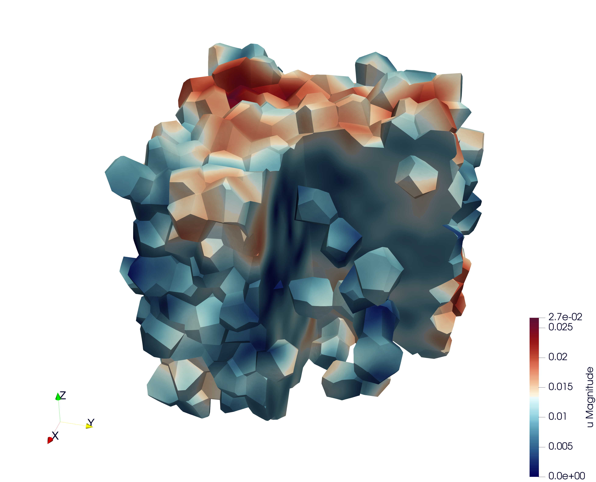
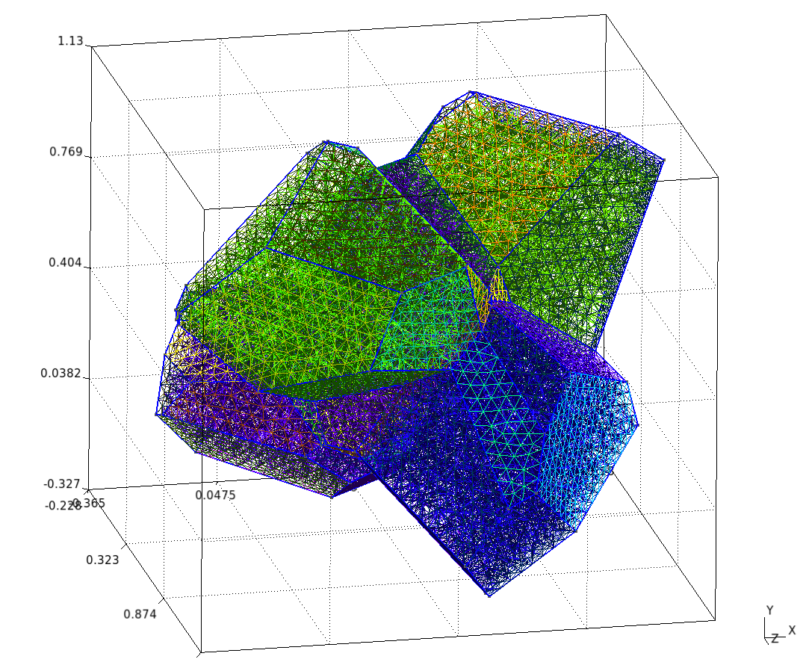
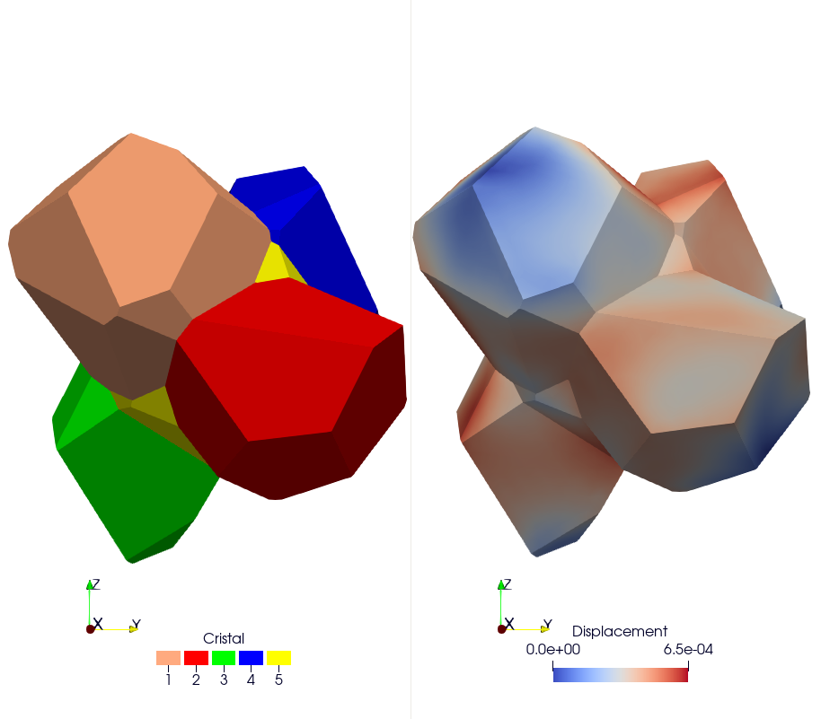
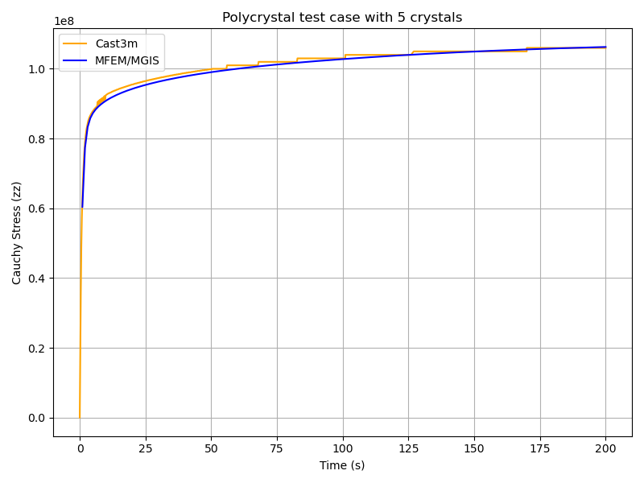

Polycrystal
===========

.. contents::

Repository: ``https://github.com/rprat-pro/mm-opera-hpc/tree/main/polycrystal``

Problem definition
------------------

This test case illustrates the simulation of a **Representative Volume Element (RVE)** of a polycrystal made of uranium dioxide (UO₂). The objective is to study the mechanical response of the material under uniaxial loading. This example also implements a fixed-point algorithm that enables the simulation of a uniaxial compression/tensile test with periodic boundary conditions.

**Boundary conditions**

* Periodic boundary conditions are applied on the RVE faces.
* The loading is imposed in one direction (axial component :math:`F_{zz}` of the macroscopic deformation gradient). The off-diagonal components of the macroscopic deformation gradient are set to zero.
* The macroscopic unknowns :math:`F_{xx}` and :math:`F_{zz}` are determined via a fixed-point algorithm imposing :math:`S_{xx}=S_{yy}=0` (macroscopic components of the Cauchy stress tensor).
* The main verification result is the stress-strain curve: :math:`S_{zz}` (Cauchy) versus :math:`F_{xx}`.

Numerical and physical parameters

* **Finite element order:** 1 (linear interpolation)
* **Finite element space:** :math:`H^1`
* **Simulation duration:** 200 s
* **Number of time steps:** 600

**Constitutive law (crystal)**

The ``UO₂`` crystal plasticity law used in this example is described in reference [#portelette2018]_, and the corresponding MFront file is available on the MMM GitHub repository. In the case of uranium dioxide, the crystal symmetry is cubic, and the corresponding orthotropic elastic properties used in the crystal plasticity law are:

* Young's modulus = 222.e9 Pa
* Poisson's ratio = 0.27
* Shear modulus = 54.e9 Pa

The orthotropic basis of each grain is provided as input material data, precomputed from the grain Euler angles. The fixed-point algorithm uses the homogenized elastic properties of the polycrystal to predict the displacement gradient required to converge toward a uniaxial tensile test. These macroscopic properties are derived from the single-crystal elastic constants given above, taking the mean values of the Voigt and Reuss bounds for an isotropic polycrystal (see `MacroscropicElasticMaterialProperties.cxx` in the repository).

Mesh generation
---------------

This section explains how to generate a sample mesh using the **Merope** toolkit [#josien2024]_.

Before running the script, ensure that the environment variable `MEROPE_DIR` is properly loaded:

.. code-block:: bash

   source ${MEROPE_DIR}/Env_Merope.sh

Then, generate the mesh in two steps:

.. code-block:: bash

   source ${MEROPE_DIR}/Env_Merope.sh
   python3 mesh/5crystals.py # generates 5crystals.geo
   gmsh -3 5crystals.geo     # generates 5crystals.msh

You will obtain a 3D mesh (`5crystals.msh`) of a polycrystalline sample composed of 5 grains.

Mesh generation options
~~~~~~~~~~~~~~~~~~~~~~~

The following parameters are set in the ``mesh/5crystals.py`` script:

.. code-block:: python

    L = [1, 1, 1]        # Dimensions of the RVE box
    nbSpheres = 5        # Number of grains (polycrystal composed of 5 crystals)
    distMin = 0.4        # Minimum distance between sphere centers
    randomSeed = 0       # Random seed for reproducibility
    MeshOrder = 1        # Polynomial order of elements
    MeshSize = 0.05      # Target mesh size

The resulting polycrystal is composed of 5 grains.

Mesh Polycrystal composed of 5 crystals
~~~~~~~~~~~~~~~~~~~~~~~~~~~~~~~~~~~~~~~

Simulation options
------------------

The main executable for this test case is **uniaxial-polycrystal**. Its command-line options are:

.. code-block:: bash

   ./uniaxial-polycrystal --help

Main options
~~~~~~~~~~~~

.. list-table:: Executable options
    :header-rows: 1

    * - Option
      - Type
      - Default
      - Description
    * - ``-h, --help``
      - —
      - —
      - Print the help message and exit.
    * - ``-m <string>, --mesh <string>``
      - string
      - ``mesh/5crystals.msh``
      - Mesh file to use.
    * - ``-f <string>, --vect <string>``
      - string
      - ``mesh/vectors_5crystals.txt``
      - Vector file to use.
    * - ``-l <string>, --library <string>``
      - string
      - ``src/libBehaviour.so``
      - Material library.
    * - ``-b <string>, --behaviour <string>``
      - string
      - ``Mono_UO2_Cosh_Jaco3``
      - Mechanical behaviour.
    * - ``-o <int>, --order <int>``
      - int
      - ``1``
      - Finite element order (polynomial degree).
    * - ``-r <int>, --refinement <int>``
      - int
      - ``0``
      - Mesh refinement level.
    * - ``-v <int>, --verbosity-level <int>``
      - int
      - ``0``
      - Output verbosity level.
    * - ``-d <double>, --duration <double>``
      - double
      - ``200``
      - Simulation duration.
    * - ``-n <int>, --nstep <int>``
      - int
      - ``600``
      - Number of time steps.
    * - ``--linear-solver <string>``
      - string
      - ``HyprePCG``
      - Linear solver to use.
    * - ``--linear-solver-preconditioner <string>``
      - string
      - ``HypreBoomerAMG``
      - Preconditioner for the linear solver. Use ``none`` to disable.
    * - ``--macroscopic-stress-output-file <string>``
      - string
      - ``uniaxial-polycrystal.res``
      - Output file containing the evolution of the deformation gradient and the Cauchy stress.
    * - ``--enable-post-processings``
      - bool
      - ``false``
      - Execute post-processing steps.
    * - ``--enable-export-von-Mises-stress``
      - bool
      - ``false``
      - Export von Mises stress.
    * - ``--enable-export-first_eigen_stress``
      - bool
      - ``false``
      - Export the first eigen stress.

.. note::

   To generate the grain orientation vectors, use the ``randomVectorGeneration`` tool provided in the distribution. This ensures a consistent and physically realistic initialization of crystallographic orientations.

Results & Post-processing
-------------------------

You can run the simulation in parallel using MPI:

.. code-block:: bash

    mpirun -n 16 ./uniaxial-polycrystal

Check Results
-------------

By default, the simulation generates the file ``uniaxial-polycrystal.res``.

Plot and Compare:
~~~~~~~~~~~~~~~~~

To visualize and compare the results:

.. code-block:: bash

   python3 plot_polycrystal_results.py

This script generates the figure `plot_polycrystal.png` (Figure 6), showing a comparison between Cast3M and MFEM-MGIS results. The Cast3M curve shows minor oscillations due to time-step discretization. The MFEM-MGIS implicit formulation (full Newton algorithm using tangent stiffness) exhibits robust quadratic convergence and excellent parallel performance.

Check the Values
~~~~~~~~~~~~~~~~

To verify simulation results:

.. code-block:: bash

    python3 check_polycrystal_restults.py

Expected output: ``Check PASS``.

Example detailed output:

.. code-block:: text

       Time     MFEM/MGIS       CAST3M  RelDiff_% Status
    0      1.0  6.041066e+07   63100000.0   4.451762     OK
    1      2.0  7.737121e+07   79000000.0   2.105167     OK
    2      3.0  8.327457e+07   84300000.0   1.231384     OK
    3      4.0  8.583679e+07   86600000.0   0.889139     OK
    4      5.0  8.730071e+07   87900000.0   0.686468     OK
    ..     ...           ...          ...        ...    ...
   595  199.0  1.062465e+08  106000000.0  -0.231979     OK
   596  199.0  1.062465e+08  106000000.0  -0.231979     OK
   597  200.0  1.062661e+08  106000000.0  -0.250424     OK
   598  200.0  1.062661e+08  106000000.0  -0.250424     OK
   599  200.0  1.062661e+08  106000000.0  -0.250424     OK

This table shows the comparison between simulated Cauchy stress values and the reference Cast3M results, with relative differences and status indicators.

References
----------

.. [#josien2024] Josien, M.  
   *Mérope: A microstructure generator for simulation of heterogeneous materials.*  
   *Journal of Computational Science*, **81**, 102359 (2024).

.. [#portelette2018] Portelette, L., Amodeo, J., Madec, R., *et al.*  
   *Crystal viscoplastic modeling of UO₂ single crystal.*  
   *Journal of Nuclear Materials*, **510**, 635–643 (2018).