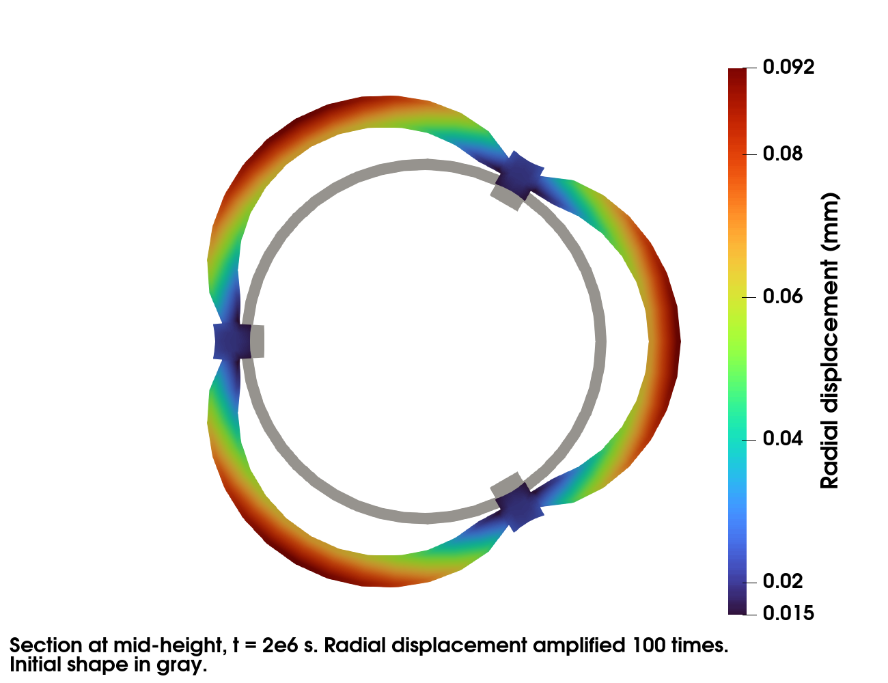

Thermomechanical Simulation of a RJH Plate
==========================================

.. contents::

website: https://github.com/latug0/mfem-mgis-examples/tree/master/ex8

This example models one ring of a RJH fuel assembly. The fuel is U3Si2. The
cladding and the stiffeners are ALFENI.

Two problems are strongly coupled at each time step by an
``IterativeCouplingScheme``:

- a heat transfer problem. The power density in the fuel increases linearly
  during a ramp, then stays constant.
- a mechanical problem at finite strain. It accounts for the thermal
  expansion, the swelling and the irradiation creep of the fuel, and for the
  plasticity of ALFENI.

The behaviours are written with MFront. The file ``MFront/README.md``
describes them.

Build the mesh
--------------

The default mesh ``mesh/assemblage_hexa.msh`` is generated by the gmsh script
``mesh/assemblage_hexa.py``. It is copied next to the executable at build
time. The script requires the ``gmsh`` Python module:

.. code-block:: bash

   cd mesh
   python3 assemblage_hexa.py --output_file assemblage_hexa.msh

The coarser mesh ``mesh/assemblage_hexa_coarse.msh`` is generated with:

.. code-block:: bash

   python3 assemblage_hexa.py --densHaut 5 --densFuelLength 8 --densFuelThick 3 \
     --densCladConn 3 --densStifThick 3 --densStifConn 3 \
     --output_file assemblage_hexa_coarse.msh

+----------------------------+-------------------------------------+-----------------------+
| Option                     | Description                         | Default               |
+============================+=====================================+=======================+
| ``--densHaut``             | Number of elements along the height | 10                    |
+----------------------------+-------------------------------------+-----------------------+
| ``--densFuelLength``       | Number of elements along the fuel   | 15                    |
|                            | length                              |                       |
+----------------------------+-------------------------------------+-----------------------+
| ``--densFuelThick``        | Number of elements across the fuel  | 5                     |
|                            | thickness                           |                       |
+----------------------------+-------------------------------------+-----------------------+
| ``--densCladConn``         | Number of elements across the       | 5                     |
|                            | cladding thickness                  |                       |
+----------------------------+-------------------------------------+-----------------------+
| ``--densStifThick``        | Number of elements across the       | 5                     |
|                            | stiffener thickness                 |                       |
+----------------------------+-------------------------------------+-----------------------+
| ``--densStifConn``         | Number of elements in the stiffener | 5                     |
|                            | outside the cladding                |                       |
+----------------------------+-------------------------------------+-----------------------+
| ``--output_file``          | Output mesh file                    | assemblage_hexa.msh   |
+----------------------------+-------------------------------------+-----------------------+

Run the simulation
------------------

This command runs the default simulation on 2 processes:

.. code-block:: bash

   mpirun -n 2 ./Thermomechanical

The results are exported to Paraview in the ``Results`` directory:

.. code-block:: bash

   paraview Results/Mechanics/Mechanics.pvd

The figures show the results at t = 2e6 s. They are computed with
``mpirun -n 4 ./Thermomechanical -et 2e6 -ns 20``. The radial displacement is
amplified 100 times. The cladding bulges between the stiffeners.

.. figure:: img/ex8-3d.png
    :alt: Radial displacement at t = 2e6 s, amplified 100 times.

At the end of the simulation, the swelling is compared to its exact value. The
end of the power ramp is a time step boundary. The power density is thus
linear over each time step, and the swelling model integrates it exactly. The
run fails if they differ.

Available options
~~~~~~~~~~~~~~~~~

+------------------------------------+-----------------------------------+--------------------------+
| Command line                       | Description                       | Default                  |
+====================================+===================================+==========================+
| ``--mesh`` or ``-m``               | Mesh file                         | assemblage_hexa.msh      |
+------------------------------------+-----------------------------------+--------------------------+
| ``--libraryU3SI2`` or ``-lU``      | Material library of the U3Si2     | src/libU3SI2-generic.so  |
|                                    | fuel                              |                          |
+------------------------------------+-----------------------------------+--------------------------+
| ``--libraryALFENI`` or ``-lA``     | Material library of the ALFENI    | src/libALFENI-generic.so |
|                                    | cladding and stiffeners           |                          |
+------------------------------------+-----------------------------------+--------------------------+
| ``--linearsolver-thermal`` or      | Linear solver of the heat         | HypreGMRES               |
| ``-lsTh``                          | transfer problem                  |                          |
+------------------------------------+-----------------------------------+--------------------------+
| ``--preconditioner-thermal`` or    | Preconditioner of the linear      | HypreBoomerAMG           |
| ``-pcTh``                          | solver of the heat transfer       |                          |
|                                    | problem                           |                          |
+------------------------------------+-----------------------------------+--------------------------+
| ``--linearsolver-mechanics`` or    | Linear solver of the mechanical   | MUMPSSolver              |
| ``-lsMc``                          | problem                           |                          |
+------------------------------------+-----------------------------------+--------------------------+
| ``--preconditioner-mechanics`` or  | Preconditioner of the linear      | HypreBoomerAMG           |
| ``-pcMc``                          | solver of the mechanical problem  |                          |
+------------------------------------+-----------------------------------+--------------------------+
| ``--order`` or ``-o``              | Finite element order              | 1                        |
+------------------------------------+-----------------------------------+--------------------------+
| ``--refinement`` or ``-r``         | Number of uniform refinements of  | 0                        |
|                                    | the mesh                          |                          |
+------------------------------------+-----------------------------------+--------------------------+
| ``--post-processing`` or ``-pp``,  | Export or not the results to      | export                   |
| ``--no-post-processing`` or        | Paraview                          |                          |
| ``-no-pp``                         |                                   |                          |
+------------------------------------+-----------------------------------+--------------------------+
| ``--verbosity-level`` or ``-v``    | Verbosity level of the linear     | 0                        |
|                                    | solvers                           |                          |
+------------------------------------+-----------------------------------+--------------------------+
| ``--debug`` or ``-d``,             | Print or not the minimum, maximum | print                    |
| ``--no-debug`` or ``-no-d``        | and mean values of the            |                          |
|                                    | temperature, of the norm of the   |                          |
|                                    | displacement, of the swelling and |                          |
|                                    | of the power density at the end   |                          |
|                                    | of the simulation                 |                          |
+------------------------------------+-----------------------------------+--------------------------+
| ``--reference-file`` or ``-rf``    | Reference values of these         | no comparison            |
|                                    | statistics, one line per field,   |                          |
|                                    | in the printed format             |                          |
+------------------------------------+-----------------------------------+--------------------------+
| ``--end-time`` or ``-et``          | End time of the simulation        | 1e5                      |
+------------------------------------+-----------------------------------+--------------------------+
| ``--nbsteps`` or ``-ns``           | Number of time steps              | 1                        |
+------------------------------------+-----------------------------------+--------------------------+
| ``--t-ramp`` or ``-tr``            | Duration of the power ramp. Its   | 1e5                      |
|                                    | end must be a time step boundary. |                          |
|                                    | 0 disables the ramp.              |                          |
+------------------------------------+-----------------------------------+--------------------------+
| ``--h-conv`` or ``-hc``            | Thermal convection coefficient    | 5e4                      |
+------------------------------------+-----------------------------------+--------------------------+
| ``--water-pressure`` or ``-wp``    | Coolant pressure on the cladding  | 1e6                      |
|                                    | and the stiffeners                |                          |
+------------------------------------+-----------------------------------+--------------------------+

The iterative solvers are ``CGSolver``, ``GMRESSolver``, ``BiCGSTABSolver``,
``MINRESSolver``, ``SLISolver``, ``HyprePCG``, ``HypreGMRES`` and
``HypreFGMRES``. The direct solver is ``MUMPSSolver``. It ignores the
preconditioner. The preconditioners are ``HypreBoomerAMG``,
``HypreDiagScale``, ``HypreEuclid``, ``HypreILU`` and ``HypreParaSails``.

Iterative solvers are much slower than MUMPS for the mechanics of this
problem. With the default mesh, the simulation takes 8 s on 2 processes with
MUMPS and 165 s on 4 processes with ``HyprePCG``.

Tests
-----

``ctest`` runs three tests:

- ``Thermomechanical_MUMPS`` runs the simulation on 2 processes with the
  coarser mesh. It compares the statistics of the temperature and of the
  displacement to ``assemblage_hexa_coarse-statistics.ref``.
- ``U3Si2SwellingMTest`` compares the swelling model to its exact value under
  a power ramp.
- ``RobinTest`` compares the Robin boundary condition to the exact solution of
  a bar.
