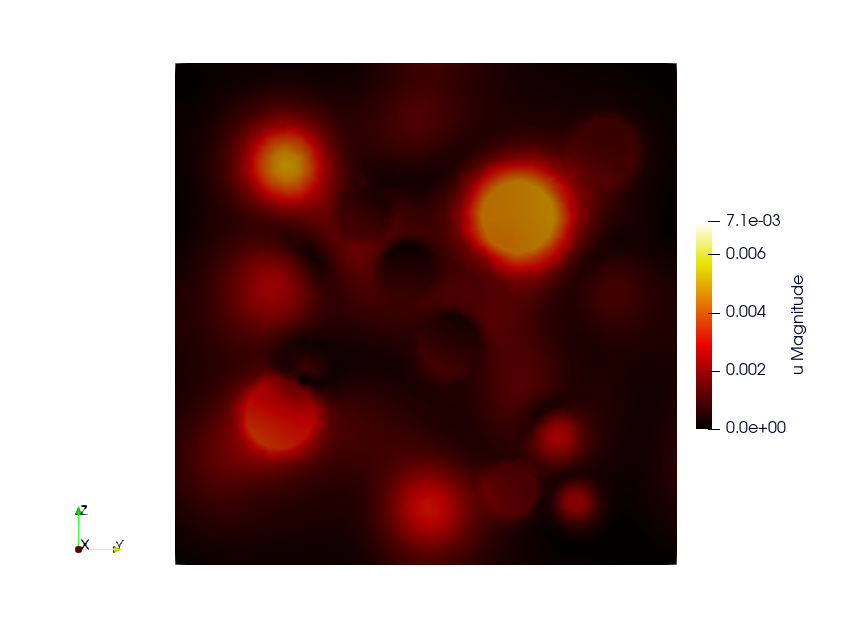
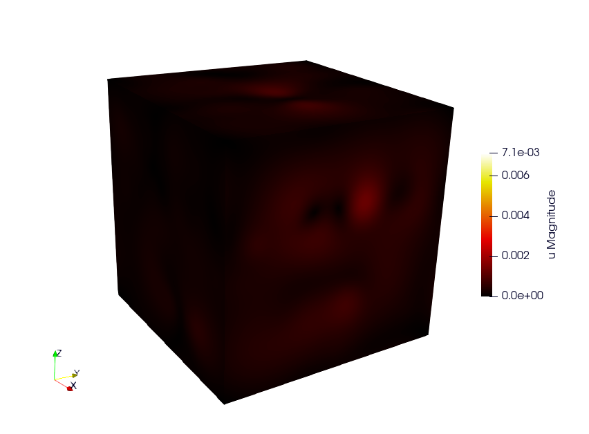

Representative Volume Element with Elastic inclusions
=====================================================

.. contents::

Simulation of a Representative Volume Element (RVE) with a non-linear elastic behavior law. A geometry mesh is provided : "inclusions_49.geo". The mesh can be generated using the following command: gmsh -3 inclusions_49.geo. By modifying the parameters within the .geo file, such as the number of spheres and the size of the element mesh, you can control and customize the simulation accordingly. (code source: ex6)

Build the mesh
--------------

Use GMSH to mesh the geometry. The ``.geo`` file is in the ``ex6`` repository. Command line:

.. code:: bash

    # generate the .msh file with GMSH
    gmsh -3 inclusions_49.geo 

Run the Simulation
------------------

.. code:: bash

   mpirun -n 12 ./rve --mesh inclusions_49.msh --verbosity-level 0 

Available options
~~~~~~~~~~~~~~~~~

To customize the simulation, several options are available, as detailed
below.

+-------------------------+--------------------------------------------+
| Command line            | Description                                |
+=========================+============================================+
| --mesh or -m            | Specify the mesh ".msh" used (default =    |
|                         | inclusion.msh)                             |
+-------------------------+--------------------------------------------+
| --refinement or -r      | Refinement level of the mesh (default = 0) |
+-------------------------+--------------------------------------------+
| --order or -o           | Finite element order (polynomial degree)   |
|                         | (default = 2)                              |
+-------------------------+--------------------------------------------+
| --verbosity-level or -v | Choose the verbosity level (default = 0)   |
+-------------------------+--------------------------------------------+
| --post-processing or -p | Run post processing step (default = 1)     |
+-------------------------+--------------------------------------------+
