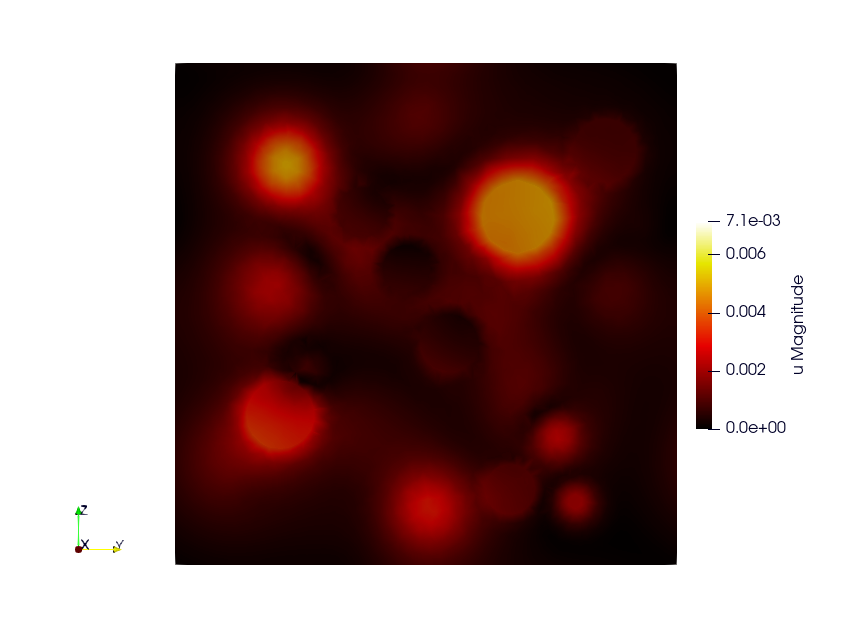
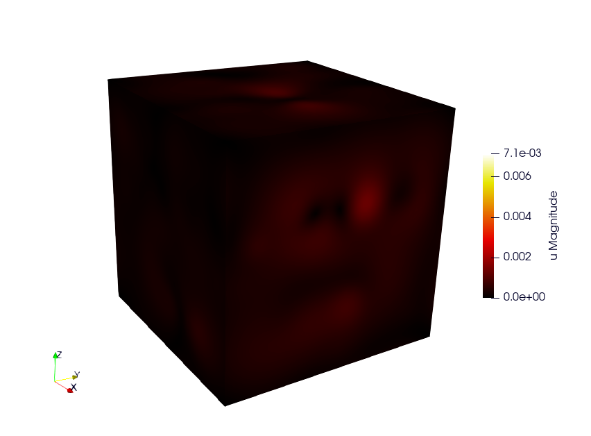

Representative Volume Element with Elastic inclusions
=====================================================

.. contents::

website: https://github.com/latug0/mfem-mgis-examples/tree/master/ex6

This example models a periodic Representative Volume Element made of two
materials. Both follow the Saint Venant-Kirchhoff hyperelastic behaviour. A
macroscopic deformation gradient is imposed.

By default, the Representative Volume Element is a cube made of two layers.
The solution is then compared to the analytical one. The file
``inclusions_49.geo`` describes a Representative Volume Element with 49
spherical inclusions.

Build the mesh
--------------

The ``.geo`` file is in the ``ex6`` directory. Mesh it with GMSH:

.. code:: bash

    gmsh -3 inclusions_49.geo

The number of spheres and the size of the elements are parameters of the
``.geo`` file.

Run the Simulation
------------------

The first command runs the default case. The second one runs the case with
inclusions:

.. code:: bash

   ./rve
   mpirun -n 12 ./rve --mesh inclusions_49.msh --no-check

The analytical solution is only valid for the default mesh. The option
``--no-check`` disables the comparison.

Available options
~~~~~~~~~~~~~~~~~

+----------------------------------+----------------------------------+----------------------+
| Command line                     | Description                      | Default              |
+==================================+==================================+======================+
| ``--mesh`` or ``-m``             | Mesh file                        | cube_2mat_per.mesh   |
+----------------------------------+----------------------------------+----------------------+
| ``--library`` or ``-l``          | Material library                 | src/libBehaviour.so  |
+----------------------------------+----------------------------------+----------------------+
| ``--order`` or ``-o``            | Finite element order             | 1                    |
+----------------------------------+----------------------------------+----------------------+
| ``--refinement`` or ``-r``       | Number of uniform refinements of | 0                    |
|                                  | the mesh                         |                      |
+----------------------------------+----------------------------------+----------------------+
| ``--post-processing`` or         | Export or not the results to     | export               |
| ``-pp``, ``--no-post-processing``| Paraview                         |                      |
| or ``-no-pp``                    |                                  |                      |
+----------------------------------+----------------------------------+----------------------+
| ``--check`` or ``-c``,           | Compare or not the solution to   | compare              |
| ``--no-check`` or ``-no-c``      | the analytical solution of the   |                      |
|                                  | two-layer cube                   |                      |
+----------------------------------+----------------------------------+----------------------+
| ``--verbosity-level`` or ``-v``  | Verbosity level of the solvers   | 1                    |
+----------------------------------+----------------------------------+----------------------+
