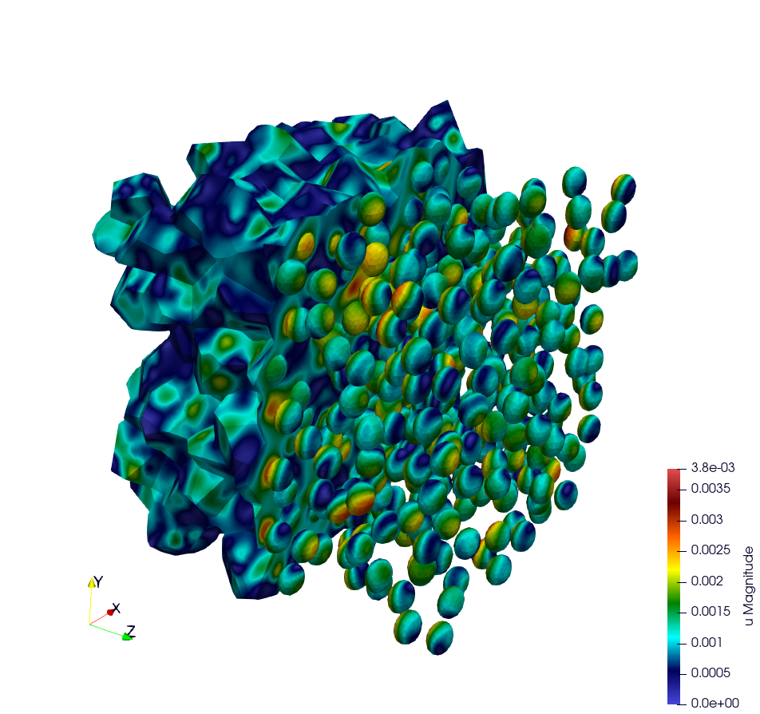

Representative Volume Element of Combustible Mixed Oxides for Nuclear Applications
==================================================================================

.. contents::

website: https://github.com/latug0/mfem-mgis-examples/tree/master/ex7

This example models a Representative Volume Element of a mixed oxide fuel
under a uniform macroscopic strain. Its results are compared to the ones of
Fauque et al. 2021 and Masson et al. 2020, who used an FFT method.

Problem solved
--------------

.. code:: text

        Problem : RVE MOx 2 phases with elasto-viscoplastic behavior laws

        Parameters :

        start time = 0
        end time = 5s
        number of time step = 40

        Imposed strain tensor :
                [ -a/2 ,   0  ,  0 ]
        eps  =  [   0  , -a/2 ,  0 ] * t
                [   0  ,   0  ,  a ]
        with a = 0.012 s^-1

        Solver : HypreGMRES
        Preconditioner : HypreBoomerAMG

        Moduli and Norton behavior law parameters :
        [ parameters       , matrix   , inclusions ]
        [ Young Modulus    , 8.182e9  , 2*8.182e9  ];
        [ Poisson Ratio    , 0.364    , 0.364      ];
        [ Stress Threshold , 100.0e6  , 100.0e12   ];
        [ Norton Exponent  , 3.333333 , 3.333333   ];
        [ Temperature      , 293.15   , 293.15     ];

        Element :
        - Family H1
        - Order 2

The matrix is the material 1 of the meshes. The inclusions are the
material 2. Their stress threshold is high enough for them to remain elastic.

    Illustration of a RVE with 634 spheres after 5 seconds.

Build the mesh
--------------

Two meshes are provided in the ``mesh`` directory:

- ``OneSphere.msh`` is the default mesh. Its spherical inclusion fills 17 % of
  the volume. Its elements are quadratic tetrahedra.
- ``inclusion.msh`` contains one inclusion, which fills 11 % of the volume.
  Its elements are linear tetrahedra.

The meshes are generated with MEROPE and GMSH. MEROPE first generates a
``.geo`` file with the RSA algorithm. Its scripts are in the
``script_merope`` directory:

.. code:: bash

    python3 script_17percent_minimal.py

GMSH then meshes the geometry. The ``.geo`` files are in the ``file_geo``
directory:

.. code:: bash

    gmsh -3 OneSphere.geo

Run the simulation
------------------

This command runs the default simulation from the build directory:

.. code:: bash

    ./mox2 --mesh mesh/OneSphere.msh

Available options
~~~~~~~~~~~~~~~~~

+--------------------------------------+-----------------------------------+--------------------+
| Command line                         | Description                       | Default            |
+======================================+===================================+====================+
| ``--mesh`` or ``-m``                 | Mesh file                         | mesh/OneSphere.msh |
+--------------------------------------+-----------------------------------+--------------------+
| ``--refinement`` or ``-r``           | Number of uniform refinements of  | 0                  |
|                                      | the mesh                          |                    |
+--------------------------------------+-----------------------------------+--------------------+
| ``--nbsteps`` or ``-ns``             | Number of time steps. The end     | 40                 |
|                                      | time is 5 s.                      |                    |
+--------------------------------------+-----------------------------------+--------------------+
| ``--order`` or ``-o``                | Finite element order              | 2                  |
+--------------------------------------+-----------------------------------+--------------------+
| ``--verbosity-level`` or ``-v``      | Verbosity level of the linear     | 0                  |
|                                      | solvers                           |                    |
+--------------------------------------+-----------------------------------+--------------------+
| ``--post-processing`` or ``-pp``,    | Export or not the results to      | export             |
| ``--no-post-processing`` or          | Paraview                          |                    |
| ``-no-pp``                           |                                   |                    |
+--------------------------------------+-----------------------------------+--------------------+
| ``--reference-file`` or ``-rf``      | Reference values of the mean      | no comparison      |
|                                      | stresses in each material         |                    |
+--------------------------------------+-----------------------------------+--------------------+
| ``--use-petsc`` and                  | Use PETSc with the given          | no PETSc           |
| ``--petsc-configuration-file``       | configuration file. It requires   |                    |
|                                      | MFEM built with PETSc.            |                    |
+--------------------------------------+-----------------------------------+--------------------+

Examples with other options:

.. code:: bash

    ./mox2 -r 2 -o 3 --mesh mesh/OneSphere.msh
    mpirun -n 2 ./mox2 --use-petsc --petsc-configuration-file petscrc

Parallel computing mode
~~~~~~~~~~~~~~~~~~~~~~~

The mesh with 634 spheres is not provided. These commands generate it and
run the simulation in parallel:

.. code:: bash

    gmsh -3 file_geo/634Spheres.geo
    mpirun -n 12 ./mox2 --mesh file_geo/634Spheres.msh

On Topaze, a supercomputer of the CCRT, the commands are:

.. code:: bash

    ccc_mprun -n 8 -c 1 -p milan ./mox2 -r 0 -o 3 --mesh mesh/OneSphere.msh
    ccc_mprun -n 2048 -c 1 -p milan ./mox2 -r 2 -o 1 --mesh file_geo/634Spheres.msh

Test
~~~~

The test runs the default simulation with 5 time steps instead of 40. It
compares the mean stresses in each material to the reference values of
``OneSphere-avgStress.ref``. With 5 time steps, the average stress SZZ differs
by less than 6 % from the one computed with 40 time steps.

Post-processing of simulation data
----------------------------------

The average stress SZZ is compared to the FFT results of Fauque et al. 2021
and Masson et al. 2020. These reference values are in ``results/res-fft.txt``.

The ``MeanThermodynamicForces`` post-processing writes the file ``avgStress``.
It gives the mean stresses in each material as a function of time. The
results of mfem-mgis are in the ``results`` directory:

- ``res-mfem-mgis.txt`` gives the average stress SZZ over the RVE of
  ``OneSphere.msh`` at order 3. It is obtained with the awk command below.
- ``res-mfem-mgis-634spheres-o2.txt`` is the ``avgStress`` file of the RVE
  with 634 spheres at order 2.

The RVE of ``OneSphere.msh`` contains 83 % of matrix and 17 % of inclusion.
This awk command computes its average stress SZZ:

.. code:: bash

    awk '{if(NR>13) print $1 " " 0.83*$4+0.17*$10}' avgStress > res-mfem-mgis.txt

The average stress SZZ at the end of the simulation, at t = 5 s, is:

+------------------------------------------------------------+----------------+
| Simulation                                                 | SZZ in MPa     |
+============================================================+================+
| FFT, ``res-fft.txt``                                       | 93.05          |
+------------------------------------------------------------+----------------+
| ``OneSphere.msh`` at order 3, ``res-mfem-mgis.txt``        | 94.63          |
+------------------------------------------------------------+----------------+
| ``OneSphere.msh`` at order 2, default                      | 99.87          |
+------------------------------------------------------------+----------------+
| ``OneSphere.msh`` at order 1                               | 140.0          |
+------------------------------------------------------------+----------------+
| 634 spheres at order 2, ``res-mfem-mgis-634spheres-o2.txt``| 101.6          |
+------------------------------------------------------------+----------------+

At order 1, the average stress is overestimated once the matrix flows. This
is consistent with the volumetric locking of linear tetrahedra, since the
viscoplastic flow is isochoric.

Display results with gnuplot
~~~~~~~~~~~~~~~~~~~~~~~~~~~~

.. code:: bash

    gnuplot> plot "res-fft.txt" u 1:10 w l title "fft"
    gnuplot> replot "res-mfem-mgis.txt" u 1:2 w l title "mfem-mgis"
