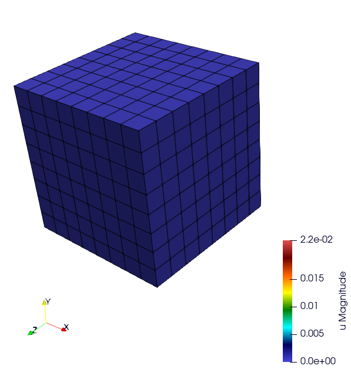

==================
MFEM MGIS Examples
==================

All the examples presented in this section can be found in the git repository: https://github.com/latug0/mfem-mgis-examples

TensileTest
===========

Ssna303 Example (2D and 3D)
===========================

This tutorial deals with a 2D (plane strain) tensile test (ex2) and 3D (ex4) on a notched beam modeled by finite-strain plastic behavior. 

.. figure:: _static/ssna303Start.png
   :alt: Illustration of the start of the ssna303 simulation.

.. figure:: _static/ssna303End.png
   :alt: Illustration of the start of the ssna303 simulation.

See tutorial. 

Satoh
=====

Modelling plate of length 1 in plane strain clamped on the left and right boundaries and submitted to a parabolic thermal gradient along the x-axis. (source code 5)

.. figure:: _static/SatohTest.png
   :alt: Illustration of the displacement of the plate.

Problem solved
--------------

.. code:: text

  This test models a 2D plate of lenght 1 in plane strain clamped on the left
  and right boundaries and submitted to a parabolic thermal gradient along the
  x-axis:
  
  - the temperature profile is minimal on the left and right boundaries
  - the temperature profile is maximal for x = 0.5
  
  This example shows how to define an external state variable using an
  analytical profile.

  Solver : UMFPackSolver
  Preconditioner : None

  Elastic behavior law parameters :
  [ parameters       , material ]
  [ Young Modulus    , 150e9    ];
  [ Poisson Ratio    , 0.3      ];
  [ Temperature      , 293.15   ];

  Element: 
  - Family H1
  - Order 2

Run the simulation
------------------

TODO

Representative Volume Element with Elastic inclusions
=====================================================

Simulation of a Representative Volume Element (RVE) with a non-linear elastic behavior law. A geometry mesh is provided : "inclusions_49.geo". The mesh can be generated using the following command: gmsh -3 inclusions_49.geo. By modifying the parameters within the .geo file, such as the number of spheres and the size of the element mesh, you can control and customize the simulation accordingly. (code source: ex6)

.. figure:: _static/ex6half.png
   :alt: Slice of a RVE with 49 spheres.

Build the mesh
--------------

Use GMSH to mesh the geometry. Files ``.geo`` is in the depository ``ex6``. Command line:

.. code:: bash

   # generate the .msh file with GMSH
   gmsh -3 inclusions_49.geo 

Run the Simulation
------------------

.. code:: bash

  mpirun -n 12 ./rve --mesh inclusions_49.msh --verbosity-level 0 

Available options
~~~~~~~~~~~~~~~~~

To customize the simulation, several options are available, as detailed
below.

+------------------------+--------------------------------------------+
| Command line           | Descritption                               |
+========================+============================================+
| –mesh or -m            | specify the mesh “.msh” used (default =    |
|                        | inclusion.msh)                             |
+------------------------+--------------------------------------------+
| –refinement or -r      | refinement level of the mesh (default = 0) |
+------------------------+--------------------------------------------+
| –order or -o           | Finite element order (polynomial degree)   |
|                        | (default = 2)                              |
+------------------------+--------------------------------------------+
| –verbosity-level or -v | choose the verbosity level (default = 0)   |
+------------------------+--------------------------------------------+
| –post-processing or -p | run post processing step (default = 1)     |
+------------------------+--------------------------------------------+

Representative Volume Element of Combustible Mixed Oxides for Nuclear Applications
==================================================================================

This simulation represents an RVE of MOx (Mixed Oxide) material under
uniform macroscopic deformation. The aim of this simulation is to
reproduce and compare the results obtained by (Fauque et al., 2021;
Masson et al., 2020) who used an FFT method. (source code: ex7)

Problem solved
--------------

.. code:: text

       Problem : RVE MOx 2 phases with elasto-viscoplastic behavior laws

       Parameters : 

       start time = 0
       end time = 5s
       number of time step = 40

       Imposed strain tensor : 
               [ -a/2 ,   0  ,  0 ]
       eps  =  [   0  , -a/2 ,  0 ] 
               [   0  ,   0  ,  a ]
       with a = 0.012

       Solver : HyprePCG
       Preconditioner : HypreBoomerAMG

       Moduli and Norton behavior law parameters :
       [ parameters       , inclusions   , matrix ]
       [ Young Modulus    , 8.182e9  , 2*8.182e9  ];
       [ Poisson Ratio    , 0.364    , 0.364      ];
       [ Stress Threshold , 100.0e6  , 100.0e12   ];
       [ Norton Exponent  , 3.333333 , 3.333333   ];
       [ Temperature      , 293.15   , 293.15     ];

       Element :
       - Familly H1
       - Order 2

.. figure:: _static/mox-order2.png
   :alt: Illustration of a RVE with 634 spheres after 5 seconds.

   Illustration of a RVE with 634 spheres after 5 seconds.

How to run the simulation “RVE MOX”
-----------------------------------

Build the mesh
--------------

The mesh is generated with MEROPE and GMSH through the following steps:

-  First step, use MEROPE to generate a ``.geo`` file using the RSA
   algorithm. Scripts are in directory ``script_merope``. Command line:

.. code:: bash

   # generate .geo file with MEROPE
   python3 script_17percent_minimal.py

-  Second step, use GMSH to mesh the geometry. Files ``.geo`` are in the
   directory ``file_geo``. Command line:

.. code:: bash

   # generate the .msh file with GMSH
   gmsh -3 OneSphere.geo 

Run the simulation
------------------

Run a minimal version of the simulation
~~~~~~~~~~~~~~~~~~~~~~~~~~~~~~~~~~~~~~~

In order to run the simulation in sequential computing mode, use the
command line:

.. code:: bash

   # run the simulation by specifying the mesh with --mesh option
   ./mox2 --mesh OneSphere.msh

Available options
~~~~~~~~~~~~~~~~~

To customize the simulation, several options are available, as detailed
below.

+------------------------+--------------------------------------------+
| Command line           | Descritption                               |
+========================+============================================+
| –mesh or -m            | specify the mesh “.msh” used (default =    |
|                        | inclusion.msh)                             |
+------------------------+--------------------------------------------+
| –refinement or -r      | refinement level of the mesh (default = 0) |
+------------------------+--------------------------------------------+
| –order or -o           | Finite element order (polynomial degree)   |
|                        | (default = 2)                              |
+------------------------+--------------------------------------------+
| –verbosity-level or -v | choose the verbosity level (default = 0)   |
+------------------------+--------------------------------------------+
| –post-processing or -p | run post processing step (default = 1)     |
+------------------------+--------------------------------------------+

Example of customized simulation:

.. code:: bash

   # run the simulation in sequential computing mode with various options
   ./mox2 -r 2 -o 3 --mesh OneSphere.msh

Parallel computing mode
~~~~~~~~~~~~~~~~~~~~~~~

The simulation can be run in parallel computing mode by using the
command:

.. code:: bash

   # run the simulation by specifying the mesh with --mesh option
   mpirun -n 12 ./mox2 --mesh 634Spheres.msh

Simulation can be run on supercomputers. The command depends on the
server manager. For example, on Topaze, a CCRT-hosted supercomputer
co-designed by Atos and CEA, the commands are :

.. code:: bash

   ccc_mprun -n 8 -c 1 -p milan ./mox2 -r 0 -o 3 --mesh OneSphere.msh
   ccc_mprun -n 2048 -c 1 -p milan ./mox2 -r 2 -o 1 --mesh 634Sphere.msh

Post-processing of simulation data
----------------------------------

The aim of this exercise is to reproduce the simulation results of
(Fauque et al., 2021; Masson et al., 2020). To this end, the average
stresses in the z-axis direction (SZZ) will be analyzed. The reference
values, obtained by (Fauque et al., 2021; Masson et al., 2020), can be
found in the directory ``results``, file res-fft.txt (Average stress
versus time).

Extract simulation data from MMM
~~~~~~~~~~~~~~~~~~~~~~~~~~~~~~~~

The avgStress post-processing file generated by MMM contains average
stress values as a function of time, by material phase. MMM simulation
data are available: ``results/res-mfem-mgis-onesphere-o3.txt`` and
``results/res-mfem-mgis-634sphere-o2.txt``.

For example, the average stress SZZ over the RVE (composed of 83% matrix
and 17% inclusion) can be calculated with the awk command under unix:

.. code:: bash

   awk '{if(NR>13) print $1 " " 0.83*$4+0.17*$10}' avgStress > res-mfem-mgis.txt

Display results with gnuplot
~~~~~~~~~~~~~~~~~~~~~~~~~~~~

.. code:: bash

   gnuplot> plot "res-fft.txt" u 1:10 w l title "fft"
   gnuplot> replot "res-mfem-mgis.txt" u 1:2 w l title "mfem-mgis"
