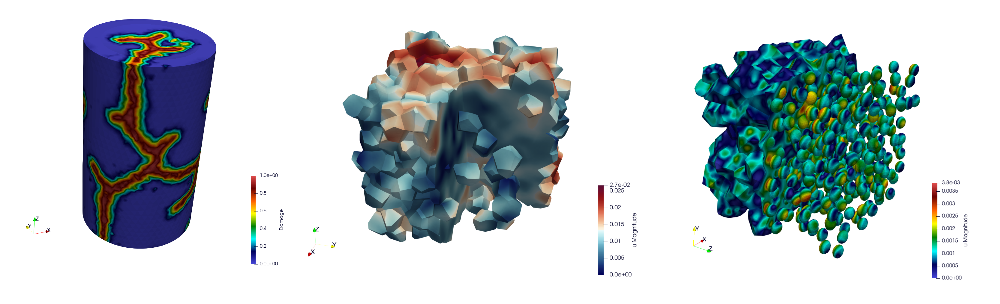

.. _mfem_mgis:

=========================
The ``MFEM/MGIS`` project
=========================

.. toctree::
   :hidden:
   :maxdepth: 1

   installation_guide/installation_guide.rst
   user_guide/user_guide.rst
   commented_examples/commented_examples.rst
   developer_guide/developer_guide.rst

The aim of the ``MFEM/MGIS`` project is to provide a ``C++`` library to
build advanced mechanical simulation based on ``MFront`` behaviours with
``MFEM`` . The ``MGIS`` project is used to interface
``MFront`` behaviours .

The ``MFEM-MGIS`` project, aims at efficiently use supercomputers in
order to describe coupled multiphysics phenomena with a particular focus
on thermo-mechanics. This open-source library is based on several
components as prerequisites:

- the ``mfem`` (Modular Finite Element Methods) library
  :cite:`Anderson_2020`,
- the ``MGIS`` (MFront Generic Interface Support) library
  :cite:`helfer_mfrontgenericinterfacesupport_2020`,
-  the ``MFront`` code generator.

Thanks to the features embedded within ``MGIS`` and ``MFront`` and
thanks to specific developments, ``MFEM-MGIS`` adds several mechanical
features compared to a pure ``MFEM`` approach.

The library tackles some peculiarities of nonlinear mechanics. In
particular, the support of complex constitutive laws and the management
of advanced boundary conditions. It provides a high level of abstraction
based focused on the physics to be treated.

Statement of need
=================

The solid mechanic examples in ``MFEM`` are mostly limited to simple
constitutive equations such as elasticity and hyperelasticity without
internal state variables. This is insufficient to address many
engineering studies and in particular complex nuclear fuel
simulations.

The aim of the ``MFEM/MGIS`` project is to combine ``MFEM`` with the
``MFrontGenericInterfaceSupport`` (``MGIS``) project, an open-source ``C++``
library that handles all the kinds of behaviours supported by the open-source
``MFront`` code generator.

In the field of nonlinear mechanics, this encompasses arbitrary complex
behaviours that can describe damage, plasticity, and viscoplasticity in both
small or finite strain analyses. Generalized behaviours such as
variational approaches to fracture are supported by ``MFEM/MGIS``.

The ``MGIS`` data structures are used to add support for partial
quadrature functions to ``MFEM``, a feature needed to store internal state
variables on each material.

State of the field
==================

Many open-source thermomechanical solvers allow handling complex
mechanical behaviours. ``code_aster``, ``MoFEM``, ``CalculiX`` are examples
of state of the art solvers which have an interface with ``MFront``.

However, those solvers lack many features provided by ``MFEM`` that the
authors found interesting to explore in the field of solid mechanics
(see the above section for a detailed list). The authors also found
interesting to take a platform designed from the start for high
performance computing and adapt it to engineering needs and evaluate
the resulting performances.

References
==========

.. bibliography:: bibliography.bib
