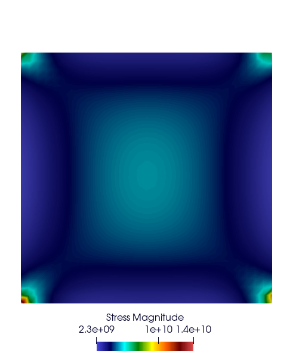
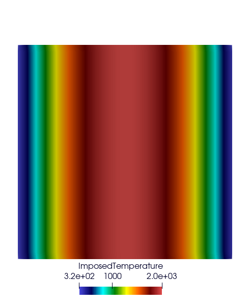
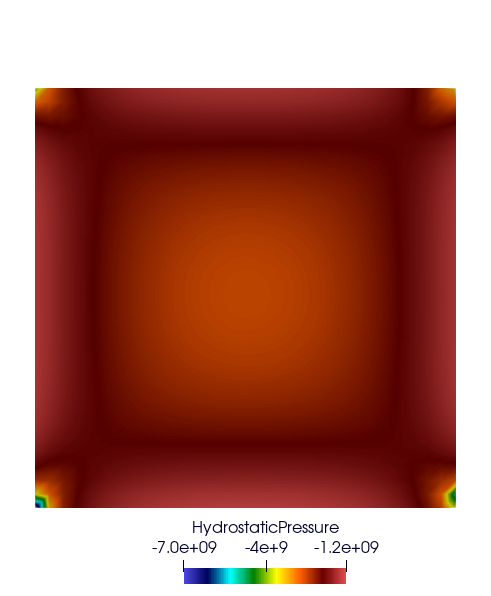
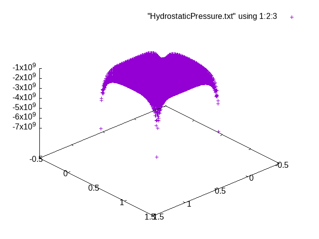

========================
Post Processing Features
========================

In this section, we describe the post-processing options available in MFEM-MGIS.

.. warning::

  This section is under construction

Dump Paraview Results
---------------------

- Key: ``ParaviewExportResults``

**Example:**

.. code-block:: cpp

  problem.addPostProcessing("ParaviewExportResults",
                            {{"OutputFileName", "SatohTestOutput"}});

**Results**

.. figure:: _static/SatohTest.png

Export Integration Point Results At Nodes
------------------------------------------

- Key: ``ParaviewExportIntegrationPointResultsAtNodes``

**Example:**

.. code-block:: cpp

  auto results = std::vector<mfem_mgis::Parameter>{
      "Stress", "ImposedTemperature", "HydrostaticPressure"};
  problem.addPostProcessing(
      "ParaviewExportIntegrationPointResultsAtNodes",
      {{"OutputFileName", "SatohTestIntegrationPointOutput"},
       {"Materials", {"plate"}},
       {"Results", results}});

**Results**

Compute Mean Thermodynamic Forces
---------------------------------

- Key: ``MeanThermodynamicForces``

**Example: print the average stress of one inclusion into a matrix (RVE)**

.. code-block:: cpp

  p.addPostProcessing(
      "MeanThermodynamicForces",
      {{"OutputFileName", "avgStress"}});

**Results**

We display the average stress SZZ over the RVE (composed of 83% matrix and 17% inclusion), we process the avgstress file and then plot the result: 

.. code-block:: text

  awk '{if(NR>13) print $1 " " 0.83*$4+0.17*$10}' avgStress > res-mfem-mgis.txt
  plot "res-mfem-mgis.txt" u 1:2 w l title "mfem-mgis"

.. figure:: _static/avgStress.png

Compute Stored Energy
---------------------

- Key: ``StoredEnergy``

**Example:**

.. code-block:: cpp

  p.addPostProcessing(
      "StoredEnergy",
      {{"OutputFileName", "energy.txt"}});

Compute dissipated Energy
-------------------------

- Key: ``DissipatedEnergy``

**Example:**

.. code-block:: cpp

  p.addPostProcessing(
      "DissipatedEnergy",
      {{"OutputFileName", "dissiped_energy.txt"}});

Dump Partial Quadrature
-----------------------

**Example: dump the Hydrostatic Pressure at Partial quadrature points**

.. code-block:: cpp

  constexpr bool parallel = true;
  std::ofstream output("HydrostaticPressure.txt");
  const auto pr = getInternalStateVariable(static_cast<const mfem_mgis::Material&>(m1), "HydrostaticPressure");
  dumpPartialQuadratureFunction<parallel>(output, pr);

**Results**

Command:

.. code-block:: text

  splot "HydrostaticPressure.txt" using 1:2:3

Plot: 

