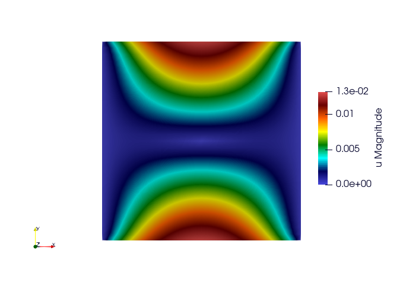
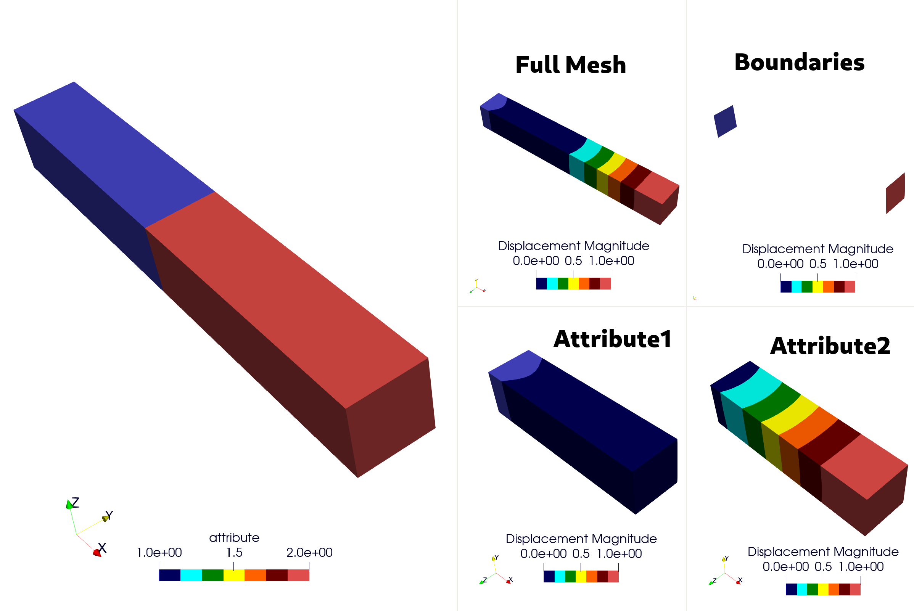
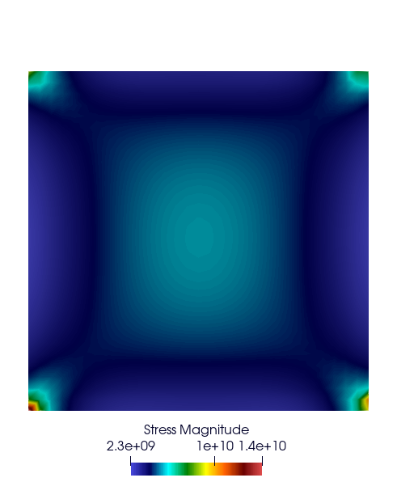
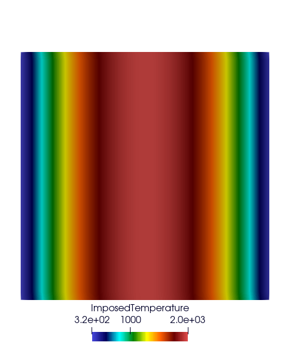
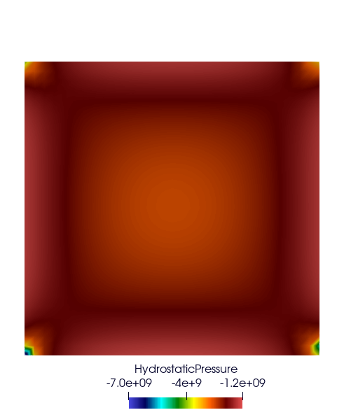
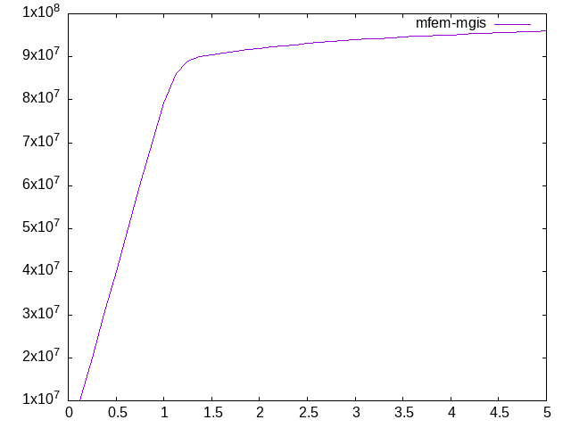

.. _mfem_mgis_general_post_processings:

========================
General post-processings
========================

In this section, we describe the post-processing options available in
MFEM-MGIS.

.. contents::
    :depth: 3
    :local:

.. warning::

  This section is under construction

The :code:`ParaviewExport` post-processing
==========================================

This post-processing allows exporting the unknowns of a nonlinear
evolution problem for visualization in :code:`paraview`:

- Key: ``ParaviewExportResults``

**Example:**

.. code-block:: cpp

  problem.addPostProcessing(ctx, "ParaviewExportResults",
                            {{"OutputFileName", "SatohTestOutput"}}) |
      or_die;

**Results**

It is also possible to extract only portions of the mesh by defining either the boundary zones or the materials (domain attributes). This is particularly useful for reducing the size of output files when only a small part is to be studied.

**Example**

.. code-block:: cpp

    std::vector<mfem_mgis::Parameter> materials{"Attr1", "Attr2"};
    std::vector<mfem_mgis::Parameter> bdrs{"left", "right"};
    /** You can not define Materials and Boundaries in a single post processing
     */
    problem.addPostProcessing(
        ctx, "ParaviewExportResults",
        {{"OutputFileName", "TestPPSubMeshOutputDir/AllMesh"},
         {"Materials", materials},
         {"OutputFieldName", "Displacement"},
         {"Verbosity", 1}}) |
        or_die;
    problem.addPostProcessing(
        ctx, "ParaviewExportResults",
        {{"OutputFileName", "TestPPSubMeshOutputDir/Attribute1"},
         {"OutputFieldName", "Displacement"},
         {"Material", "Attr1"},
         {"Verbosity", 1}}) |
        or_die;
    problem.addPostProcessing(
        ctx, "ParaviewExportResults",
        {{"OutputFileName", "TestPPSubMeshOutputDir/Attribute2"},
         {"OutputFieldName", "Displacement"},
         {"Material", "Attr2"},
         {"Verbosity", 1}}) |
        or_die;
    problem.addPostProcessing(
        ctx, "ParaviewExportResults",
        {{"OutputFileName", "TestPPSubMeshOutputDir/Boundaries"},
         {"OutputFieldName", "Displacement"},
         {"Boundaries", bdrs},
         {"Verbosity", 1}}) |
        or_die;

.. note::

  Boundary and Material names are defined by the problem using the key words: "Boundaries" or "Materials" such as:

  - {"Materials", mfem_mgis::Parameters{{"Attr1", 1}, {"Attr2", 2}}}
  - {"Boundaries", mfem_mgis::Parameters{{"left", 1}, {"right", 2}}}

**Results**

+------------------------------+--------------------------------------------------------------------------------------------+
| **Key**                      | **Description**                                                                            |
+==============================+============================================================================================+
| OutputFileName               | Name of the output directory                                                               |
+------------------------------+--------------------------------------------------------------------------------------------+
| OutputFieldName              | Name of the field that will appear in ParaView (default: ``"u"``)                          |
+------------------------------+--------------------------------------------------------------------------------------------+
| Material/Materials           | List of materials; a submesh will be used instead of exporting the entire mesh             |
+------------------------------+--------------------------------------------------------------------------------------------+
| Boundary/Boundaries          | List of boundaries; a submesh will be used instead of exporting the entire mesh            |
+------------------------------+--------------------------------------------------------------------------------------------+
| Verbosity                    | If this value is ``>= 1``, submesh information will be displayed when using attributes     |
+------------------------------+--------------------------------------------------------------------------------------------+
| ExecuteInitialPostProcessing | Export the results at the initial time of the simulation (default: ``true``)               |
+------------------------------+--------------------------------------------------------------------------------------------+

Export Integration Point Results At Nodes
==========================================

- Key: ``ParaviewExportIntegrationPointResultsAtNodes``

**Example:**

.. code-block:: cpp

  auto results = std::vector<mfem_mgis::Parameter>{
      "Stress", "ImposedTemperature", "HydrostaticPressure"};
  problem.addPostProcessing(
      ctx, "ParaviewExportIntegrationPointResultsAtNodes",
      {{"OutputFileName", "SatohTestIntegrationPointOutput"},
       {"Materials", {"plate"}},
       {"Results", results}}) |
      or_die;

The optional ``ExecuteInitialPostProcessing`` boolean parameter (``true`` by
default) states if the results are exported at the initial time of the
simulation.

**Results**

Compute Mean Thermodynamic Forces
=================================

This post-processing computes the mean value of each component of the
thermodynamic forces in each material. For a mechanical behaviour, the
thermodynamic forces are the stresses.

- Key: ``MeanThermodynamicForces``

**Example:**

.. code-block:: cpp

  problem.addPostProcessing(ctx, "MeanThermodynamicForces",
                            {{"OutputFileName", "avgStress"}}) |
      or_die;

**Results**

These results come from the example :doc:`../../commented_examples/rve_mox`.
Its RVE contains 83 % of matrix and 17 % of inclusion. These commands compute
the average stress SZZ over the RVE and plot it:

.. code-block:: text

  awk '{if(NR>13) print $1 " " 0.83*$4+0.17*$10}' avgStress > res-mfem-mgis.txt
  plot "res-mfem-mgis.txt" u 1:2 w l title "mfem-mgis"

Compute Stored Energy
=====================

- Key: ``StoredEnergy``

**Example:**

.. code-block:: cpp

  problem.addPostProcessing(ctx, "StoredEnergy",
                            {{"OutputFileName", "energy.txt"}}) |
      or_die;

Compute dissipated Energy
=========================

- Key: ``DissipatedEnergy``

**Example:**

.. code-block:: cpp

  problem.addPostProcessing(ctx, "DissipatedEnergy",
                            {{"OutputFileName", "dissipated_energy.txt"}}) |
      or_die;

Materials with several behaviour integrators
============================================

The ``ComputeResultantForceOnBoundary``, ``MeanThermodynamicForces``,
``StoredEnergy`` and ``DissipatedEnergy`` post-processings accept an optional
``BehaviourIntegrator`` parameter. It selects the behaviour integrators of each
material:

- an integer: the behaviour integrator of this index in each material,
- ``"All"``: all the behaviour integrators, whose contributions are summed.

Without this parameter, each material must have a single behaviour integrator.

**Example:**

.. code-block:: cpp

  problem.addPostProcessing(ctx, "StoredEnergy",
                            {{"OutputFileName", "energy.txt"},
                             {"BehaviourIntegrator", "All"}}) |
      or_die;
