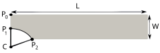

.. _mfem_mgis_tutorial:

=======================
A tutorial introduction
=======================

This tutorial describes how to describe in ``MFEM/MGIS`` a tensile test
on a notched beam made of an isotropic plastic behaviour with linear
hardening in the logarithmic space. This tutorial highlights the key
features of this project.

The full code is available in the ``mfem-mgis-examples`` repository in
``ex2`` directory: https://github.com/latug0/mfem-mgis-examples

Description of the test case
============================

This tutorial considers a tensile test on a notched beam which is
modelled by plastic behaviour at finite strain:

-  The geometry and the mesh is described in Section
   :ref:`sec:mfem_mgis:ssna303:mesh`.
-  The boundary conditions are described in Section
   :ref:`sec:mfem_mgis:ssna303:bc`.
-  The mechanical behaviour is described in Section
   :ref:`sec:mfem_mgis:ssna303:behaviour`.

This case is a variant of another one available on ``code-aster``\ web
site:

https://www.code-aster.org/V2/doc/v10/fr/man_v/v6/v6.01.303.pdf

.. _sec:mfem_mgis:ssna303:mesh:

Geometry and mesh
-----------------

   Mesh used to describe the notched beam

For symmetry reasons, only half of the notched beam is represented in
Figure :ref:`fig:mfem_mgis:ssna303:mesh`. The height :math:`h` of the beam is
30 mm. The half-width :math:`w` of the beam is 5.4 mm.

The positions of the points :math:`p_{1}`, :math:`p_{2}` and :math:`c` are
respectively :math:`(3\,\mathrm{mm}, 0)`,
:math:`(5.4\,\mathrm{mm}, 4.8\,\mathrm{mm})` and
:math:`(9\,\mathrm{mm}, 0)`.

This notched beam has been meshed using `Cast3M <http://www-cast3m.cea.fr/>`_ and exported in the ``MED`` 
file format proposed and used by `Salomé <https://www.salome-platform.org/>`_ platform. This file has been
converted in the ``msh`` file format using
`gmsh <https://gmsh.info/>`_ tool in order to import it easily in
MFEM.

.. note::

   ``MED`` files are read directly when ``MFEM`` is built with ``MED``
   support.

Modelling hypothesis
--------------------

The beam is treated using the plane strain modelling hypothesis. In
finite strain, this assumes that the axial component of the deformation
gradient is set equal to 1.

.. _sec:mfem_mgis:ssna303:bc:

Boundary conditions
-------------------

Dirichlet boundary conditions force the solution to attain certain
prescribed values a priori on some boundaries. The vertical displacement is
blocked on the bottom line :math:`y=0`. A vertical displacement
:math:`U_{y}` is imposed at the top of the beam :math:`y=h`.

The symmetry axis on the left is blocked in the ``x``-direction.

.. _sec:mfem_mgis:ssna303:behaviour:

Mechanical behaviour
--------------------

Description
~~~~~~~~~~~

The material of the notched beam is described by a simple isotropic
elasto-plastic behaviour with isotropic hardening in the logarithmic
space :cite:`miehe_anisotropic_2002` and is implemented using the `MFront <http://tfel.sourceforge.net>`_
code generator.

This behaviour is characterized by four parameters:

-  The ``Young Modulus`` (:math:`E`) is the slope of the linear part of
   the stress-strain curve for a material under tension or compression
   (isotropic elastic material).
-  The ``Poisson Ratio`` (:math:`\nu`) is the coefficient to
   characterize the contraction of the material perpendicular to the
   direction of the force applied.
-  The ``Yield Strength`` (:math:`\sigma_{0}`) defines the point on the
   stress versus strain curve where the material initially starts to go
   into plastic strain.
-  The ``Strain Hardening Modulus`` (:math:`H`) defines the slope of the stress
   versus strain curve after the point of yield of a material.

In our example the following values are used:

.. math::

   \left\{
       \begin{array}{lcl}
           E & = & 70\,10^{9}\,\mathrm{Pa} \\
           \nu & = & 0.34 \\
           H & = & 10\,10^{9}\,\mathrm{Pa} \\
           \sigma_{0} & = & 300\,10^{6}\,\mathrm{Pa}
       \end{array}
   \right.

Compilation of the ``MFront`` behaviour
~~~~~~~~~~~~~~~~~~~~~~~~~~~~~~~~~~~~~~~

The previous values are hard-coded in the ``MFront`` file. The
``MFront`` implementation is stored in a source file called
``Plasticity.mfront``. This file must be compiled before the execution
of our ``MFEM/MGIS`` ``C++`` example which will be detailed in depth in
Section :ref:`sec:mfem_mgis:ssna303`. Compilation is performed as follows:

.. code:: sh

   mfront --obuild --interface=generic Plasticity.mfront
   Treating target : all
   The following library has been built :
   - libBehaviour.so :  Plasticity_AxisymmetricalGeneralisedPlaneStrain 
     Plasticity_Axisymmetrical Plasticity_PlaneStrain
     Plasticity_GeneralisedPlaneStrain Plasticity_Tridimensional

.. _sec:mfem_mgis:ssna303:

Numerical resolution
====================

Initialization of the resolution
--------------------------------

The ``initialize`` function must be called at the very beginning of the
``main`` function to process the command line arguments:

.. code:: cpp

   mfem_mgis::initialize(argc, argv);

..

   **The ``mfem_mgis`` namespace**

   All the classes and functions of the ``MFEM/MGIS`` project are placed
   in the ``mfem_mgis`` namespace.

This call is mostly useful in parallel and handles:

-  The initialization of interprocess communications handled by the
   ``MPI`` framework.
-  The initialization of the `PETSc <https://www.mcs.anl.gov/petsc/>`_ scientific
   toolkit, if supported and
   requested.

Execution context
~~~~~~~~~~~~~~~~~

Most functions of the library take an execution context as first argument.
This context stores the error messages:

.. code:: cpp

     auto ctx = mgis::Context{};
     auto or_die = ctx.getFatalFailureHandler();

These functions report their failures. The ``or_die`` handler stops the
program with the error message when a failure occurs:

.. code:: cpp

     problem.update(ctx) | or_die;

Constant variables
~~~~~~~~~~~~~~~~~~

The code then defines some constant variables defining the path to the
mesh file, the path to the ``MFront`` shared library, and the name of
the behaviour:

.. code:: cpp

     const char* mesh_file = "ssna303.msh";
     const char* library = "src/libBehaviour.so";
     const char* behaviour = "Plasticity";

Command line options
~~~~~~~~~~~~~~~~~~~~

The numerical resolution can be parametrized using command line options
by relying on the ``MFEM`` facilities provided by the ``OptionsParser``
class.

The proposed implementation allows the following options:

-  ``--order`` which specifies the finite element order (polynomial
   degree).
-  ``--nbsteps`` and ``--end-time`` which specify the number of time
   steps and the end time of the loading.
-  ``--reference-file`` which specifies a file of reference values of
   the resultant force. No comparison is made if it is empty.
-  ``--parallel`` and ``--no-parallel`` which specify if the simulation
   must be run in parallel.

Those options are associated with local variables which are
default initialized as follows:

.. code:: cpp

     const char* reference_file = "";
   #if defined(MFEM_USE_MUMPS) && defined(MFEM_USE_MPI)
     bool parallel = true;
   #else
     bool parallel = false;
   #endif
     auto order = 1;
     auto nbsteps = 50;
     auto end_time = mfem_mgis::real{1};

If left unchanged, those default values select:

-  a parallel computation if ``MFEM`` was built with ``MPI`` and
   ``MUMPS`` support and a sequential computation otherwise.
-  the use of linear elements.
-  50 time steps from 0 to 1.
-  no comparison to reference values.

If ``MFEM`` was built with support of ``PETSc`` library, the following
options are added by the ``mfem_mgis::declareDefaultOptions`` function:

-  ``--use-petsc`` which specifies that linear and non linear solvers of
   the ``PETSc`` toolkit must be used.
-  ``--petsc-configuration-file`` which specifies a configuration file
   for the ``PETSc`` toolkit.

In practice, an object of the class ``mfem::OptionsParser`` is declared.
The expected options are declared and the ``Parse`` method is called:

.. code:: cpp

     mfem::OptionsParser args(argc, argv);
     mfem_mgis::declareDefaultOptions(args);
     args.AddOption(&order, "-o", "--order",
                    "Finite element order (polynomial degree).");
     args.AddOption(&nbsteps, "-ns", "--nbsteps", "Number of time steps.");
     args.AddOption(
         &end_time, "-et", "--end-time",
         "End time. The displacement of the upper boundary is 6e-3 * t.");
     args.AddOption(&reference_file, "-rf", "--reference-file",
                    "Reference values of the resultant force on the upper "
                    "boundary, no comparison if empty.");
     args.AddOption(&parallel, "-p", "--parallel", "-no-p", "--no-parallel",
                    "Perform parallel computations.");
     args.Parse();
     if (args.Help()) {
       args.PrintUsage(mfem_mgis::getOutputStream());
       mfem_mgis::finalize();
       return EXIT_SUCCESS;
     }
     if (!args.Good()) {
       args.PrintUsage(mfem_mgis::getOutputStream());
       mfem_mgis::abort(EXIT_FAILURE);
     }

Declaring the non linear problem
--------------------------------

The non linear evolution problem is defined as follows:

.. code:: cpp

     auto problem = mfem_mgis::construct<mfem_mgis::NonLinearEvolutionProblem>(
                        ctx, mfem_mgis::Parameters{{"MeshFileName", mesh_file},
                                                   {"FiniteElementFamily", "H1"},
                                                   {"FiniteElementOrder", order},
                                                   {"UnknownsSize", dim},
                                                   {"Hypothesis", "PlaneStrain"},
                                                   {"Parallel", parallel}}) |
                    or_die;

The ``construct`` function calls the constructor of the
``NonLinearEvolutionProblem`` class. This constructor takes an
object of ``Parameters`` type which is able to store various kinds of
data in a hierarchical structure. The valid parameters for the
construction of a non linear evolution problem are described in the
``doxygen`` documentation of the ``NonLinearEvolutionProblem`` class.

The ``NonLinearEvolutionProblem`` class is the main class manipulated by
the end-users of the ``MFEM/MGIS`` library. It is meant to handle all
the aspects of the non linear resolution.

Thanks to the ``Parameters`` type, which is used at different locations
in the interface of the ``NonLinearEvolutionProblem`` class, the
``MFEM/MGIS`` exposes a high level API (Application Programming
Interface) which hides (by default) all the details related to
parallelization and memory management. For example, the parameter
``Parallel`` allows switching from a sequential computation to a parallel
one at runtime.

   **Input files and ``python`` wrappers**

   This high level API can be used to configure a resolution from an
   input file or to wrap the library in ``python``. Those features are
   not yet implemented.

Although based on the ``MFEM`` library, the standard end-user of the
``MFEM/MGIS`` library would barely ever directly use the ``MFEM``
data-structures. However, the ``MFEM/MGIS`` library does not preclude directly using the ``MFEM``
data-structures, built-in non linear forms,
etc. This lower level API is however not described in this tutorial.

Naming boundaries and materials
-------------------------------

``MFEM`` distinguishes elements of the mesh (materials and boundaries)
by integers. This may seem unpractical to most users. The ``MFEM/MGIS``
allows associating names to materials and boundaries as follows:

.. code:: cpp

     problem.setMaterialsNames(ctx, {{1, "NotchedBeam"}}) | or_die;
     problem.setBoundariesNames(
         ctx, {{3, "LowerBoundary"}, {4, "SymmetryAxis"}, {2, "UpperBoundary"}}) |
         or_die;

..

   **Automatic definition of the names of materials and boundaries**

   Many mesh file formats naturally associate names to mesh elements.
   This is the case for ``MED`` file format and the ``msh`` file format
   generated by ``gmsh``.

   Future versions of the library may thus automatically define the
   names of materials and boundaries.

Declaring the mechanical behaviour
----------------------------------

The following line associates a mechanical behaviour to the first
material:

.. code:: cpp

     problem.addBehaviourIntegrator(ctx, "Mechanics", "NotchedBeam", library,
                                    behaviour) |
         or_die;

The four arguments of the ``addBehaviourIntegrator`` method following the
execution context are:

-  The type of physical problem described. Currently two types of
   physical problems are supported out of the box by the library:
   ``Mechanics`` and ``HeatTransfer``. Support for other physical
   problems can be plugged in at runtime if needed.
-  The material identifier, as defined in the mesh file. This identifier
   may be either an integer or a string. In the latter case, the string
   is interpreted as a regular expression, a feature introduced by the
   ``Licos`` fuel performance code and which proved very practical in
   many cases :cite:`helfer_licos_2015`.
-  The shared library containing the behaviour to be used.
-  The name of the behaviour to be used.

..

   **Information associated with the behaviour and automatic memory
   management**

   Thanks to the ``MGIS``
   project :cite:`helfer_mfrontgenericinterfacesupport_2020`, all the information
   related to the mechanical behaviour is retrieved, including:

   -  The type of behaviour (finite strain mechanical behaviour in this
      case).
   -  The names of material properties, parameters, state variables and
      external state variables.
   -  etc.

   The memory required to store the state of the materials is
   automatically allocated.

Initialisation of the temperature
---------------------------------

The following lines define a uniform temperature on the material at the
beginning of the time step and at the end of time step:

.. code:: cpp

     auto& m1 = problem.getMaterial(ctx, "NotchedBeam", 0) | or_die;
     mgis::behaviour::setExternalStateVariable(ctx, m1.s0, "Temperature", 293.15) |
         or_die;
     mgis::behaviour::setExternalStateVariable(ctx, m1.s1, "Temperature", 293.15) |
         or_die;

Defining the temperature is required by all ``MFront`` behaviours.

The last argument of the ``getMaterial`` method is the identifier of the
behaviour integrator of the material. The object returned by this method is a
thin
wrapper around the ``MaterialDataManager`` provided by the `MGIS <https://thelfer.github.io/mfem-mgis/index.html>`_ project
:cite:`helfer_mfrontgenericinterfacesupport_2020`.

In the previous lines, ``m1.s0`` and ``m1.s1`` denote respectively the
state of the material at the beginning of the time step and at the end
of the time step.

Boundary Condition
------------------

The ``NonLinearEvolutionProblem`` class allows defining uniform
Dirichlet boundary conditions (imposed displacement) using the
``addUniformDirichletBoundaryCondition`` method as follows:

.. code:: cpp

     problem.addUniformDirichletBoundaryCondition(
         ctx, {{"Boundary", "LowerBoundary"}, {"Component", 1}}) |
         or_die;
     problem.addUniformDirichletBoundaryCondition(
         ctx, {{"Boundary", "SymmetryAxis"}, {"Component", 0}}) |
         or_die;
     problem.addUniformDirichletBoundaryCondition(
         ctx, {{"Boundary", "UpperBoundary"},
               {"Component", 1},
               {"LoadingEvolution",  {
                  const auto u = 6e-3 * t;
                  return u;
                }}}) |
         or_die;

Again, the code is almost self-explanatory. If the value of the imposed
displacement is not specified (using the ``LoadingEvolution``
parameter), the selected component is set to zero. The
``LoadingEvolution`` parameter allows specifying the evolution of the
imposed displacement using a function of time (defined here using a
``C++`` lambda expression).

Non linear solver parameters.
-----------------------------

If ``PETSc`` is not used, the following line sets the parameters of the
Newton-Raphson solver used to find the equilibrium of the whole
structure:

.. code:: cpp

     if (!mfem_mgis::usePETSc()) {
       problem.setSolverParameters(ctx, {{"VerbosityLevel", 0},
                                         {"RelativeTolerance", 1e-6},
                                         {"AbsoluteTolerance", 0.},
                                         {"MaximumNumberOfIterations", 10}}) |
           or_die;
     }

Valid parameters for the ``setSolverParameters`` are described in the
``doxygen`` documentation of the library.

If ``PETSc`` is used (see the ``--use-petsc`` command line option), the
parameters associated with the choice of the non linear solver must be
provided by an external configuration file (see the
``--petsc-configuration-file`` command line option).

Selection of the linear solver
------------------------------

If ``PETSc`` is not used, the linear solver can be selected using the
``setLinearSolver`` method. Here we select ``MUMPS``, in parallel and
``UMFPack`` in sequential:

.. code:: cpp

     if (!mfem_mgis::usePETSc()) {
       if (parallel) {
         problem.setLinearSolver(ctx, "MUMPSSolver", {}) | or_die;
       } else {
         problem.setLinearSolver(ctx, "UMFPackSolver", {}) | or_die;
       }
     }

The second argument is an object of the ``Parameters`` type which can be
used to fine tune the linear solver and, in the case of iterative
solvers, optionally define a preconditioner. For direct solvers, no
parameters are required.

Post-processings
----------------

The ``addPostProcessing`` method lets the user define some built-in
postprocessings.

In this example, we export the displacements for visualization in
`paraview <https://www.paraview.org/>`_ and compute the resultant
force on the boundary where the displacement is imposed, as follows:

.. code:: cpp

     problem.addPostProcessing(
         ctx, "ComputeResultantForceOnBoundary",
         {{"Boundary", 2}, {"OutputFileName", "force.txt"}}) |
         or_die;
     problem.addPostProcessing(ctx, "ParaviewExportResults",
                               {{"OutputFileName", "ssna303-displacements"}}) |
         or_die;
     problem.addPostProcessing(ctx, "ParaviewExportIntegrationPointResultsAtNodes",
                               {{{"Results", "FirstPiolaKirchhoffStress"},
                                 {"OutputFileName", "ssna303-stress"}}}) |
         or_die;
     problem.addPostProcessing(
         ctx, "ParaviewExportIntegrationPointResultsAtNodes",
         {{{"Results", "EquivalentPlasticStrain"},
           {"OutputFileName", "ssna303-equivalent-plastic-strain"}}}) |
         or_die;

These post-processings are called using the ``executePostProcessings``
method at runtime using the state at the end of the time step. The
user may also plug in their own post-processing.

Resolution
----------

The ``NonLinearEvolutionProblem`` class is meant to solve the problem on
one time step only. This makes it easy to build weakly coupled non
linear resolutions (for example, thermo-mechanical resolutions where the
heat transfer and mechanical problems are solved using a staggered
scheme) or set up couplings with external solvers.

In this tutorial, a local time-substepping scheme is set up to handle
resolution failures.

By default, the loading starts at time 0 and ends at time 1. This range
is divided into 50 time steps.

.. code:: cpp

     const auto nsteps = mfem_mgis::size_type(nbsteps);
     const auto dt = end_time / nsteps;
     auto t = mfem_mgis::real{0};
     auto iteration = mfem_mgis::size_type{};
     for (mfem_mgis::size_type i = 0; i != nsteps; ++i) {
       std::cout << "iteration " << iteration << " from " << t << " to " << t + dt
                 << '\n';

The local time substepping scheme is simply set up as follows:

.. code:: cpp

       auto ct = t;
       auto dt2 = dt;
       auto nsteps = mfem_mgis::size_type{1};
       auto nsubsteps  = mfem_mgis::size_type{0};
       while (nsteps != 0) {
         auto converged = problem.solve(ctx, ct, dt2);
         if (converged) {
           --nsteps;
           ct += dt2;
           problem.update(ctx) | or_die;
         } else {
           nsteps *= 2;
           dt2 /= 2;
           ++nsubsteps;
           problem.revert(ctx) | or_die;
           if (nsubsteps == 10) {
             mfem_mgis::abort("maximum number of substeps");
           }
         }
       }

Every time a resolution is successful, the material state is updated
using the ``update`` method, the current time is incremented and the
number of the remaining substeps is decreased. The loop stops when the
remaining number of sub-steps goes to zero.

If the resolution failed, the local time step is divided by 2, the
number of remaining substeps is multiplied by 2 and the state of the
material is reverted to the beginning of the time step using the
``revert`` method. The resolution stops if more than 10 nested reverts
are generated.

Once a time step has been successful, the post-processings are executed
and the time is incremented.

.. code:: cpp

       problem.executePostProcessings(ctx, t, dt) | or_die;
       t += dt;
       ++iteration;
     }

Comparison to the reference values
----------------------------------

When a reference file is given, the vertical component of the resultant
force is compared to the reference values at each time step. It is read in
the file ``force.txt`` written by the ``ComputeResultantForceOnBoundary``
post-processing. Only the process writing this file makes the comparison:

.. code:: cpp

     if ((!std::string_view{reference_file}.empty()) &&
         (mfem_mgis::isMainProcess(problem.getFiniteElementDiscretization()))) {
       if (!checkVerticalForce("force.txt", reference_file)) {
         return EXIT_FAILURE;
       }
     }

The relative tolerance is 1e-4, since the forces are written with 6
significant digits.

Running the example
-------------------

The whole loading is computed by default:

.. code:: sh

   ./Ssna303

The test of the example computes the first two time steps, during which the
plastic flow starts. It compares the resultant force to the reference values:

.. code:: sh

   ./Ssna303 --nbsteps 2 --end-time 0.04 --reference-file ssna303-force.ref
