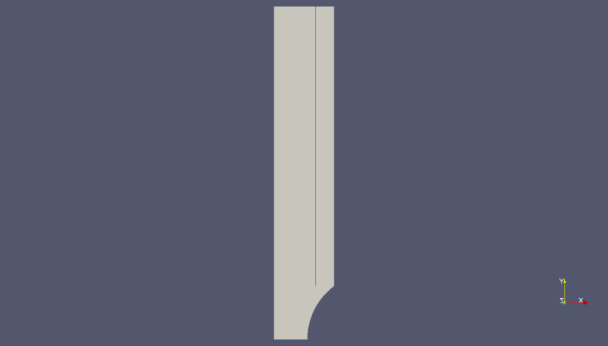

This tutorial describes how to describe in `MFEM/MGIS` a tensile test on
a notched bar made of an isotropic plastic behaviour with linear
hardening in the logarithmic space. This tutorial highlights the key
features of this project.

The full code is available in the `mgis-examples` repository:

<https://github.com/latug0/mfem-mgis-examples>

# Description of the test case

This tutorial considers a tensile test on a notched beam which is
modelled by plastic behaviour at finite strain:

- The geometry and the mesh is described in Section
  @sec:mfem_mgis:ssna303:mesh.
- The boundary conditions are described in Section
  @sec:mfem_mgis:ssna303:bc.
- The mechanical behaviour is described in Section
  @sec:mfem_mgis:ssna303:behaviour.

## Geometry and mesh {#sec:mfem_mgis:ssna303:mesh}

{#fig:mfem_mgis:ssna303:mesh width=80%}

We will speak about the objet of the study the `beam`. With the Figure
@fig:mfem_mgis:ssna303:mesh, we can see the form of the beam is a
rectangular parallelepiped (l $\times$ L $\times$ h). A circle extrusion
has been made with a radius `r` in x=L and y=$\frac{l}{2}$.

$$
\left\{
    \begin{array}{l}
        L,~for~the~length \\
        l,~for~the~width \\
        h,~for~the~height \text{(in \(3D\))}
    \end{array}
\right.
$$

The `ssna303` project has a goal to numerize the behaviour of a notched
beam (i.e. Figure @fig:mfem_mgis:ssna303:mesh) with the non linear
mechanics hypothesis. Numerically we could make a lot of test without
any risk but the numerical test has to respect the mechanicals
behaviours to be the most representative of the reality.

## Modelling hypothesis

In \(2D\), the beam is treated in plane strain.

## Boundary conditions {#sec:mfem_mgis:ssna303:bc}

The problem is also affected by Dirichlet boundary conditions.

The beam is fixed at the origin in y=0 and an displacement \(U\) is
imposed an the top of the beam, as follows:

$$
\left\{
    \begin{array}{ll}
        ~0 & for~y~=~0 \\
        ~U & for~y~=~L
    \end{array}
\right.
$$
`
The symmetry axis on the left is blocked in the `x`-direction.

## Mechanical behaviour {#sec:mfem_mgis:ssna303:behaviour}

### Description

The material of the notched beam is described by a simple isotropic
elasto-plastic behaviour with isotropic hardening in the logarithmic
space [@miehe_anisotropic_2002].

This behaviour is characterized by by four parameters:

- The `Young Modulus` ($E$), which is the constant relating tensile
  stress and strain for an isotropic elastic material.
- The `Poisson Ratio` ($\nu$), is the coefficient to characterise the
  contraction of the material perpendicular at the direction of the
  force applied.
- The `Yield Strength` ($\sigma_{0}$), which defines the point on the
  stress versus strain curve where the material initially starts to go
  into plastic strain.
- The `Strain Hardening Modulus` (H), which defined the slope of the
  stress versus strain curve after the point of yield of a material.

For our example the following values are used:

\[
\label{size}
\left\{
    \begin{array}{lcl}
        \nu & = & 0.34 \\
        \epsilon & = & 70.10^{9} MPa \\
        H & = & 10.10^{9} \\
        s_0 & = & 300.10^{6}
    \end{array}
\right.
\]

### Compilation of the `MFront` behaviour

The `MFront` implementation is stored in a source file called
`Plasticity.mfront`. This file must be compiled before the execution of
our `MFEM/MGIS` `C++` example which will be detailled in depth in
Section @sec:mfem_mgis:ssna303 as follows:

~~~~{.cxx}
$ mfront --obuild --interface=generic Plasticity.mfront
Treating target : all
The following library has been built :
- libBehaviour.so :  Plasticity_AxisymmetricalGeneralisedPlaneStrain 
  Plasticity_Axisymmetrical Plasticity_PlaneStrain
  Plasticity_GeneralisedPlaneStrain Plasticity_Tridimensional
~~~~

# Numerical resolution {#sec:mfem_mgis:ssna303}

## Initialization of the resolution

The `initialize` function must be called at the very beginning of the
`main` function to process the command line arguments:

~~~~{.cxx}
mfem_mgis::initialize(argc, argv);
~~~~

> **The `mfem_mgis` namespace**
>
> All the classes and funtions of the `MFEM/MGIS` project are place in
> the `mfem_mgis` namespace.

This call is mostly useful in parallel and handle:

- The initialization of interprocess communications handled by the
  [`MPI` framework](https://www.mpi-forum.org/docs/).
- The initialization of the [`PETSc` scientific
  toolkit](https://www.mcs.anl.gov/petsc/), if supported and requested.

### Constant variables

The code then defines some constant variables defining the path to the
mesh file, the path the the `MFront` shared library, and the name of the
behaviour:

~~~~{.cxx}
  const char* mesh_file = "ssna303.msh";
  const char* library = "src/libBehaviour.so";
  const char* behaviour = "Plasticity";
~~~~

> **Mesh file format**
>
> The mesh is stored using the `gmsh` format.

### Command line options

The resolution can be parametrized using command line options by relying
on the `MFEM` facilities provided by the `OptionsParser` class.

The proposed implementation allows the following options:

- `--order` which specifies the finite element order (polynomial degree).
- `--parallel` which specifices if the simulation must be run in parallel.
- `--use-petsc` which speficies that linear and non linear solvers of
  the `PETSc` toolkit must be used.
- `--petsc-configuration-file` which specifies a configuration file for
  the `PETSc` toolkit.

The options `--use-petsc` and `--petsc-configuration-file` are only
available if `MFEM` is compiled with `PETSc` support.

The other options are associated with local variables which are default
initialized as follows:

~~~~{.cxx}
  auto parallel = int{1};
  auto order = 1;
~~~~

If left unchanged, those default values select a parallel computation
with linear elements.

In practice, an object of the class `mfem::OptionsParser` is declared.
The expected options are declared and the `Parse` method is called:

~~~~{.cxx}
  mfem::OptionsParser args(argc, argv);
  mfem_mgis::declareDefaultOptions(args);
  args.AddOption(&parallel, "-p", "--parallel",
                 "Perform parallel computations.");
  args.AddOption(&order, "-o", "--order",
                 "Finite element order (polynomial degree).");
  args.Parse();
  if (!args.Good()) {
    args.PrintUsage(std::cout);
    return EXIT_FAILURE;
  }
~~~~

The `declareDefaultOptions` function declares the options the
`--use-petsc` and `--petsc-configuration-file` if they are relevant.

## Declaring the non linear problem

The non linear evolution problem is defined as follows:

~~~~{.cxx}
 mfem_mgis::NonLinearEvolutionProblem problem(
      {{"MeshFileName", mesh_file},
       {"FiniteElementFamily", "H1"},
       {"FiniteElementOrder", order},
       {"UnknownsSize", dim},
       {"Hypothesis", "Tridimensional"},
       {"Parallel", parallel}});
~~~~

The constructor of the `NonLinearEvolutionProblem` class takes an object
of `Parameters` type which is able to store various kind of data in a
hierarchical structure. The valid parameters for the construction of a
non linear evolution problem are described in the `doxygen`
documentation of the `NonLinearEvolutionProblem` class.

## Names boundaries and materials

~~~~{.cxx}
  problem.setMaterialsNames({{1, "NotchedBeam"}});
  problem.setBoundariesNames(
      {{3, "LowerBoundary"}, {4, "SymmetryAxis"}, {2, "UpperBoundary"}});
~~~~

## Declaring the mechanical behaviour

The following line associates a mechanical behaviour to the first
material:

~~~~{.cxx}
  problem.addBehaviourIntegrator("Mechanics", "NotchedBeam",
                                 "src/libBehaviour.so",
                                 "Plasticity");
~~~~

The four arguments are:

- The type of phenomena described.
- The material identifier, as defined in the mesh file.
- The shared library containing the behaviour to be used.
- The name of the behaviour to be used.

## Initialisation of the temperature

The following lines define an uniform temperature on the material at the
beginning of the time step and at the end of time step:

~~~~{.cxx}
  auto& m1 = problem.getMaterial("NotchedBeam");
  mgis::behaviour::setExternalStateVariable(m1.s0, "Temperature", 293.15);
  mgis::behaviour::setExternalStateVariable(m1.s1, "Temperature", 293.15);
~~~~

The object returned a by the `getMaterial` method returns a thin wrapper
around the `MaterialDataManager` provided by the [`MGIS`
project](https://thelfer.github.io/mgis/web/index.html)
[@helfer_mfrontgenericinterfacesupport_2020].

In the previous lines, `m1.s0` and `m1.s1` denotes respectively the
state of the material at the beginning of the time step and at the end
of the time step.

## Boundary Condition

The problem is base on condition and more precisely on the boundary
conditions which helps to define the behaviour of the material. 4
boundary conditions are defined with the name at the top of the line to
add the boundary condition `addBoundaryCondition`. The `MFEM_MGIS`
program named `UniformDirichletBoundaryCondition` is called by each
boundary conditions, and the first number is to define on which side
this conditions are and the second number is for the direction :

- 0 for the x.
- 1 for the y. 
- 2 for the z

~~~~{.cxx}
  problem.addUniformDirichletBoundaryCondition(
      {{"Boundary", "LowerBoundary"}, {"Component", 1}});
  problem.addUniformDirichletBoundaryCondition(
      {{"Boundary", "SymmetryAxis"}, {"Component", 0}});
  problem.addUniformDirichletBoundaryCondition(
      {{"Boundary", "UpperBoundary"},
       {"Component", 1},
       {"LoadingEvolution",  {
          const auto u = 6e-3 * t;
          return u;
        }}});
~~~~

## Non linear solver parameters.

If `PETSc` is not used, the following line set the parameters of the
Newton-Raphson solver used to find the equilibrium of the whole
structure:

~~~~{.cxx}
  if (!mfem_mgis::usePETSc()) {
    problem.setSolverParameters({{"VerbosityLevel", 0},
                                 {"RelativeTolerance", 1e-6},
                                 {"AbsoluteTolerance", 0.},
                                 {"MaximumNumberOfIterations", 10}});
  }
~~~~

Valid parameters for the `setSolverParameters` are described in the
`doxygen` documentation.

## Selection of the linear solver

If `PETSc` is not used, the linear solver can be selected using the
`setLinearSolver` method. Here we select `MUMPS`, in parallel and
`UMFPack` in sequential:

~~~~{.cxx}
  if (!mfem_mgis::usePETSc()) {
    if (parallel) {
      problem.setLinearSolver("MUMPSSolver", {});
    } else {
      problem.setLinearSolver("UMFPackSolver", {});
    }
  }
~~~~

The second argument is an object of the `Parameters` type which can be
used to fine tune the linear solver and, in the case of iterative
solvers, optionnaly define a preconditioner. For direct solvers, no
parameters are required.

## Post-processings

The `addPostProcessing` method let the user define some built-in
postprocessings.

In this example, we export the displacements for visualization in
[`paraview`](https://www.paraview.org/) and compute the resultant force
on the boundary where the displacement as follows:

~~~~{.cxx}
  problem.addPostProcessing("ComputeResultantForceOnBoundary",
                            {{"Boundary", 2}, {"OutputFileName", "force.txt"}});
  problem.addPostProcessing("ParaviewExportResults",
                            {{"OutputFileName", "ssna303-displacements"}});
  problem.addPostProcessing("ParaviewExportIntegrationPointResultsAtNodes",
                            {{{"Results", "FirstPiolaKirchhoffStress"},
                              {"OutputFileName", "ssna303-stress"}}});
  problem.addPostProcessing(
      "ParaviewExportIntegrationPointResultsAtNodes",
      {{{"Results", "EquivalentPlasticStrain"},
        {"OutputFileName", "ssna303-equivalent-plastic-strain"}}});
~~~~

These post-processings are called using the `executePostProcessings`
method during the resolution using the state at the end of time step.

The user may also provide their own post-processings. In particular, the

## Resolution initialization

It's time to make the loop which will execute the test, for that some
initialization have to be made:

- the number of steps.
- the step timer.
- the time variable.
- the number of iteration.

Once all is done, the timer loop can be made with the `for` condition
between the counter `i` and the `nsteps`. A print is made to follow the
steps.

~~~~{.cxx}
  const auto nsteps = mfem_mgis::size_type{50};
  const auto dt = mfem_mgis::real{1} / nsteps;
  auto t = mfem_mgis::real{0};
  auto iteration = mfem_mgis::size_type{};
  for (mfem_mgis::size_type i = 0; i != nsteps; ++i) {
    std::cout << "iteration " << iteration << " from " << t << " to " << t + dt
              << '\n';
~~~~

## Resolution

The resolution part starts with a copy of the parameters defined above,
with this copy the datas can be local and global in the loop.

~~~~{.cxx}
    auto ct = t;
    auto dt2 = dt;
    auto nsteps = mfem_mgis::size_type{1};
    auto nsubsteps  = mfem_mgis::size_type{0};
    while (nsteps != 0) {
~~~~

The `while` loop is used to realize all the step of the process. The
`try` indicates a portion of code where an error may occur and after the
`catch` introduces the portion of code that retrieves the object and
handles the error. Whether the there is an error the variable
`converged` is defined as `false`.

~~~~{.cxx}
      auto converged = problem.solve(ct, dt2);
~~~~

Here the tests are made with the `converged` variable difined earlier.
If converged is true the first test is realiaze otherwise the test is
made until the `nsubsteps`=10.

~~~~{.cxx}
      if (converged) {
        --nsteps;
        ct += dt2;
      } else {
        std::cout << "\nsubstep: " << nsubsteps << '\n';
        nsteps *= 2;
        dt2 /= 2;
        ++nsubsteps;
        problem.revert();
        if (nsubsteps == 10) {
          mfem_mgis::raise("maximum number of substeps");
        }
      }
    }
~~~~

This lines are to execute the postprocessing diffined in the `VTK
Export`, the variables are steped up. The `return` line to close the
`ssna303` programm.

~~~~{.cxx}
      problem.executePostProcessings(t, dt);
      problem.update();
      t += dt;
      ++iteration;
      std::cout << '\n';
    }
  }
  return EXIT_SUCCESS;
}
~~~~  

# References